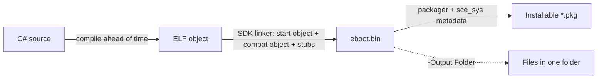

# SharpProspero

A C# SDK and toolchain for building applications that run on the console. Write the application in C#;
the toolchain compiles it ahead of time to a self-contained ELF, links it with its own linker, and packs
it into an installable package — an `eboot.bin` with no separate runtime to deploy alongside it.

Everything needed is in this one repository: the interop bindings for the device services, a drawing and
interface layer, an application host, the memory, audio, input, networking, storage and system-service
surfaces, the command-line tools that inspect and package a module, and `dotnet new` templates to start
from. A build needs only the .NET 10 SDK.

## Contents

- [Overview](#overview)
- [How it works](#how-it-works)
- [Requirements](#requirements)
- [Quick start](#quick-start)
- [Templates](#templates)
- [Command-line tools](#command-line-tools)
- [Feature reference](#feature-reference)
- [Documentation](#documentation)
- [Building and testing the SDK](#building-and-testing-the-sdk)
- [License](#license)

## Overview

- Write the application in C#; it compiles ahead of time to a self-contained `eboot.bin` with no runtime
  to ship alongside it.
- Interop bindings for the device services an application uses: display output, controller input and
  output, audio, files, network sockets, the real-time clock, the entropy source, and the user and system
  services.
- A 2D drawing surface, a scalable-font text layer, a controller-driven interface toolkit, and a movable
  2D scene, plus a graphics-processor layer with a lit 3D mesh renderer.
- An application host — derive from `ProsperoApp`, override `OnFrame`, call `Run` — with a paced loop, a
  state machine, an event bus, and a fixed-timestep accumulator on top.
- Audio output and capture, memory tools for the constrained heap, timing, threading, storage and data
  formats, hashing, and the full run of system services (save data, dialogs, trophies, capture, package
  install, firmware compatibility).
- A toolchain that stands alone: its own linker, start object, and module stubs, so a build needs no
  separate linker, start file, or stub library.
- Command-line tools to inspect, strip, retarget, convert and package a module, and to generate a C#
  wrapper for a library.
- 19 `dotnet new` templates, and one build that runs across a range of system versions.

## How it works

A build runs three steps, wired together by the shared pipeline in `build/`:

1. **Compile** — the C# is compiled ahead of time to a self-contained x86_64 ELF object. This step runs
   on Linux; on Windows the build runs it through WSL automatically. The runtime comes from the .NET SDK's
   own runtime pack, so nothing extra is installed.
2. **Link** — the SDK's linker turns that object into an `eboot.bin` (or a `.prx` for a library). It
   supplies its own start object, a compatibility object that bridges the few places the C library and the
   system differ, and a stub for every device-service import, so the link needs no separate linker, start
   file, or stub library.
3. **Package** — the packager assembles the `eboot.bin`, the `sce_sys` metadata, and any `sce_module`
   libraries into an installable `*.pkg`, or writes them into a single folder ready to copy
   (`-Output Folder`).



A payload takes a shorter path: it links to a single position-independent `.elf` that a loader maps and
runs in a process over the network, with no packaging step. See
[Modules and payloads](docs/modules-and-payloads.md) for when each form is the right one.

## Requirements

- .NET 10 SDK, on Windows, Linux or macOS (64-bit).
- The compile step runs on Linux; on Windows the build runs it through WSL automatically, so no host
  switch is needed. Nothing else is set up: the runtime comes from the .NET SDK's own runtime pack, and
  the SDK's linker supplies its own start object, a compatibility object, and the module stubs.

See [docs/setup.md](docs/setup.md) for the full per-operating-system install, and run `pwsh doctor.ps1`
to check a machine and print what to set for anything missing.

## Quick start

Check the setup, then build and test the SDK:

```
pwsh doctor.ps1
dotnet build SharpProspero.slnx
dotnet test tests/SharpProspero.Tests/SharpProspero.Tests.csproj
```

`doctor.ps1` reports the .NET SDK and, on Windows, the WSL host the compile step uses. A plain build and
the tests need only .NET 10.

Scaffold your own project from a template, point it at the SDK once, and build:

```
dotnet new install templates/prospero-app
dotnet new prospero-app -n MyGame --title "My Game" --titleId PPSA99099
setx SHARPPROSPERO_ROOT "<this folder>"     # or export on Linux/macOS
pwsh MyGame/build.ps1
```

Or build the bundled sample and pick the output you want:

```
pwsh src/SharpProspero.Sample/build.ps1                  # an installable *.pkg
pwsh src/SharpProspero.Sample/build.ps1 -Output Folder   # every file in one folder
```

The application itself is a few lines:

```csharp
using SharpProspero.Application;
using SharpProspero.Graphics;

internal sealed class HelloApp : ProsperoApp
{
    protected override void OnFrame(FrameContext context)
    {
        Surface surface = context.Surface;
        surface.Clear(Color.FromRgb(0x0E, 0x11, 0x16));
        surface.DrawTextCentered("Hello from C#", 500, 5, Color.White);
    }
}

internal static class Program
{
    private static void Main() => new HelloApp().Run();
}
```

See [docs/getting-started.md](docs/getting-started.md) to go from an empty project to a build.

## Templates

Nineteen `dotnet new` templates cover each kind of project. Install one, create a project from it, and its
`build.ps1` runs the shared pipeline. Applications take the package identity (`--title`, `--titleId`,
`--conceptId`, `--contentId`) as options.

See [docs/templates.md](docs/templates.md) for the options, what each template contains, and the full
install list.

## Command-line tools

The SDK ships command-line programs for working with a module outside the build. The binding generator
hosts most of them as verbs (`dotnet run --project tools/SharpProspero.Bindings.Generator -- <verb>`):

| Command | What it does |
|---|---|
| `prx` | Read a `.prx` or `.sprx`, list its exports, and generate a C# wrapper for it. |
| `elf` | Inspect an ELF or signed module: segments, plus `--sizes`, `--symbols`, `--strings`, and `--strip`. |
| `self` | Read a signed container, extract its ELF, report which form a file is, and convert between the forms. |
| `offsets` | Dump a module's export identifiers and addresses, and how it covers the names the SDK needs. |
| `retarget` | Change the system version a module records, so one built for a newer system loads on an older one. |
| `gnf` | Build a GNF texture file from a PNG, TGA or BMP image, and resize an image with `--resize`. |
| `shader` | Inspect a shader binary: its kind, inputs, and resources. |
| `vag` | Convert audio between WAV and VAG. |
| `payload` | Send a built payload `.elf` to a loader over the network. |

The packager (`tools/SharpProspero.Packager`) assembles a package over the packaging library, and the
binding generator with no verb turns the SDK headers into more bindings from a catalog. See
[docs/toolchain.md](docs/toolchain.md) for the toolchain as a whole.

## Feature reference

- **Interop bindings** for the device services an application module uses: direct memory, display
  output, controller input and output, audio output and microphone input, network sockets,
  system-module loading, and the user and system services. Bindings are declared as direct imports; the
  linker resolves them at link time against stubs it generates for each module, so a build needs no stub
  library from elsewhere.
- **A drawing layer**: a framebuffer surface with rectangle, circle, triangle and polygon fills,
  blended rectangle and circle fills, linear and radial gradients, multi-stop color ramps and palettes,
  rounded rectangles, thin and thick
  lines, outlines, opaque, alpha-blended, scaled (nearest or smooth) and rotated surface copies, and
  sub-region clipping; in-place image effects (grayscale, invert,
  brightness, contrast, tint, flip and blur); PNG, JPEG, BMP, TGA, QOI and animated GIF image decoding, PNG, JPEG, BMP and
  TGA encoding for screenshots; off-screen buffers you own for pre-rendering and caching; ellipses, arcs,
  pies and rings, connected lines, thick outlines and nine-part panel stretching; an 8x8 bitmap
  font and a scalable TrueType/OpenType font for antialiased text, with an outlined form that stays
  readable over a photo or a video frame, over a double-buffered display device that presents on the
  vertical blank. Colors read and write in RGB, HSV and HSL.
- **A 2D scene**: a movable, zoomable camera that converts between world and screen coordinates and
  clamps to a map's edges, a tile map drawn from a sprite sheet through the camera (loaded from CSV,
  with tile-collision queries), a sprite-sheet animation player, a particle system for effects,
  A* grid pathfinding for routing around walls, a quadtree for fast range queries over a crowded scene,
  and Bezier and Catmull-Rom splines for curved motion paths.
- **A GPU graphics layer (Agc)**: the complete flat-C command interface (192 command builders and 79
  driver calls) under `SharpProspero.Interop.Agc`, and a managed layer over it: a `DrawCommandBuffer` that
  records register writes, draws and synchronization; shader, format and device helpers; the present path;
  surface layout for every tile mode (`AgcSurface`); the sixteen-register color render-target block with
  typed field setters and a description-driven setup (`CxRenderTarget`, `AgcRenderTargetSetup`); and a
  pixel tiler that converts an image between linear and hardware-tiled order for texture upload and
  framebuffer read-back (`AgcTiler`). Above it, `Renderer3D` draws a lit mesh with built-in shaders, and
  the toolchain's `gnf` command builds texture files from PNG, TGA, and BMP images. See
  [docs/graphics-gpu.md](docs/graphics-gpu.md).
- **Text that fits**: wrap a paragraph to a width, place a line left, centred or right, measure the
  wrapped block, and shorten a label that will not fit. It measures through a font abstraction, so the
  same layout serves the built-in text and a loaded outline font.
- **An application host**: derive from `ProsperoApp`, override `OnFrame`, and call `Run`. The host
  opens the display and controller, drives a paced loop, and tears everything down on exit. For the
  logic on top, a state machine runs the app as named states (a menu, a level, a pause screen) with
  paired enter and exit work, an in-process event bus lets parts of the app talk without holding
  references to each other, an undo/redo history backs editor-style tools, a fixed-timestep accumulator
  advances a simulation deterministically, and a localization table keeps user-facing text in data.
- **An interface toolkit**: build screens from labels, buttons, lists, checkboxes, radio groups,
  sliders and progress bars, driven by the controller with automatic layout and focus, so an
  application does not draw its interface by hand. Move between pages with a back-stack of screens,
  stack controls down a column or across a row, wrap a paragraph, divide a tool into tabbed pages,
  scroll content taller than the screen, show a name and its value on one line, put a panel over
  everything that takes the controller until it is answered (with one-call message and confirm
  panels), fill a round meter to a known amount, turn a ring while work is under way, repeat a held
  direction for fast scrolling, and raise a short message that takes itself down.
  See [docs/ui.md](docs/ui.md).
- **Memory tools** for the constrained heap: a direct-memory region with deterministic release, a
  heap monitor that reads usage against the configured ceiling, an object pool that reuses
  short-lived objects so a hot loop allocates less, and a bounded most-recently-used cache that holds a
  fixed number of decoded assets and drops the least-used to stay within budget.
- **Timing and files**: a monotonic clock for frame pacing and measurement, game-logic timers
  (cooldowns, intervals and countdowns) driven by the frame delta, a scheduler that runs a callback after
  a delay or on a repeat, a wall-clock reader for the calendar
  date and time, a reader for the assets bundled with the module, a filesystem layer
  that lists directories, walks and copies whole trees, and creates, moves and removes entries, path
  helpers that pull a path apart and join it back, an INI settings store for a module's own
  configuration, a JSON reader and writer for a config file, a manifest or a reply from a service, an XML
  reader, writer and small document model for a config or data file, a CSV
  reader and writer for a table or an export, a tar reader for unpacking a bundle of assets, an in-memory
  data table to sort, filter and group those rows for a list or grid, a versioned save with forward
  migration, endian-aware binary buffers for reading and writing a save file, a header or a message,
  bit-field readers and writers for a value that is not a whole number of bytes wide, ring
  buffers for a rolling history or a byte stream, and base-N (hex, Base32, Base64) encodings for a token
  or a blob.
- **Compression and archives**: managed DEFLATE, zlib and gzip compression and decompression that works
  anywhere with no size cap, a ZIP archive reader that lists a bundle's members and decompresses them on
  demand with a CRC-32 check, and a ZIP writer that gathers files into one archive - for reading and
  writing compressed assets, a download, or a pack of files shipped as one.
- **Text and web glue**: format the strings an application shows — a file size, a duration, a
  filename-friendly sort, aligned columns, a hex dump — fuzzy-match a pattern to filter and rank a list
  the way a type-to-find box does, and encode, decode, build and parse URL query strings and form bodies
  for the HTTP client and server.
- **Background work**: run slow work off the frame loop — a one-shot background operation you poll for
  its result, and a small pool of worker threads that run the jobs you queue, so the screen keeps
  drawing while a file loads or a request is in flight; and a hand-off point that runs a callback back on
  the frame thread, so a worker can apply its result to the drawing state safely.
- **Randomness and math**: a reproducible generator for gameplay (ranges, booleans, picking and
  shuffling) seeded from the system entropy source, a weighted table for loot and drop charts, a
  two-dimensional vector type for positions, velocities and directions, a rectangle type with the point,
  rectangle and circle overlap tests game code reaches for, the small floating-point helpers that go with
  them (blend, remap, smooth-step, move-towards, angle wrapping) plus critically-damped smoothing for a
  camera or value that eases to a target without overshoot, coherent noise for terrain and textures, and a
  rectangle packer for building a sprite sheet or a glyph atlas.
- **Settings and users**: a reader for the user's system settings (language, date and time formats,
  time zone), and the signed-in users with their display names.
- **System features**: play a media file or a network stream and pull its decoded audio, open the
  system browser over the running application, and install a package file. Read and write the values
  the system keeps for itself, by identifier, where the running build is permitted to. Services a
  title does not link against are loaded at run time and resolved by name.
- **Media decoding**: turn compressed audio (Layer III, Advanced Audio Coding) into samples an audio
  port takes, and decode H.264 a unit at a time to get the pictures themselves — for a stream an
  application receives, or anywhere the frames are wanted rather than playback.
- **App and content management**: install, size, check, uninstall and launch an application by its
  title id; list the photos and videos in the content library, export a file into it, and read a
  file's metadata; find connected USB drives and where they are mounted (mapping one on request), to
  browse them with the file APIs; and let the user pick a save through the save-data dialog.
- **Trophies**: read a title's trophy set and the signed-in player's progress — the set title, the
  unlocked count and completion, and each trophy's grade, name and unlock state — show the system trophy
  list, and unlock a trophy or report an activity or statistic by posting an event through the
  universal-data-system.
- **Audio and input**: a stereo audio-output port that paces the caller to the audio clock; a tone and
  effect generator (sine, square, triangle, sawtooth, noise) for beeps and simple sound effects with no
  audio file; a mixer that layers several sounds at once, spreading mono to stereo and retuning a clip
  recorded at another rate; a two-pole filter (low, high, band-pass and notch) for tone shaping and an
  attack-decay-sustain-release envelope for giving a note a natural swell and fade; a microphone-input
  port for recording and level metering; 16-bit WAV file
  reading and writing with no module; controller vibration and light-bar control; controller samples
  decoded down to motion (orientation, acceleration, angular velocity) and touch-pad contacts, with a
  gesture recognizer for taps, holds, drags, flicks and pinches; and an
  action map that names the controls (single button, chord, or alternatives) so game code reads clearly
  and controls are easy to rebind.
- **Networking**: TCP and UDP sockets for a client or a server, a poller for serving many connections
  from one thread, a small HTTP/1.1 server for a control panel or a file browser, and a name resolver,
  alongside the connection-status reader and the HTTP downloader.
- **Integrity and capture**: file checksums and digests (SHA-256, SHA-512, SHA-1, MD5, CRC-32, SHA-3) and
  keyed digests (HMAC over any of them) with no module needed; screenshot and photo export of a
  drawing surface to PNG or JPEG; system capture of the whole
  composited screen to the gallery as a 2K or 4K screenshot or a video clip; live capture of the
  finished screen's audio and video for a recorder or stream (an advanced, privileged surface); and
  app-loop control such as keeping the console awake through a long operation, reacting to system
  events, and chain-loading another module.
- **Logging and timing**: a small leveled logging facility with a file sink and a console sink, so a
  module can record progress and errors to a file the user reads back or to the development console;
  and a frame-rate and frame-time tracker that reads out the recent pace and graphs it over the screen.
- **Optical disc**: browse a mounted disc's filesystem under `/mnt/disc` with the file APIs, and open
  the raw drive device for a sector read or a full dump, where the running module has the privilege to
  reach the drive.
- **System-version range**: a module built with the SDK targets the earliest supported system by
  default and runs on every later one; raise the target only to call a function a later system added.
- **Firmware compatibility at run time**: read the running system version, resolve system services by
  name (so one build adapts across versions instead of pinning an address), and check that a service
  provides every export a feature needs before using it, refusing it with a specific reason otherwise.
  A single registry records the supported range and what each resolved-by-name service depends on. See
  [docs/firmware.md](docs/firmware.md).
- **Module support**: load a `.prx` you supply at run time, resolve its exports, and pack it in the
  application's `sce_module` folder. Build the application as an `eboot.bin` or a `.prx` library.
- **Signed and unsigned forms**: a program is a `.elf` or a signed `.self`, a library a `.prx` or a
  signed `.sprx`. The reader and inspector take either, unwrapping a signed module to its ELF first,
  and a container tool reports which form a file is and converts between them.
- **A module toolkit** that reads a `.prx` or `.sprx`, lists its exports, and generates a C# wrapper
  for it, so a project needs only its own module to interact with it.
- **Firmware tooling**: dump a module's export identifiers and addresses (and how it covers the names
  the SDK needs) so a firmware's facts can be contributed, and retarget a module's recorded version so
  one built for a newer system can load on an older one.
- **A binding generator** that turns the SDK headers into more bindings from a small catalog.
- **Two ways to ship**: pack the built module and its metadata into a `*.pkg`, or write every file
  into a single folder ready to copy (`-Output Folder`).

## Documentation

The pages under `docs/` are both the repository documentation and a Jekyll site. Start here:

- [Getting started](docs/getting-started.md) — from nothing to a running module.
- [Setup](docs/setup.md) — the full install for Windows, Linux and macOS (64-bit).
- [Templates](docs/templates.md) — starting points for each kind of project.
- [Guides and tips](docs/guides.md) — everyday recipes and troubleshooting.

Every page names the namespace it documents, and the site's search box indexes the whole set.

## Building and testing the SDK

```
dotnet build SharpProspero.slnx
dotnet test tests/SharpProspero.Tests/SharpProspero.Tests.csproj
```

The class library builds and the tests run on .NET 10 alone, with no console or WSL involved; the compile
and link steps only come in when building an actual module.

## License

GPL-3.0-or-later. Copyright © SvenGDK 2026.
