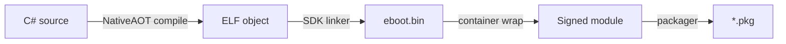
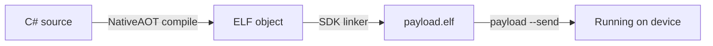

# SharpProspero

A C# SDK and toolchain for building both **application modules** and **payloads** that run on the console.
Write everything in C#; the toolchain compiles it ahead of time, links it with its own linker, and produces
either an installable package or a position-independent ELF — no separate runtime, linker, or stub library
needed. A build requires only the .NET 10 SDK.

## How it works

### Application modules

An application module compiles to a self-contained `eboot.bin` packed into an installable `*.pkg`.



1. **Compile** — NativeAOT compiles the C# to a self-contained x86_64 ELF object. On Windows the build
   runs this step through WSL automatically.
2. **Link** — the SDK linker supplies its own start object, a compatibility object, and stubs for every
   device-service import.
3. **Wrap** — the module goes into the signed container the loader expects.
4. **Package** — the packager assembles the `eboot.bin`, `sce_sys` metadata, and `sce_module` libraries
   into an installable `*.pkg` (or a plain folder with `-Output Folder`).

### Payloads

A payload compiles to a position-independent `.elf` that a loader maps into a running process over the
network. No packaging step — just send it.



1. **Compile** — same NativeAOT step as application modules.
2. **Link** — the linker produces a position-independent `.elf` with the CRT start object, which provides
   the kernel log, the raw syscall gateway, and the pipe-primitive kernel access.
3. **Deploy** — `payload --send` pushes the `.elf` to a loader listening on the device.

The payload SDK provides the full kernel access surface (process walk, credential escalation, virtual memory,
page tables), filesystem and mount operations, POSIX I/O, networking, bypass hooks, multi-firmware offsets
(FW 1.00 through 12.70), and service daemons. See [Modules and payloads](docs/modules-and-payloads.md)
for when each form is the right choice.

## Requirements

- **.NET 10 SDK** (Windows or Linux, x64 only).
- The compile step runs on Linux; on Windows the build runs it through **WSL** automatically.

Run `pwsh doctor.ps1` to check the environment. See [docs/setup.md](docs/setup.md) for the full install.

## Quick start

Check the setup and build the SDK:

```
pwsh doctor.ps1
dotnet build SharpProspero.slnx
```

### Application module

```
cp -r samples/prospero-app MyGame
setx SHARPPROSPERO_ROOT "<this folder>"
pwsh $SHARPPROSPERO_ROOT/build/build-app.ps1 -ProjectPath MyGame/SampleApp.csproj
```

The application itself is a few lines:

```csharp
using SharpProspero.Application;
using SharpProspero.Graphics;

internal sealed class HelloApp : ProsperoApp
{
    protected override void OnFrame(FrameContext context)
    {
        Surface surface = context.Surface;
        surface.Clear(Color.FromRgb(0x0E, 0x11, 0x16));
        surface.DrawTextCentered("Hello from C#", 500, 5, Color.White);
    }
}

internal static class Program
{
    private static void Main()
    {
        using var app = new HelloApp();
        app.Run();
    }
}
```

### Payload

```
cp -r samples/prospero-payload-echo MyPayload
pwsh $SHARPPROSPERO_ROOT/build/build-app.ps1 -ProjectPath MyPayload/SampleApp.csproj -Payload
```

A minimal payload:

```csharp
using System.Runtime.InteropServices;
using SharpProspero.Payload;

namespace SampleApp;

internal static unsafe class Program
{
    [UnmanagedCallersOnly(EntryPoint = "__managed__Main")]
    public static int Main(void* args)
    {
        PayloadCrt.Klog("hello from payload\n\0"u8);
        return 0;
    }
}
```

See [docs/getting-started.md](docs/getting-started.md) for the full walkthrough.

## Command-line tools

| Command | What it does |
|---|---|
| `link` | Link objects into an `eboot.bin`, a `.prx` library, or a payload `.elf`. |
| `prx` | Read a `.prx` or `.sprx`, list its exports, and generate a C# wrapper. |
| `elf` | Inspect an ELF or signed module: segments, sizes, symbols, strings, and strip. |
| `self` | Report a file's form, sign an ELF into its container, or extract back to ELF. |
| `param` | Check and apply application metadata (`sce_sys/param.json`). |
| `gnf` | Build a GNF texture from PNG, QOI, TGA, or BMP (with resize and sRGB). |
| `vag` | Convert WAV to VAG or VAG to WAV. |
| `shader` | Report a compiled shader's kind, version, sizes, and register usage. |
| `payload` | Send a built payload `.elf` to a loader over the network. |
| `nid` | Compute the export identifier for a symbol name. |
| `stub` | Build an import library for a module from a name list. |
| `crt` | Write the CRT start object. |
| `compat` | Write the compatibility object. |
| `diff` | Report exports added, removed, and moved between two modules. |
| `modules` | Check that every required module ships with the application. |
| `sysver` | Settle the system version against the modules the application ships. |
| `offsets` | Dump a module's export identifiers and addresses. |
| `retarget` | Change the system version a module records. |

Run any command with `--help` for its full options. See [docs/commands.md](docs/commands.md) for every
command grouped by task.

## Documentation

Start here:

- [Getting started](docs/getting-started.md) — from nothing to a running module.
- [Setup](docs/setup.md) — the full install for Windows and Linux.
- [Application Modules](docs/application-modules.md) — the API surface for homebrew titles.
- [Payloads](docs/payloads.md) — the kernel access surface, multi-firmware offsets, and the full payload API.

Then by area:

| Area | Covers |
|---|---|
| [Application Modules](docs/application-modules.md) | [Graphics](docs/graphics.md), [input](docs/input.md), [audio](docs/audio.md), [media](docs/media.md), [networking](docs/networking.md), [memory](docs/memory.md), [UI toolkit](docs/ui.md), [data](docs/data.md), [system services](docs/system-services.md), [modules](docs/modules.md), [samples](docs/app-samples.md). |
| [Payloads](docs/payloads.md) | [Runtime](docs/payload-runtime.md), [resolver](docs/payload-resolver.md), [kernel access](docs/payload-kernel.md), [API reference](docs/payload-api.md), [samples](docs/payload-samples.md), [deploy](docs/payload-deploy.md), [troubleshooting](docs/payload-troubleshooting.md). |
| [Toolchain](docs/toolchain.md) | [Architecture](docs/architecture.md), [build pipeline](docs/build-pipeline.md), [modules vs payloads](docs/modules-and-payloads.md). |
| [References](docs/references.md) | [Bindings](docs/bindings.md), [signed forms](docs/signed-and-unsigned.md), [commands](docs/commands.md). |
| [Help](docs/help.md) | [Troubleshooting](docs/help-troubleshooting.md). |

## License

GPL-3.0-or-later. Copyright (C) SvenGDK 2026.
