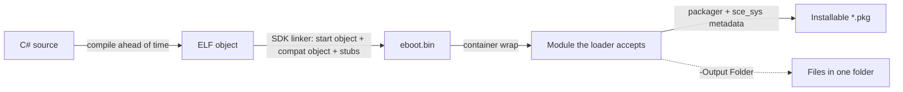

# SharpProspero

A C# SDK and toolchain for building applications that run on the PS5. Write the application in C#;
the toolchain compiles it ahead of time to a self-contained ELF, links it with its own linker, and packs
it into an installable package — an `eboot.bin` with no separate runtime to deploy alongside it.

Everything needed is in this one repository: the interop bindings for the device services, a drawing and
interface layer, an application host, the memory, audio, input, networking, storage and system-service
surfaces, the command-line tools that inspect and package a module, and ready-to-build samples to start
from. A build needs only the .NET 10 SDK.

## Contents

- [SharpProspero](#sharpprospero)
  - [Contents](#contents)
  - [At a glance](#at-a-glance)
  - [How it works](#how-it-works)
  - [Requirements](#requirements)
  - [Quick start](#quick-start)
  - [Samples](#samples)
  - [Command-line tools](#command-line-tools)
  - [Repository layout](#repository-layout)
  - [Feature reference](#feature-reference)
  - [Documentation](#documentation)
  - [System-version support](#system-version-support)
  - [Building the SDK](#building-the-sdk)
  - [License](#license)

## At a glance

- Write the application module in C#; it compiles ahead of time to a self-contained `eboot.bin` with
  no runtime to ship alongside it. The same toolchain also builds payloads — position-independent
  `.elf`s a loader maps into a running process. See [docs/payloads.md](docs/payloads.md).
- Interop bindings for the device services an application uses: display output, controller input and
  output, audio, files, network sockets, the real-time clock, the entropy source, and the user and system
  services.
- A 2D drawing surface, a scalable-font text layer, a controller-driven interface toolkit, and a movable
  2D scene, plus a graphics-processor layer with a lit 3D mesh renderer.
- An application host — derive from `ProsperoApp`, override `OnFrame`, call `Run` — with a paced loop, a
  state machine, an event bus, and a fixed-timestep accumulator on top.
- Audio output and capture, memory tools for the constrained heap, timing, threading, storage and data
  formats, hashing, and the full run of system services (save data, dialogs, trophies, capture, package
  install, firmware compatibility).
- A toolchain that stands alone: its own linker, start object, and module stubs, so a build needs no
  separate linker, start file, or stub library.
- Command-line tools to inspect, strip, retarget, convert and package a module, and to generate a C#
  wrapper for a library.
- Ready-to-build samples covering every application-module kind plus the payload daemons that pair
  with them, and one build that runs across a range of system versions.

## How it works

A build runs four steps, wired together by the shared pipeline in `build/`:

1. **Compile** — NativeAOT compiles the C# ahead of time to a self-contained x86_64 ELF object. This step runs
   on Linux; on Windows the build runs it through WSL automatically. The runtime comes from the .NET SDK's
   own runtime pack, so nothing extra is installed.
2. **Link** — the SDK's linker turns that object into an `eboot.bin` (or a `.prx` for a library). It
   supplies its own start object, a compatibility object that bridges the few places the C library and the
   system differ, and a stub for every device-service import, so the link needs no separate linker, start
   file, or stub library.
3. **Wrap** — every module goes into the container the loader expects: the one just built and the ones
   the application carries in `sce_module`. A module left as a plain ELF is turned away before any of
   its code runs, so this step is what makes the result launchable. A module already wrapped this way
   is left as it is, so re-running a build is safe.
4. **Package** — the packager assembles the `eboot.bin`, the `sce_sys` metadata, and any `sce_module`
   libraries into an installable `*.pkg`, or writes them into a single folder ready to copy
   (`-Output Folder`).



A payload takes a shorter path: it links to a single position-independent `.elf` that a loader maps and
runs in a process over the network, with no packaging step. See
[Modules and payloads](docs/modules-and-payloads.md) for when each form is the right one.

## Requirements

- .NET 10 SDK, on Windows or Linux (x64 only).
- The compile step runs on Linux; on Windows the build runs it through WSL automatically, so no host
  switch is needed. The .NET SDK's own runtime pack supplies the runtime, and the SDK's linker
  supplies its own start object, a compatibility object, and the module stubs.

See [docs/setup.md](docs/setup.md) for the full per-operating-system install, and run `pwsh doctor.ps1`
to check a machine and print what to set for anything missing.

## Quick start

Check the setup, then build the SDK:

```
pwsh doctor.ps1
dotnet build SharpProspero.slnx
```

`doctor.ps1` reports the .NET SDK and, on Windows, the WSL host the compile step uses. A plain build
needs only .NET 10.

Copy a sample folder to your own workspace, point at the SDK once, and build:

```
cp -r samples/prospero-app MyGame
setx SHARPPROSPERO_ROOT "<this folder>"     # or export on Linux
pwsh $SHARPPROSPERO_ROOT/build/build-app.ps1 -ProjectPath MyGame/SampleApp.csproj
```

`build-app.ps1` publishes an installable `*.pkg` under `MyGame/out`, or the loose files with
`-Output Folder`.

The application itself is a few lines:

```csharp
using SharpProspero.Application;
using SharpProspero.Graphics;

internal sealed class HelloApp : ProsperoApp
{
    protected override void OnFrame(FrameContext context)
    {
        Surface surface = context.Surface;
        surface.Clear(Color.FromRgb(0x0E, 0x11, 0x16));
        surface.DrawTextCentered("Hello from C#", 500, 5, Color.White);
    }
}

internal static class Program
{
    private static void Main()
    {
        using var app = new HelloApp();
        app.Run();
    }
}
```

See [docs/getting-started.md](docs/getting-started.md) to go from an empty project to a build.

## Samples

Ready-to-build samples cover each kind of project. Copy the sample folder from `samples/` into your
own workspace and build it with the shared pipeline.

| Sample | Creates |
|---|---|
| `prospero-app` | A frame-loop application that draws to the screen and reads the controller. |
| `prospero-game` | A real-time game paced by the frame time, with a score and a frame-rate overlay. |
| `prospero-scene` | A scrolling 2D scene: a camera that follows a sprite, a tile map with collision, and particles. |
| `prospero-3d` | A spinning, lit cube rendered on the graphics processor with the built-in mesh shaders. |
| `prospero-ui` | An application built from the interface toolkit (labels, buttons, sliders, steppers, pickers). |
| `prospero-launcher` | An app launcher: a carousel of entries that launches the chosen title id. |
| `prospero-filemanager` | A file browser that walks the file system with the controller. |
| `prospero-dashboard` | A tabbed read-out of system, user, network, memory, and firmware facts. |
| `prospero-tool` | A toolbox application that shows a checksum, the console name, and the network status. |
| `prospero-media` | A media player that plays a bundled file, pacing the loop to the decoded audio. |
| `prospero-synth` | An audio synthesizer that generates and mixes tones and streams them to the output. |
| `prospero-input` | An input tester that draws the live controller, keyboard, and mouse state each frame. |
| `prospero-savedata` | A save browser that mounts a save, reads a counter, increments it, and writes it back. |
| `prospero-dialog` | A menu that opens the system message, on-screen keyboard, and error dialogs. |
| `prospero-server` | A network service that serves an HTTP control panel and a JSON status endpoint. |
| `prospero-prx` | A relocatable library module (`.prx`) that exports functions for another module to load. |
| `prospero-payload-httpd` | A payload web service that answers requests with a status page. |
| `prospero-payload-unjail` | A daemon payload that listens on a TCP port and promotes an application module on request (credentials, capabilities, filesystem view). |

See [docs/app-samples.md](docs/app-samples.md) for the application-module samples and
[docs/payload-samples.md](docs/payload-samples.md) for the payload samples.

## Command-line tools

The SDK ships command-line programs for working with a module outside the build. The binding generator
hosts most of them as verbs (`dotnet run --project tools/SharpProspero.Bindings.Generator -- <verb>`):

| Command | What it does |
| --- | --- |
| `prx` | Read a `.prx` or `.sprx`, list its exports, and generate a C# wrapper for it. |
| `link` | Link objects into an `eboot.bin`, a `.prx` library, or a payload `.elf`. |
| `stub` | Build an import library for a module from a name list, with the module and library versions assumed (`--lib`) or read from the module itself (`--module`). |
| `crt` | Write the start object that carries the program entry point. |
| `compat` | Write the compatibility object that bridges the runtime's C calls. |
| `nid` | Compute the export identifier for a name. |
| `diff` | Report the exports added, removed and moved between two modules. |
| `elf` | Inspect an ELF or signed module: segments, plus `--sizes`, `--symbols`, `--strings`, and `--strip`. |
| `self` | Report which form a file is, sign an `.elf` or `.prx` into its container, and extract a container back to its ELF. |
| `param` | Check the metadata that describes the application to the system, fill in what a finished title carries (`--apply`), and list the kinds of title (`--list`). |
| `modules` | Check that every module the application has to carry travels with it, and gather the missing ones. |
| `sysver` | Settle the system version the application requires against the modules it ships. |
| `offsets` | Dump a module's export identifiers and addresses, and how it covers the names the SDK needs. |
| `retarget` | Change the system version a module records, so one built for a newer system loads on an older one. |
| `gnf` | Build a GNF texture file from a PNG, QOI, TGA or BMP image (`--resize` scales first, `--srgb` marks the colour channels), and read a GNF back with `--info`. |
| `shader` | Report a compiled shader's kind, version, sizes, and — with `--registers` — the registers it writes. |
| `vag` | Convert a 16-bit PCM WAV to VAG, or a VAG back to WAV. |
| `payload` | Send a built payload `.elf` to a loader over the network. |

Run any verb with `--help` for its full options. The packager (`tools/SharpProspero.Packager`) assembles
a package over the packaging library, and the binding generator with no verb turns the SDK headers into
more bindings from a catalog. See [docs/commands.md](docs/commands.md) for every command grouped by task,
and [docs/toolchain.md](docs/toolchain.md) for the toolchain as a whole.

## Repository layout

| Path | Contents |
| --- | --- |
| `src/SharpProspero` | The SDK class library. |
| `tools/SharpProspero.Link` | The linker that turns the compiled object into an `eboot.bin` or a `.prx`. |
| `tools/SharpProspero.Prx` | Module and signed-container reader, identifier computer, and C# wrapper generator. |
| `tools/SharpProspero.Bindings.Generator` | The binding generator and the `prx`, `link`, `stub`, `crt`, `compat`, `nid`, `diff`, `elf`, `self`, `param`, `modules`, `sysver`, `offsets`, `retarget`, `gnf`, `shader`, `vag`, and `payload` commands. |
| `tools/SharpProspero.Texture` | Builds GNF texture files from PNG, QOI, TGA, and BMP images (the `gnf` command). |
| `tools/SharpProspero.Packager` | The command-line packager over the packaging library. |
| `build/` | The shared compile-link-package pipeline (`Prospero.App.props`, `Prospero.App.targets`, `Prospero.Payload.props`, `Prospero.Payload.targets`, `build-app.ps1`). |
| `samples/` | Ready-to-build sample projects, one per kind. |
| `runtime/` | Notes on how the ahead-of-time runtime is sourced and its operating-system surface met, with the import lists in `runtime/imports`. |
| `docs/` | The documentation, and the Jekyll site built from it. |
| `doctor.ps1` | The environment check: the .NET SDK and, on Windows, the WSL host the compile step uses. |

## Feature reference

- **Interop bindings** for the device services an application module uses: direct memory, display
  output, controller input and output, audio output and microphone input, network sockets,
  system-module loading, and the user and system services. Bindings are declared as direct imports; the
  linker resolves them at link time against stubs it generates for each module, so a build needs no stub
  library from elsewhere.
- **A drawing layer** over a double-buffered display device that presents on the vertical blank:
  - Fills: rectangle, circle, triangle, polygon, blended rectangle and circle, rounded rectangles.
  - Gradients: linear and radial, multi-stop color ramps and palettes.
  - Lines and outlines: thin and thick lines, outlines, ellipses, arcs, pies, rings, connected lines,
    thick outlines, and nine-part panel stretching.
  - Surface copies: opaque, alpha-blended, scaled (nearest or smooth), and rotated, with sub-region
    clipping. Off-screen buffers for pre-rendering and caching.
  - Image effects: grayscale, invert, brightness, contrast, tint, flip and blur (in-place).
  - Image codecs: PNG, JPEG, BMP, TGA, and animated GIF decode; PNG, JPEG, BMP, and TGA encode for
    screenshots.
  - Text: an 8x8 bitmap font and a scalable TrueType/OpenType font for antialiased text, with an
    outlined form that stays readable over a photo or a video frame.
  - Colors read and write in RGB, HSV and HSL.
- **A 2D scene**: a movable, zoomable camera that converts between world and screen coordinates and
  clamps to a map's edges, a tile map drawn from a sprite sheet through the camera (loaded from CSV,
  with tile-collision queries), a sprite-sheet animation player, a particle system for effects,
  A* grid pathfinding for routing around walls, a quadtree for fast range queries over a crowded scene,
  and Bezier and Catmull-Rom splines for curved motion paths.
- **A GPU graphics layer (Agc)**:
  - Interop: the complete flat-C command interface (192 command builders and 79 driver calls) under
    `SharpProspero.Interop.Agc`.
  - Command recording: `DrawCommandBuffer` records register writes, draws and synchronization.
  - Helpers: shader, format and device helpers, and the present path.
  - Surface layout: every tile mode (`AgcSurface`, with `LinearSurface` for plain row-major
    arithmetic).
  - Render targets: sixteen-register color and depth blocks with typed field setters and
    description-driven setup (`CxRenderTarget`, `CxDepthRenderTarget`, `AgcRenderTargetSetup`).
  - State blocks: blend and depth-stencil (`CxBlendControl`, `CxBlendColor`,
    `CxDepthStencilControl`), viewport and scissor (`AgcViewport`).
  - Descriptors: image, sampler and buffer (`AgcTextureDescriptor`, `AgcSamplerDescriptor`,
    `AgcBufferDescriptor`).
  - Tiling: `AgcTiler` converts between linear and hardware-tiled order for texture upload and
    framebuffer read-back.
  - 3D rendering: `Renderer3D` draws a lit mesh with built-in shaders over `MeshBuffer`.
  - Textures: the toolchain's `gnf` command builds texture files from PNG, QOI, TGA and BMP images.
  - See [docs/graphics-gpu.md](docs/graphics-gpu.md).
- **Text that fits**: wrap a paragraph to a width, place a line left, centred or right, measure the
  wrapped block, and shorten a label that will not fit. It measures through a font abstraction, so the
  same layout serves the built-in text and a loaded outline font.
- **An application host**: derive from `ProsperoApp`, override `OnFrame`, and call `Run`. The host
  opens the display and controller, drives a paced loop, and tears everything down on exit.
  - A state machine runs the app as named states (a menu, a level, a pause screen) with paired enter
    and exit work.
  - An in-process event bus lets parts of the app talk without holding references to each other.
  - An undo/redo history backs editor-style tools.
  - A fixed-timestep accumulator advances a simulation deterministically.
  - A tween with a full easing set animates a value over a duration.
  - A localization table keeps user-facing text in data.
- **An interface toolkit**: build screens driven by the controller with automatic layout and focus,
  so an application does not draw its interface by hand.
  - Controls: labels, buttons, lists, checkboxes, radio groups, sliders, steppers, option selectors,
    text fields, images, and progress bars.
  - Layout: stack controls down a column, across a row, or into a wrapping grid; divide a tool into
    tabbed pages; wrap a paragraph; rule off one group from the next.
  - Navigation: move between pages with a back-stack of screens; scroll content taller than the screen;
    run a highlight through a long column; turn a horizontal strip of entries the way a launcher does;
    repeat a held direction for fast scrolling.
  - Panels and indicators: put a panel over everything until it is answered (with one-call message and
    confirm panels); fill a round meter; turn a ring while work is under way; show a name and its value
    on one line; raise a short message that takes itself down.
  - See [docs/ui.md](docs/ui.md).
- **Memory tools** for the constrained heap: a direct-memory region with deterministic release, a
  heap monitor that reads usage against the configured ceiling, an object pool that reuses
  short-lived objects so a hot loop allocates less, and a bounded most-recently-used cache that holds a
  fixed number of decoded assets and drops the least-used to stay within budget.
- **Timing and files**:
  - Timing: a monotonic clock for frame pacing and measurement, game-logic timers (cooldowns, intervals,
    countdowns) driven by the frame delta, a scheduler that runs a callback after a delay or on a repeat,
    and a wall-clock reader for the calendar date and time.
  - Files: a reader for the assets bundled with the module, a filesystem layer that lists directories,
    walks and copies whole trees, and creates, moves and removes entries, and path helpers that pull a
    path apart and join it back.
  - Data formats: INI settings, JSON reader and writer, XML reader/writer and document model, CSV
    reader and writer, and a tar reader for unpacking a bundle of assets.
  - Data tools: an in-memory data table to sort, filter and group rows for a list or grid, and a
    versioned save with forward migration.
  - Buffers: endian-aware binary buffers for a save file, a header, or a message; bit-field readers and
    writers for a value that is not a whole number of bytes wide; ring buffers for a rolling history or a
    byte stream; and base-N (hex, Base32, Base64) encodings for a token or a blob.
- **Compression and archives**: managed DEFLATE, zlib and gzip compression and decompression that works
  anywhere with no size cap, a ZIP archive reader that lists a bundle's members and decompresses them on
  demand with a CRC-32 check, and a ZIP writer that gathers files into one archive - for reading and
  writing compressed assets, a download, or a pack of files shipped as one.
- **Text and web glue**: format the strings an application shows — a file size, a duration, a
  filename-friendly sort, aligned columns, a hex dump — fuzzy-match a pattern to filter and rank a list
  the way a type-to-find box does, and encode, decode, build and parse URL query strings and form bodies
  for the HTTP client and server.
- **Background work**: run slow work off the frame loop — a one-shot background operation you poll for
  its result, and a small pool of worker threads that run the jobs you queue, so the screen keeps
  drawing while a file loads or a request is in flight; and a hand-off point that runs a callback back on
  the frame thread, so a worker can apply its result to the drawing state safely.
- **Randomness and math**:
  - Random: a reproducible generator for gameplay (ranges, booleans, picking, shuffling) seeded from the
    system entropy source, and a weighted table for loot and drop charts.
  - 2D: a vector type for positions, velocities, and directions; a rectangle type with point, rectangle,
    and circle overlap tests; floating-point helpers (blend, remap, smooth-step, move-towards, angle
    wrapping); critically-damped smoothing for a camera or value that eases to a target; coherent noise
    for terrain and textures; and a rectangle packer for building a sprite sheet or a glyph atlas.
  - 3D: a perspective and orthographic camera that projects a point to the screen and turns a cursor into
    a pick ray, a position-rotation-scale transform, rays that intersect a plane/sphere/box/triangle,
    axis-aligned boxes and spheres, and a frustum for culling what the camera cannot see.
- **Settings and users**: a reader for the user's system settings (language, date and time formats,
  time zone), and the signed-in users with their display names.
- **System features**: play a media file or a network stream and pull its decoded audio, open the
  system browser over the running application, and install a package file. Raise the on-screen toast
  that slides in at the top of the screen and drive the persistent banner beside it, read the console's
  feature flags, and open the Bluetooth human-interface-device driver. Read and write the values
  the system keeps for itself, by identifier, where the running build is permitted to. Services a
  title does not link against are loaded at run time and resolved by name.
- **Media decoding**: turn compressed audio (Layer III, Advanced Audio Coding) into samples an audio
  port takes, compress PCM back to AAC-LC for a recording or an upload, decode H.264 a unit at a time to
  get the pictures themselves — for a stream an application receives, or anywhere the frames are wanted
  rather than playback — and read a track's descriptive tags for a music list without decoding it.
- **App and content management**: install, size, check, uninstall and launch an application by its
  title id; read the install and download progress of the running application's content chunks; list
  the photos and videos in the content library, export a file into it, and read a file's metadata; find
  connected USB drives and where they are mounted (mapping one on request), to browse them with the
  file APIs; and let the user pick a save through the save-data dialog.
- **Trophies**: read a title's trophy set and the signed-in player's progress — the set title, the
  unlocked count and completion, and each trophy's grade, name and unlock state — show the system trophy
  list, and unlock a trophy or report an activity or statistic by posting an event through the
  universal-data-system.
- **Audio and input**:
  - Output: a stereo audio-output port paced to the audio clock, a tone and effect generator (sine,
    square, triangle, sawtooth, noise) for beeps and simple sound effects, and a mixer that layers
    several sounds at once (spreading mono to stereo, retuning clips recorded at another rate).
  - Shaping: a two-pole filter (low, high, band-pass, notch) for tone shaping, and an
    attack-decay-sustain-release envelope for giving a note a natural swell and fade.
  - Capture: a microphone-input port for recording and level metering.
  - Codecs: 16-bit WAV reading and writing with no module, and a four-bit VAG codec that keeps a
    folder of sound effects small.
  - Controller: vibration and light-bar control; motion (orientation, acceleration, angular velocity)
    and touch-pad contacts with a gesture recognizer for taps, holds, drags, flicks, and pinches; and
    an action map that names the controls (single button, chord, or alternatives) so game code reads
    clearly and controls are easy to rebind.
- **Networking**: TCP and UDP sockets for a client or a server, a poller for serving many connections
  from one thread, a small HTTP/1.1 server for a control panel or a file browser, and a name resolver,
  alongside the connection-status reader and the HTTP downloader.
- **Integrity and capture**:
  - Hashing: file checksums and digests (SHA-256, SHA-512, SHA-1, MD5, CRC-32, SHA-3) and keyed
    digests (HMAC over any of them), with no module needed.
  - Screenshots: export a drawing surface to PNG or JPEG; system capture of the composited screen to
    the gallery as a 2K or 4K screenshot or a video clip.
  - Live capture: the finished screen's audio and video for a recorder or stream (an advanced,
    privileged surface).
  - App-loop control: keeping the console awake through a long operation, reacting to system events,
    and chain-loading another module.
- **Logging and timing**: a small leveled logging facility with a file sink and a console sink, so a
  module can record progress and errors to a file the user reads back or to the development console;
  and a frame-rate and frame-time tracker that reads out the recent pace and graphs it over the screen.
- **Optical disc**: browse a mounted disc's filesystem under `/mnt/disc` with the file APIs, and open
  the raw drive device for a sector read or a full dump, where the running module has the privilege to
  reach the drive.
- **System-version range**: a module built with the SDK targets the earliest supported system by
  default and runs on every later one; raise the target only to call a function a later system added.
- **Firmware compatibility at run time**: read the running system version, resolve system services by
  name (so one build adapts across versions instead of pinning an address), and check that a service
  provides every export a feature needs before using it, refusing it with a specific reason otherwise.
  A single registry records the supported range and what each resolved-by-name service depends on. See
  [docs/firmware.md](docs/firmware.md).
- **Module support**: load a `.prx` you supply at run time, resolve its exports, and pack it in the
  application's `sce_module` folder. Build the application as an `eboot.bin` or a `.prx` library.
- **Signed and unsigned forms**: a program is a `.elf` or a signed `.self`, a library a `.prx` or a
  signed `.sprx`. The reader and inspector take either, unwrapping a signed module to its ELF first,
  and a container tool reports which form a file is and converts between them.
- **A module shaped the way the loader checks it**:
  - Segments: five load segments (code, read-only data, binding-time data, writable data, and an
    unprotected segment holding the linking tables, the module note, and the dynamic table), placed
    where the loader checks for them.
  - Section table: names each region so it reads back in any tool that reads a built module.
  - Container: the container writer sizes each segment's digest table from its content, writes the
    header magic with its metadata region length, and keeps the module's version records after the last
    stored segment.
  - These are what decide whether an installed application starts, and the build handles all of them
    without configuration. See [docs/build-pipeline.md](docs/build-pipeline.md) and
    [docs/signed-and-unsigned.md](docs/signed-and-unsigned.md).
- **A module toolkit** that reads a `.prx` or `.sprx`, lists its exports, and generates a C# wrapper
  for it, so a project needs only its own module to interact with it.
- **Firmware tooling**: dump a module's export identifiers and addresses (and how it covers the names
  the SDK needs) so a firmware's facts can be contributed, and retarget a module's recorded version so
  one built for a newer system can load on an older one.
- **A binding generator** that turns the SDK headers into more bindings from a small catalog.
- **Two ways to ship**: pack the built module and its metadata into a `*.pkg`, or write every file
  into a single folder ready to copy (`-Output Folder`).

## Documentation

The pages under `docs/` are both the repository documentation and a Jekyll site. Start here:

- [Getting started](docs/getting-started.md) — from nothing to a running module.
- [Setup](docs/setup.md) — the full install for Windows and Linux (x64 only).
- [Application Modules](docs/application-modules.md) — the API surface for homebrew titles.
- [Payloads](docs/payloads.md) — the runtime bring-up, the kernel-access surface, and the payload API.

Then by area:

| Section | Covers |
| --- | --- |
| [Application Modules](docs/application-modules.md) | The API surface for homebrew titles: [graphics](docs/graphics.md), [input](docs/input.md), [audio](docs/audio.md), [media](docs/media.md), [networking](docs/networking.md), [memory](docs/memory.md), [interface toolkit](docs/ui.md), [data and utilities](docs/data.md), [system services](docs/system-services.md), [modules and libraries](docs/modules.md), [samples](docs/app-samples.md), and [promoting an application](docs/app-promotion.md). |
| [Payloads](docs/payloads.md) | The [runtime bring-up](docs/payload-runtime.md), the [resolver cascade](docs/payload-resolver.md), the [kernel-access surface](docs/payload-kernel.md), the [SPRX declarations](docs/payload-sprx.md), the [payload API](docs/payload-api.md), the [samples](docs/payload-samples.md), the [send path](docs/payload-deploy.md), the [application-promotion daemon](docs/payload-promotion.md), and [troubleshooting](docs/payload-troubleshooting.md). |
| [Extras](docs/extras.md) | [Tips for application modules](docs/extras-app-module-tips.md), [tips for payloads](docs/extras-payload-tips.md), and [the sce_sys/param.json fields](docs/param-json.md). |
| [Toolchain](docs/toolchain.md) | [Architecture](docs/architecture.md), the [build pipeline](docs/build-pipeline.md), and the [modules and payloads comparison](docs/modules-and-payloads.md). |
| [References](docs/references.md) | [Bindings](docs/bindings.md), the [signed and unsigned forms](docs/signed-and-unsigned.md), [module offsets](docs/offsets.md), and the [command reference](docs/commands.md). |
| [Help](docs/help.md) | [Troubleshooting](docs/help-troubleshooting.md) for the build, the pack, the install, and the run. |

Every page names the namespace it documents, and the site's search box indexes the whole set.

## System-version support

One build runs across a range of system versions. A module targets the earliest supported system by
default and runs on every later one; raise the target only to call a function a later system added. At run
time it reads the running version, resolves system services by name rather than pinning an address, and
checks that a service provides every export a feature needs before using it — so the same build adapts
instead of breaking. See [docs/firmware.md](docs/firmware.md).

## Building the SDK

```
dotnet build SharpProspero.slnx
```

The class library builds on .NET 10 alone, with no console or WSL involved; the compile and link steps
only come in when building an actual module. The documentation is a Jekyll site under `docs/`;
[docs/setup.md](docs/setup.md) covers previewing it locally.

## License

GPL-3.0-or-later. Copyright © SvenGDK 2026.
