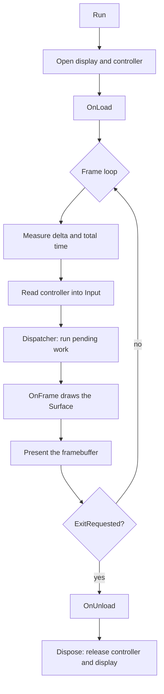

# Application

`SharpProspero.Application` is the layer that turns a module into a running program: a base class that owns the display, controller and frame loop, and a few plain-logic helpers for structuring the code that runs inside it. Everything on this page lives in `SharpProspero.Application`.

<details open markdown="block">
  <summary>On this page</summary>
  {: .text-delta }
- TOC
{:toc}
</details>

## The application host

`ProsperoApp` is the base class for a module. Derive from it, override `OnFrame`, and call `Run` from the module entry point. The base opens the display and the controller, drives a loop paced to the vertical blank, and tears everything down on exit.

```csharp
using SharpProspero.Application;
using SharpProspero.Graphics;
using SharpProspero.Interop.Pad;

internal sealed class Game : ProsperoApp
{
    protected override void OnFrame(FrameContext context)
    {
        Surface surface = context.Surface;
        surface.Clear(Color.FromRgb(0x10, 0x14, 0x1A));
        surface.DrawTextCentered("My Game", 480, 6, Color.White);

        if (context.Input.IsPressed(ScePadButton.Options))
            context.RequestExit();
    }
}

internal static class Program
{
    private static void Main()
    {
        using var app = new Game();
        app.Run();
    }
}
```

Three overridable methods bracket the run. Only `OnFrame` is required.

| Method | Called | Use it for |
| --- | --- | --- |
| `OnLoad` | once, after the display opens, before the first frame | load resources, build the interface, seed state |
| `OnFrame` | once per frame | read input, update state, draw into the framebuffer |
| `OnUnload` | once, after the loop ends, before teardown | release what `OnLoad` acquired |

Inside the class a few members are available while running: `Display` returns the open `DisplayDevice`, `GamePad` returns the controller (or null when none opened), and `Dispatcher` is the hand-off point a worker thread uses to apply a result back on the frame thread. `Config` exposes the settings the app started with.

{: .note }
> `OnUnload` runs even when a frame throws. The exception still propagates to the caller and `Dispose` releases the display and controller, but your own cleanup is not skipped on the way out.

## Startup settings

Pass an `AppConfig` to the constructor to change how the host starts; omit it for the defaults. The settings are read once, when `Run` opens the display and controller.

```csharp
using SharpProspero.Application;
using SharpProspero.Interop.VideoOut;

var app = new Game(new AppConfig
{
    Width = 1920,
    Height = 1080,
    BufferCount = 2,
    FlipMode = VideoOutFlipMode.VSync,
    HideSplashScreen = true,
    OpenGamePad = true,
});
app.Run();
```

| Setting | Default | Meaning |
| --- | --- | --- |
| `Width`, `Height` | `1920` x `1080` | framebuffer size in pixels |
| `BufferCount` | `2` | framebuffers in the swap chain |
| `UserId` | `SceUser.System` | the user the display and input open for |
| `FlipMode` | `VideoOutFlipMode.VSync` | flip timing used each frame |
| `HideSplashScreen` | `true` | remove the boot splash before the first frame |
| `OpenGamePad` | `true` | open a controller for `UserId` at startup |

When `OpenGamePad` is set but no controller is present, the host runs anyway and `GamePad` is null; `FrameContext.Input` reports the resting sample so per-frame code needs no special case.

## The frame context

`OnFrame` receives a `FrameContext`. One instance is reused across every frame, so the loop allocates nothing steady-state — read its fields, but do not hold a reference past the current frame.

| Member | What it carries |
| --- | --- |
| `Surface` | the framebuffer to draw this frame into |
| `FrameIndex` | zero-based frame counter since `Run` began |
| `DeltaSeconds` | seconds since the previous frame, measured at the vertical blank |
| `TotalSeconds` | seconds since `Run` began |
| `Input` | the latest controller sample |
| `PreviousInput` | the sample from the previous frame |
| `Dispatcher` | the hand-off point drained once per frame before `OnFrame` |

`DeltaSeconds` is the value to scale movement and animation by, so behavior stays the same whatever the frame rate. For a smooth clock, a cooldown or a fixed-step accumulator, feed it to the helpers in [Timing](timing.md).

The context also compares this frame's input against the last one, so button-edge handling needs no bookkeeping of your own:

```csharp
protected override void OnFrame(FrameContext context)
{
    if (context.Held(ScePadButton.Cross))
        Charge(context.DeltaSeconds);      // every frame the button is down

    if (context.Pressed(ScePadButton.Circle))
        Fire();                            // the frame it goes down

    if (context.Released(ScePadButton.Circle))
        Release();                         // the frame it comes up

    if (context.Pressed(ScePadButton.Options))
        context.RequestExit();
}
```

`RequestExit` sets a flag the loop checks after the frame is presented; the current frame still finishes and flips. `ExitRequested` reports whether it has been called.

## The frame lifecycle

`Run` opens the devices, calls `OnLoad`, then loops until a frame requests exit, and finally unwinds through `OnUnload` and `Dispose`. Each iteration measures the frame time, refreshes the input sample, drains any work handed back from a worker thread, calls `OnFrame`, and presents the framebuffer.



Because the loop reuses one context and draws into framebuffers allocated up front, a running application does not grow the heap each frame. Keep per-frame code free of allocation to hold that property; [Memory](memory.md) covers the heap ceiling and how to watch it.

## Structuring an app

Three helpers organize the code that runs inside the loop. None of them touch a device — they are plain logic you drive from `OnLoad` and `OnFrame`.

### States

`StateMachine<TState>` runs a program as a set of named states, one active at a time, each with optional work on entry, every frame, and exit — a menu, a level, a pause screen, a results page. Configure the states, `Start` in one, `Update` each frame, and `TransitionTo` another when something happens. The enter and exit callbacks stay paired, so a state always cleans up after itself.

```csharp
using SharpProspero.Application;

var game = new StateMachine<Screen>()
    .Configure(Screen.Menu, onUpdate: dt => { if (start) game.TransitionTo(Screen.Play); })
    .Configure(Screen.Play, onEnter: LoadLevel, onUpdate: Step, onExit: UnloadLevel);
game.Start(Screen.Menu);

// each frame:
game.Update(context.DeltaSeconds);
```

Transitioning to the active state does nothing; a `Transitioned` event reports the state left and the state entered. `Current` returns the active state and `IsRunning` whether `Start` has been called.

{: .warning }
> Call `TransitionTo` from a per-frame callback, not from an enter, exit or `Transitioned` callback. Starting a transition from inside one would leave the machine half-moved, so it is refused with an exception.

### Undo and redo

`CommandStack` gives an editor-style history. Run a change through `Execute` — either an `ICommand` or a do/undo pair of delegates — and it is performed and remembered; `Undo` and `Redo` walk the history, and a new change after an undo discards the redo branch.

```csharp
var history = new CommandStack();
history.Execute(() => item.Rename("new"), () => item.Rename("old"));
history.Undo(); // back to "old"
history.Redo(); // "new" again
```

The delegate pair is wrapped in a `DelegateCommand`; write your own `ICommand` when the do and undo need to share state. `CanUndo`, `CanRedo`, `UndoCount` and `RedoCount` drive interface elements, and `Limit` caps how many steps are kept — the oldest drop off past it.

For a run of small changes that should read as one step — typing characters, dragging a slider — implement `ICoalescingCommand`. When the command on top of the history absorbs the next one, the two collapse into a single undo.

```csharp
sealed class SetText : ICoalescingCommand
{
    private readonly TextBox _box;
    private readonly string _before;
    private string _after;

    public SetText(TextBox box, string before, string after)
    {
        _box = box;
        _before = before;
        _after = after;
    }

    public void Do() => _box.Text = _after;
    public void Undo() => _box.Text = _before;

    public bool TryCoalesceWith(ICommand next)
    {
        if (next is not SetText typed)
            return false;
        _after = typed._after; // fold the newer keystroke into this step
        return true;
    }
}
```

### Events

`EventHub` lets parts of an application talk without holding references to each other. A subscriber asks for a message type; a publisher sends one and every subscriber for that type receives it, synchronously, in subscription order. The message type is the channel, so unrelated messages stay separate.

```csharp
var events = new EventHub();
using IDisposable subscription = events.Subscribe<ScoreChanged>(m => hud.SetScore(m.Total));
events.Publish(new ScoreChanged(1200));

// a record makes a tidy message
public sealed record ScoreChanged(int Total);
```

Dispose the token from `Subscribe` to stop receiving; a handler may subscribe or unsubscribe while a message is being delivered without disturbing the one in flight. An exception a handler throws propagates to the publisher and stops the remaining handlers for that message, so keep handlers from throwing on the normal path.

## Where to go next

- [Timing](timing.md) — turn `DeltaSeconds` into clocks, cooldowns and a fixed timestep.
- [Threading](threading.md) — run work off the frame thread and hand results back through the `Dispatcher`.
- [Diagnostics](diagnostics.md) — logging and frame-time statistics for a running loop.
- [Input](input.md) — the full controller, keyboard and mouse surface behind `FrameContext.Input`.
- [Interface toolkit](ui.md) — build screens from controls instead of drawing them by hand.
