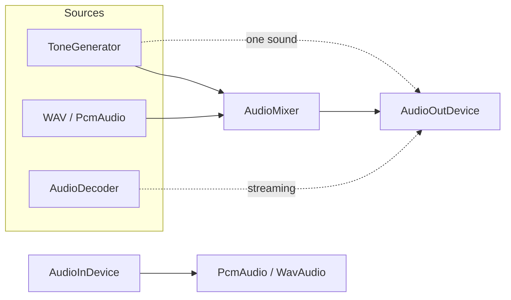

# Audio

`SharpProspero.Audio` holds what makes and captures sound: a stereo output device, a microphone, a mixer,
a decoder for compressed files, and a tone generator for effects with no file at all. Two pieces live
outside it: the AAC encoder in `SharpProspero.Platform` and the synthesis engine in
`SharpProspero.Interop.Audio`. Open a device once, then push or pull one block of 16-bit samples per
call. Each call blocks until its block plays or is captured, which paces the caller to the audio clock.

The pieces compose into one path from a sound source to the speakers, with the mixer in the middle when
more than one sound plays at once.



{: .note }
> Most applications use `AudioOutDevice` with an `AudioMixer`. The lower-level synthesis engine at the
> end of this page is for a custom voice-and-effects graph and is rarely needed.

<details open markdown="block">
  <summary>On this page</summary>
  {: .text-delta }
- TOC
{:toc}
</details>

## Play a block of sound

`AudioOutDevice` opens a stereo 16-bit output. Fill a buffer of `SamplesPerBlock` interleaved samples
(left, right, left, right, …) and push it; the push blocks until the block plays.

```csharp
using SharpProspero.Audio;

using var audio = AudioOutDevice.OpenStereo(grain: 256, sampleRate: 48000);
short[] block = new short[audio.SamplesPerBlock];
while (running)
{
    FillBlock(block);      // your synthesis or streaming
    audio.Output(block);
}
```

`OpenStereo` takes a grain, a sample rate and a user id. The grain is the frames per channel in one
block, a whole multiple of 256 from 256 to 2048, so `SamplesPerBlock` is twice it for stereo and `Grain`
reports the frame count. The main output takes 48000 or 192000 hertz and nothing else. Both arguments are
checked at the call and raise `ArgumentOutOfRangeException`, so resample a clip recorded at any other
rate before playing it. `SetVolume` sets both channels from 0 to `AudioOut.Volume0Db`. Disposing closes
the output.

{: .warning }
> `Output` blocks until the block has played, so a full audio loop paces itself to the hardware. Run it
> on its own thread rather than the frame thread — see [Threading](threading.md).

`LastOutputTime` reads the audio clock at the port's last output, so the difference between two readings
says how far the output has advanced — which is how a caller works out whether its own mixing is keeping
up. `GetPortState` reports where the samples are going and how many channels the destination takes;
watching its `RerouteCounter` catches the player moving from the television to a headset, which is when a
mix built for one speaker layout has to be rebuilt for another.

## Output that never blocks the caller

`AudioOutDevice` publishes no way to ask how much room its queue has left, so there is no telling in
advance whether a push will block. `AudioQueueDevice` is the output that does answer that. It reports how
many blocks are queued and how many more will fit, so a frame loop can mix exactly as much as the output
can take and never stall.

```csharp
using var audio = AudioQueueDevice.OpenStereo(grain: 256, sampleRate: 48000, queueDepth: 4);
short[] block = new short[audio.SamplesPerBlock];

// In the frame loop:
while (audio.FreeBlocks > 0)
{
    mixer.Fill(block);
    audio.TryOutput(block);
}
```

The queue holds `QueueDepth` blocks of `Grain` frames each. At 48 kHz a grain of 256 frames is about
5.3 ms, so a depth of two is roughly 11 ms of buffered audio and a depth of eight about 43 ms — deeper
survives a longer frame spike, shallower answers sooner. `QueuedBlocks` and `FreeBlocks` read one side
each; `ReadQueue` reads both in one call. `TryOutput` queues a block only if there is room and reports
whether it did; `Output` waits for room the way the blocking output does. `Gain` scales the port from 0
to 1.

This is a separate output path rather than a layer over `AudioOutDevice`, and an application uses one or
the other.

## Generate tones and effects

`ToneGenerator` fills those blocks with a simple tone or effect — a beep, an alert, a coin, a hit — with
no audio file. Set the wave, the pitch and the loudness; the phase carries across blocks, so a held tone
is continuous.

```csharp
using var audio = AudioOutDevice.OpenStereo();
var tone = new ToneGenerator { Waveform = Waveform.Square, Frequency = 880, Amplitude = 0.3f };
short[] block = new short[audio.SamplesPerBlock];
for (int i = 0; i < beepBlocks; i++)
{
    tone.Fill(block);
    audio.Output(block);
}
```

The `Waveform` values are `Sine`, `Square`, `Triangle`, `Sawtooth` and `Noise`. `Render(seconds)`
returns a whole short effect as one buffer instead of filling block by block, and `RenderClip(seconds)`
returns it as a `PcmAudio` ready for the mixer below. `Reset()` restarts the wave from the beginning of
its cycle.

`new ToneGenerator(sampleRate)` sets the rate every frequency is computed against, and `SampleRate`
reports it back. It defaults to 48000, so pass 192000 when the output was opened at that rate —
otherwise every tone plays two octaves high. `Render` and `RenderClip` size their buffers from the same
rate.

## Clips and WAV files

`PcmAudio` is a block of 16-bit PCM: the interleaved `Samples`, the `SampleRate`, and the `Channels`
count (1 or 2). It reports its `FrameCount` (samples per channel) and `DurationMilliseconds`. This is the
shape the output device and microphone use, so a clip loaded from a file is ready to play as-is.

`WavAudio` reads and writes 16-bit PCM WAV files with no system module, so a sound loads straight into
the shape the output plays and a recording writes straight back out.

```csharp
using SharpProspero.Audio;

PcmAudio clip = WavAudio.Load("/app0/assets/beep.wav");
// clip.FrameCount and clip.DurationMilliseconds describe it

// Save a recording:
WavAudio.Save("/data/recording.wav", new PcmAudio(recorded, 48000, 2));
```

`WavAudio.Decode` and `WavAudio.Encode` do the same over an in-memory buffer. Only uncompressed 16-bit
mono or stereo is handled, which is the format the output devices use, so what is read is always ready to
play. To hear a loaded clip, hand it to the `AudioMixer` below, which copes with any clip length; pushing
raw samples to `Output` needs a full `SamplesPerBlock` buffer.

## Compact sound effects (VAG)

A WAV is uncompressed, so a folder of effects is large. `VagAudio` reads and writes VAG - the four-bit
adaptive-differential form the console decodes for effects - about a quarter the size, and decodes to the
same `PcmAudio` so it plays through the mixer exactly like a WAV.

```csharp
PcmAudio hit = VagAudio.Load("/app0/assets/hit.vag");   // decodes to PCM ready to play
mixer.Play(hit);

VagAudio.Save("/data/effect.vag", clip);                 // encode a clip to VAG
```

`VagAudio.Decode` and `VagAudio.Encode` work over an in-memory buffer, and `Encode` and `Save` take an
optional name of up to 15 ASCII characters written into the clip header. Encoding closes a clip with the
block per channel that marks where its sound stops, and decoding stops at that mark, so a decoded clip
runs to its original length rounded up to a whole 28-sample block and no further: no full-scale step at
the end, and nothing that plays on into whatever follows it. Convert assets ahead of time on your machine
with the toolchain's `vag` command (`vag --input hit.wav --output hit.vag [--name hit]`, and back again),
so an application ships small VAG effects and loads them straight to the mixer.

## Preparing a clip

`AudioClip` reshapes a `PcmAudio` once at load time so it is ready to play: `Resample` changes the sample
rate (linear interpolation), `ToMono` and `ToStereo` change the channel count, `Gain` and `Normalize`
adjust the level, `Concat` joins two clips, and `Trim` cuts a range out. Each returns a new clip.

```csharp
PcmAudio clip = WavAudio.Load("/app0/assets/theme.wav");
clip = AudioClip.Normalize(AudioClip.Resample(clip, 48000)); // match the output rate, even out the level
```

## Shape a sound with a filter

`BiquadFilter` is a two-pole filter for tone shaping — soften a harsh effect, isolate a band, or remove a
hum. Pick a shape (`LowPass`, `HighPass`, `BandPass`, `Notch`), a sample rate and a frequency; a higher
`q` narrows the band. It keeps its state between calls, so a stream filters continuously. `Process` takes
one sample; `ProcessBlock` filters a block of 16-bit samples in place, all of them from one channel.
`Reset` clears the memory, and `Configure` re-tunes without building a new filter. A mixer block
interleaves left and right, so it needs one filter per channel, driven sample by sample with `Process`.

```csharp
var left = new BiquadFilter(BiquadType.LowPass, 48000, frequency: 1200);
var right = new BiquadFilter(BiquadType.LowPass, 48000, frequency: 1200);
short[] block = new short[audio.SamplesPerBlock];
while (running)
{
    mixer.Mix(block);
    for (int i = 0; i < block.Length; i += 2)   // left, right, left, right
    {
        block[i] = (short)Math.Clamp(MathF.Round(left.Process(block[i])), short.MinValue, short.MaxValue);
        block[i + 1] = (short)Math.Clamp(MathF.Round(right.Process(block[i + 1])), short.MinValue, short.MaxValue);
    }
    audio.Output(block);                        // everything above 1.2 kHz is muffled
}
```

## Give a note a swell and fade

`AdsrEnvelope` is the volume shape of a note: it rises over the attack, falls to the sustain level over
the decay, holds while the note is down, then fades to silence over the release. Multiply a voice by
`Level` each frame so it swells in and fades out instead of clicking on and off. Times are in seconds and
`Sustain` is a level from 0 to 1. Call `NoteOn` when the key goes down and `NoteOff` when it lifts;
`Process(deltaSeconds)` advances it and returns the new level, and `IsActive` is false once it goes idle.
`Phase` reports which `EnvelopePhase` it is in — idle, attack, decay, sustain or release — and `Reset`
silences it at once with no release, to steal a voice.

```csharp
var env = new AdsrEnvelope { Attack = 0.02f, Decay = 0.1f, Sustain = 0.6f, Release = 0.3f };
env.NoteOn();
// each frame:
float gain = env.Process(1f / 60f);
short shaped = (short)(sample * gain);
```

## Mix several sounds at once

`AudioMixer` plays music under a run of effects, effects overlapping. Start a clip with `Play`, then fill
each block from `Mix` instead of the device directly. A mono clip is spread to both channels, and a clip
recorded at another rate is retuned to the mixer's, so a sound from anywhere — a WAV, a `ToneGenerator`
effect — plays at the right pitch; finished sounds drop out on their own.

```csharp
using var audio = AudioOutDevice.OpenStereo();
var mixer = new AudioMixer();
mixer.Play(WavAudio.Load("/app0/music.wav"), volume: 0.6f, loop: true);
var coin = new ToneGenerator { Waveform = Waveform.Square, Frequency = 988 }.RenderClip(0.08);

short[] block = new short[audio.SamplesPerBlock];
while (running)
{
    mixer.Mix(block);      // overwrites the block with the mix of every playing sound
    audio.Output(block);
    if (collected)
        mixer.Play(coin);  // layered over the music
}
```

`MasterVolume` scales everything, `MaxVoices` caps how many play at once (the oldest drops to make room),
`ActiveVoices` reports how many are playing, and `StopAll` clears them. Construct the mixer with the same
sample rate as the output device (48000 by default) so its output pushes straight through.

## Capture the microphone

`AudioInDevice` captures 16-bit samples from the microphone for a voice recorder, a level meter, or
speech input. It mirrors the output side: open the device for a signed-in user, then pull one block per
call, each call blocking until a block is captured.

```csharp
using SharpProspero.Audio;
using SharpProspero.Platform;

using var mic = AudioInDevice.OpenMicrophone(Users.InitialUserId);
short[] block = new short[mic.SamplesPerBlock];
while (recording)
{
    mic.Read(block);
    // append the block to a buffer, measure its level, or feed it onward
}
```

`Users.InitialUserId` is the user who started the application; pass an entry of `Users.LoggedInUserIds`
to capture for another profile — see [System information](system.md).

`OpenMicrophone` defaults to a mono 16 kHz capture with a 256-sample grain. The grain is
`AudioIn.Grain128` or `AudioIn.Grain256`, the sample rate `AudioIn.Freq16k` or `AudioIn.Freq48k`, and
`stereo: true` selects two channels. `type` picks the purpose: `AudioInType.General` for recording and
analysis, `AudioInType.VoiceChat` for chat, with the system's voice processing applied. The open checks
none of them, so a value the system refuses arrives as a `ProsperoException`. `Grain` and `Channels` give
back what the capture opened with, and `SamplesPerBlock` is their product. `IsSilent` reports when the
input is muted at the hardware or by the system. Pair it with `WavAudio.Save` to write the captured
blocks to a file.

## Decode compressed audio

`AudioDecoder`, also in `SharpProspero.Audio`, turns compressed audio into the samples an output device
takes, so an application drives playback itself — a music player, a sound bank, or anything that wants the
samples. It reads MPEG-1/2 Audio Layer III and MPEG-4 Advanced Audio Coding.

Hand it a run of bytes and it finds the frame, reports how many bytes it used, and writes the sound.
`AudioDecodeResult` carries that pair: `BytesConsumed` from the input and `BytesProduced` to the output.
Advance by the consumed count and call again.

```csharp
using SharpProspero.Audio;
using SharpProspero.Modules;
using SharpProspero.Interop.Sysmodule;
using System.Runtime.InteropServices;

using var audioDec = SystemModule.Load(SystemModuleId.AudioDec);

using var decoder = AudioDecoder.CreateMp3();
using var device = AudioOutDevice.OpenStereo();

byte[] pcm = new byte[decoder.SuggestedOutputSize];
short[] block = new short[device.SamplesPerBlock];
int pending = 0;                                     // samples held over from the last frame
int read = 0;
while (read < file.Length)
{
    AudioDecodeResult step = decoder.Decode(file.AsSpan(read), pcm);
    if (step.BytesConsumed == 0)
        break;                                       // needs more input than is left
    read += step.BytesConsumed;

    ReadOnlySpan<short> decoded = MemoryMarshal.Cast<byte, short>(pcm.AsSpan(0, step.BytesProduced));
    while (pending + decoded.Length >= block.Length)  // push whole blocks
    {
        int take = block.Length - pending;
        decoded[..take].CopyTo(block.AsSpan(pending));
        device.Output(block);
        decoded = decoded[take..];
        pending = 0;
    }
    decoded.CopyTo(block.AsSpan(pending));            // the tail waits for the next frame
    pending += decoded.Length;
}
```

One decode call produces several output blocks: a Layer III frame carries up to 1152 samples a channel,
so 2304 interleaved samples against the 512 a 256-sample grain plays. `Output` plays exactly
`SamplesPerBlock` samples and ignores anything past them, so hold what comes out and push whole blocks.
The decoder writes at the rate the file carries, which the output takes only at 48000 or 192000;
resample anything else first, as `AudioClip.Resample` does for a clip.

| Member | What it does |
|---|---|
| `CreateMp3(wordSize)` | A decoder for Layer III, writing signed 16-bit samples by default. |
| `CreateAac(maxChannels, selfDescribingFrames, highEfficiency, wordSize)` | A decoder for Advanced Audio Coding; the default suits a file whose frames carry their own header. |
| `Decode(input, output)` | Decode one frame; returns the bytes consumed and produced. |
| `Reset()` | Drop what the decoder carried between frames, after seeking. |
| `SuggestedOutputSize` | A comfortable output buffer size for one call. |
| `SampleRate`, `ChannelCount` | What an Advanced Audio Coding decoder reported, once a frame has been read. A Layer III decoder leaves both at zero. |

{: .important }
> Load the codec's system module before creating a decoder, as the snippet does with
> `SystemModule.Load(SystemModuleId.AudioDec)`. A consumed count of zero means the remaining input holds
> no complete frame, so stop and read more.

To play a whole file rather than manage the samples yourself, use `MediaPlayer` on the [Media](media.md)
page instead.

## Encode to AAC

`AacEncoder`, in `SharpProspero.Platform`, compresses 16-bit or floating-point PCM into AAC-LC, one
1024-sample frame at a time, for a recording or an export. Create it for a channel count and bit rate,
feed it frames, and flush at the end.

```csharp
using SharpProspero.Platform;
using SharpProspero.Interop.Audio;

using var encoder = AacEncoder.Create(channels: 2, bitRate: 128000);
var block = new byte[M4aacEnc.MaxOutputBufferSize];
foreach (ReadOnlyMemory<byte> frame in frames)            // 1024 samples per channel each
{
    int written = encoder.Encode(frame.Span, block);
    output.Write(block, 0, written);
}
output.Write(block, 0, encoder.Flush(block));             // any trailing block
```

The bit rate runs from `M4aacEnc.MinBitRate` (28000) to `M4aacEnc.MaxBitRate` (320000) bits per second,
the channel count is 1 or 2, and the sample rate is 48 kHz; any other value raises
`ArgumentOutOfRangeException`. `Create` also takes an input format, `M4aacEncInputFormat.Signed16` or
`.Float`, and an output format defaulting to `M4aacEncOutputFormat.AacLcAdts`, so every frame carries its
own header; `M4aacEncOutputFormat.AacLcRaw` omits it. `Channels` reports what the encoder was created
for, `ClearContext` drops the inter-frame state to restart a stream, and disposing releases the encoder.
`Create`, `Encode` and `Flush` throw `AudioEncodeException`, which carries the `ResultCode` and
`InternalError` the encoder returned.

## Advanced synthesis and mixing

For a custom voice-and-effects graph, `SharpProspero.Interop.Audio.Ngs2` binds the synthesis and mixing
engine directly. A system owns racks, a rack owns voices that play waveforms, and a render pass mixes
them into an output buffer. Build it in this order:

| Call | What it does |
|---|---|
| `sceNgs2SystemResetOption` | Fills an option block with its defaults; change the fields you need, then pass it to the next two calls. |
| `sceNgs2SystemQueryBufferSize` | Reports the memory a system with those options needs. |
| `sceNgs2SystemCreate` | Creates the system in that buffer and returns its handle. |
| `sceNgs2RackQueryBufferSize`, `sceNgs2RackCreate` | Add a rack of one kind from `Ngs2RackId` - `Sampler`, `Submixer`, `Reverb` or `Mastering`. |
| `sceNgs2RackGetVoiceHandle` | Returns the handle of one voice in a rack, by index. |
| `sceNgs2VoiceControl`, `sceNgs2VoiceRunCommands` | Apply a parameter list or a batch of commands to a voice, which is what starts it playing. |
| `sceNgs2SystemRender` | Mixes every voice into the buffers a `SceNgs2RenderBufferInfo` describes. |

Handles are opaque integers. The sized option and command structures are pointers the caller builds: the
matching reset-option call gives each one its defaults, and the query-info calls report the fields and
sizes. Set `SceNgs2RenderBufferInfo.WaveformType` to `Ngs2WaveformType.PcmI16L` and `NumChannels` to 2 so
the rendered block goes straight to `AudioOutDevice.Output`.

Reach for this only when the `AudioMixer` above is not enough. The encoders' lower-level bindings,
`M4aacEnc` and `At9Enc`, sit alongside it for finer control, and the spatial-audio and audio-job bindings
are listed on the [Bindings](bindings.md) page.

### Placing a sound in a scene

The same class carries the calls that turn a listener and a source into the pitch and per-speaker levels
a voice is then driven with:

| Call | What it does |
|---|---|
| `sceNgs2GeomResetListenerParam`, `sceNgs2GeomResetSourceParam` | Fill a listener or a source with its defaults. |
| `sceNgs2GeomCalcListener` | Turns the listener's placing into the working form the next call takes. Do this once a frame. |
| `sceNgs2GeomApply` | Works out what one source sounds like to that listener, into a `SceNgs2GeomAttribute`. |

`SceNgs2GeomAttribute.PitchRatio` goes to the voice's pitch and `Level` to its volume matrix. Choose what
is worked out with `Ngs2GeomApplyFlags`; `Default` covers everything but the ambisonic form.

Without a scene, `sceNgs2PanInit` and `sceNgs2PanGetVolumeMatrix` do the same from an angle and a
distance per source. Prepare the workspace once with where the speakers sit, then ask for the levels.

`sceNgs2ReportRegisterHandler` is the only channel a rejected rack or voice parameter is described
through - the call that made it answers a single number - so register a handler for
`Ngs2ReportType.Message` while bringing a graph up.

## Object-based output

`SharpProspero.Interop.Audio.AudioOut2` is the other output path, and an alternative to `AudioOutDevice`
rather than a layer over it. A context holds a pool of ports and a queue; a port carries one stream of
samples into a mix, and a port opened as an object is placed in space rather than fed to fixed channels.

| Call | What it does |
|---|---|
| `sceAudioOut2Initialize` | Starts the service. |
| `sceAudioOut2ContextResetParam`, `sceAudioOut2ContextQueryMemory` | Fill a context description with its defaults and report the memory it needs. |
| `sceAudioOut2ContextCreate` | Creates the context in that memory. |
| `sceAudioOut2PortCreate` | Opens a port of one `AudioOut2PortType`; the `Object` types are the placeable ones. |
| `sceAudioOut2PortSetAttributes` | Supplies the samples and, for an object port, where it sits. |
| `sceAudioOut2ContextAdvance`, `sceAudioOut2ContextPush` | Move to the next block and hand it to the output. |

Samples and placing both arrive through the attribute list, so a frame is: set the attributes on each
port, advance the context, push it. `sceAudioOut2GetSpeakerInfo` reports what the machine is playing
through, and the speaker-array calls work out per-speaker levels for a source placed in space.
