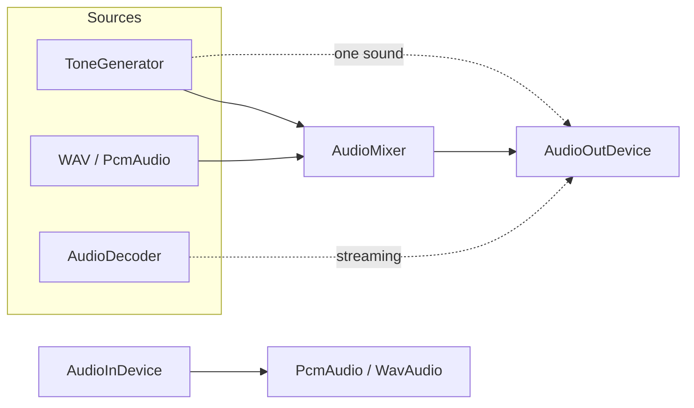

# Audio

Everything that makes or captures sound lives in `SharpProspero.Audio`: a stereo output device, a
microphone, a mixer, a decoder for compressed files, and a tone generator for effects with no file at
all. Open a device once, then push or pull one block of 16-bit samples per call. Each call blocks until
its block plays or is captured, which paces the caller to the audio clock.

The pieces compose into one path from a sound source to the speakers, with the mixer in the middle when
more than one sound plays at once.



{: .note }
> Most applications use `AudioOutDevice` with an `AudioMixer`. The lower-level synthesis engine at the
> end of this page is for a custom voice-and-effects graph and is rarely needed.

## Play a block of sound

`AudioOutDevice` opens a stereo 16-bit output. Fill a buffer of `SamplesPerBlock` interleaved samples
(left, right, left, right, …) and push it; the push blocks until the block plays.

```csharp
using SharpProspero.Audio;

using var audio = AudioOutDevice.OpenStereo(grain: 256, sampleRate: 48000);
short[] block = new short[audio.SamplesPerBlock];
while (running)
{
    FillBlock(block);      // your synthesis or streaming
    audio.Output(block);
}
```

`OpenStereo` takes a grain (samples per block, 256 to 2048) and a sample rate. `SetVolume` sets both
channels from 0 to `AudioOut.Volume0Db`. Disposing closes the output.

{: .warning }
> `Output` blocks until the block has played, so a full audio loop paces itself to the hardware. Run it
> on its own thread rather than the frame thread — see [Threading](threading.md).

## Generate tones and effects

`ToneGenerator` fills those blocks with a simple tone or effect — a beep, an alert, a coin, a hit — with
no audio file. Set the wave, the pitch and the loudness; the phase carries across blocks, so a held tone
is continuous.

```csharp
using var audio = AudioOutDevice.OpenStereo();
var tone = new ToneGenerator { Waveform = Waveform.Square, Frequency = 880, Amplitude = 0.3f };
short[] block = new short[audio.SamplesPerBlock];
for (int i = 0; i < beepBlocks; i++)
{
    tone.Fill(block);
    audio.Output(block);
}
```

The `Waveform` values are `Sine`, `Square`, `Triangle`, `Sawtooth` and `Noise`. `Render(seconds)`
returns a whole short effect as one buffer instead of filling block by block, and `RenderClip(seconds)`
returns it as a `PcmAudio` ready for the mixer below. `Reset()` restarts the wave from the beginning of
its cycle.

## Clips and WAV files

`PcmAudio` is a block of 16-bit PCM: the interleaved `Samples`, the `SampleRate`, and the `Channels`
count (1 or 2). It reports its `FrameCount` (samples per channel) and `DurationMilliseconds`. This is the
shape the output device and microphone use, so a clip loaded from a file is ready to play as-is.

`WavAudio` reads and writes 16-bit PCM WAV files with no system module, so a sound loads straight into
the shape the output plays and a recording writes straight back out.

```csharp
using SharpProspero.Audio;

PcmAudio clip = WavAudio.Load("/app0/assets/beep.wav");
// clip.FrameCount and clip.DurationMilliseconds describe it

// Save a recording:
WavAudio.Save("/data/recording.wav", new PcmAudio(recorded, 48000, 2));
```

`WavAudio.Decode` and `WavAudio.Encode` do the same over an in-memory buffer. Only uncompressed 16-bit
mono or stereo is handled, which is the format the output devices use, so what is read is always ready to
play. To hear a loaded clip, hand it to the `AudioMixer` below, which copes with any clip length; pushing
raw samples to `Output` needs a full `SamplesPerBlock` buffer.

## Mix several sounds at once

`AudioMixer` plays music under a run of effects, effects overlapping. Start a clip with `Play`, then fill
each block from `Mix` instead of the device directly. A mono clip is spread to both channels, and a clip
recorded at another rate is retuned to the mixer's, so a sound from anywhere — a WAV, a `ToneGenerator`
effect — plays at the right pitch; finished sounds drop out on their own.

```csharp
using var audio = AudioOutDevice.OpenStereo();
var mixer = new AudioMixer();
mixer.Play(WavAudio.Load("/app0/music.wav"), volume: 0.6f, loop: true);
var coin = new ToneGenerator { Waveform = Waveform.Square, Frequency = 988 }.RenderClip(0.08);

short[] block = new short[audio.SamplesPerBlock];
while (running)
{
    mixer.Mix(block);      // overwrites the block with the mix of every playing sound
    audio.Output(block);
    if (collected)
        mixer.Play(coin);  // layered over the music
}
```

`MasterVolume` scales everything, `MaxVoices` caps how many play at once (the oldest drops to make room),
`ActiveVoices` reports how many are playing, and `StopAll` clears them. Construct the mixer with the same
sample rate as the output device (48000 by default) so its output pushes straight through.

## Capture the microphone

`AudioInDevice` captures 16-bit samples from the microphone for a voice recorder, a level meter, or
speech input. It mirrors the output side: open the device for a signed-in user, then pull one block per
call, each call blocking until a block is captured.

```csharp
using SharpProspero.Audio;

using var mic = AudioInDevice.OpenMicrophone(userId);
short[] block = new short[mic.SamplesPerBlock];
while (recording)
{
    mic.Read(block);
    // append the block to a buffer, measure its level, or feed it onward
}
```

`OpenMicrophone` defaults to a mono 16 kHz capture; pass `stereo: true` or a different grain and sample
rate to change it. `IsSilent` reports when the input is muted at the hardware or by the system. Pair it
with `WavAudio.Save` to write the captured blocks to a file.

## Decode compressed audio

`AudioDecoder`, also in `SharpProspero.Audio`, turns compressed audio into the samples an output device
takes, so an application drives playback itself — a music player, a sound bank, or anything that wants the
samples. It reads MPEG-1/2 Audio Layer III and MPEG-4 Advanced Audio Coding.

Hand it a run of bytes and it finds the frame, reports how many bytes it used, and writes the sound.
`AudioDecodeResult` carries that pair: `BytesConsumed` from the input and `BytesProduced` to the output.
Advance by the consumed count and call again.

```csharp
using SharpProspero.Audio;
using SharpProspero.Modules;
using SharpProspero.Interop.Sysmodule;
using System.Runtime.InteropServices;

SystemModule.Load(SystemModuleId.AudioDec);

using var decoder = AudioDecoder.CreateMp3();
using var device = AudioOutDevice.OpenStereo();

byte[] pcm = new byte[decoder.SuggestedOutputSize];
int read = 0;
while (read < file.Length)
{
    AudioDecodeResult step = decoder.Decode(file.AsSpan(read), pcm);
    if (step.BytesConsumed == 0)
        break;                                   // needs more input than is left
    read += step.BytesConsumed;
    device.Output(MemoryMarshal.Cast<byte, short>(pcm.AsSpan(0, step.BytesProduced)));
}
```

| Member | What it does |
|---|---|
| `CreateMp3(wordSize)` | A decoder for Layer III, writing signed 16-bit samples by default. |
| `CreateAac(maxChannels, selfDescribingFrames, highEfficiency, wordSize)` | A decoder for Advanced Audio Coding; the default suits a file whose frames carry their own header. |
| `Decode(input, output)` | Decode one frame; returns the bytes consumed and produced. |
| `Reset()` | Drop what the decoder carried between frames, after seeking. |
| `SuggestedOutputSize` | A comfortable output buffer size for one call. |
| `SampleRate`, `ChannelCount` | What the decoder reported, once a frame has been read. |

{: .important }
> Load the codec's system module before creating a decoder, as the snippet does with
> `SystemModule.Load(SystemModuleId.AudioDec)`. A consumed count of zero means the remaining input holds
> no complete frame, so stop and read more.

To play a whole file rather than manage the samples yourself, use `MediaPlayer` on the [Media](media.md)
page instead.

## Encode to AAC

`AacEncoder`, in `SharpProspero.Platform`, compresses 16-bit or floating-point PCM into AAC-LC, one
1024-sample frame at a time, for a recording or an export. Create it for a channel count and bit rate,
feed it frames, and flush at the end.

```csharp
using SharpProspero.Platform;
using SharpProspero.Interop.Audio;

using var encoder = AacEncoder.Create(channels: 2, bitRate: 128000);
var block = new byte[M4aacEnc.MaxOutputBufferSize];
foreach (ReadOnlyMemory<byte> frame in frames)            // 1024 samples per channel each
{
    int written = encoder.Encode(frame.Span, block);
    output.Write(block, 0, written);
}
output.Write(block, 0, encoder.Flush(block));             // any trailing block
```

The bit rate runs from `M4aacEnc.MinBitRate` to `M4aacEnc.MaxBitRate` at a 48 kHz sample rate.
`ClearContext` drops the encoder's inter-frame state to restart a stream, and disposing releases the
encoder.

## Advanced synthesis and mixing

For a custom multi-voice graph with effects, `SharpProspero.Interop.Audio.Ngs2` binds the synthesis and
mixing engine directly: a system owns racks (sampler, submixer, reverb, mastering), a rack owns voices
that play waveforms, and a render pass mixes them into an output buffer. It works in a buffer the caller
sizes with the query-buffer-size calls; handles are opaque, and the option and command structures are
built against the reset-option and query-info calls. Reach for it only when the `AudioMixer` above is not
enough; the encoders' lower-level bindings (`M4aacEnc` and `At9Enc`) sit alongside it for finer control.
