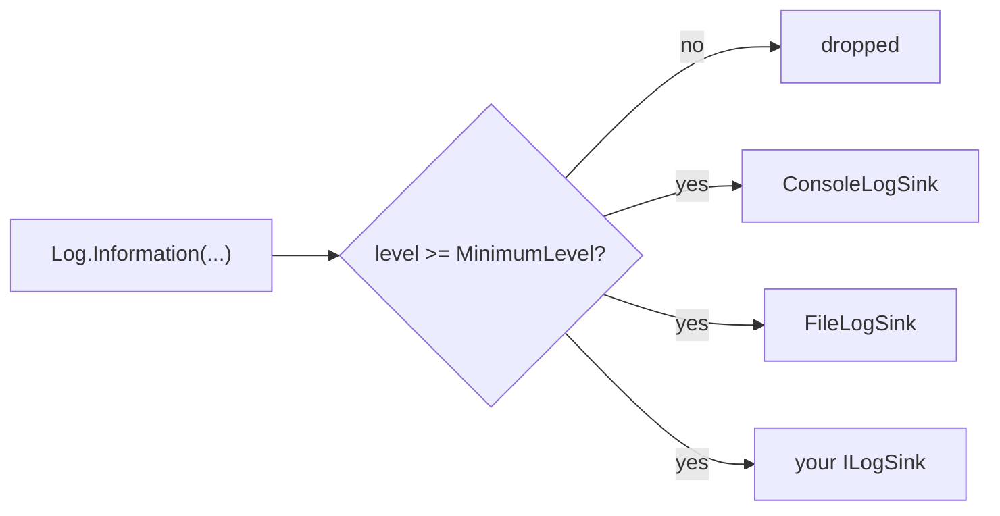

# Diagnostics

Two small facilities in `SharpProspero.Diagnostics` help a module report on itself while it runs: a leveled log that fans messages out to one or more sinks, and a frame-rate tracker that reports the pace a build is holding.

## Logging

`Log` is a static facility: pick a minimum level, add one or more sinks, and write leveled messages. A message below the minimum level, or a message written when no sink is attached, costs almost nothing. Logging never throws, so a failing sink cannot bring the module down.

```csharp
using SharpProspero.Diagnostics;

Log.MinimumLevel = LogLevel.Debug;
Log.AddSink(FileLogSink.Open("/data/app.log"));   // appends lines to a file
Log.AddSink(new ConsoleLogSink());                // and to the development console

Log.Information("started");
Log.Error($"load failed: 0x{code:X8}");
```

Each message runs through the level filter once, then fans out to every attached sink:



The five write methods each carry a level: `Log.Trace`, `Log.Debug`, `Log.Information`, `Log.Warning` and `Log.Error`. There is no `Log.Info` — the information-level method is `Log.Information`. `Log.Write(level, message)` takes the level as an argument when you need to choose it at run time.

{: .note }
> The default `MinimumLevel` is `LogLevel.Information`, so `Trace` and `Debug` lines are dropped until you lower it. `AddSink`, `RemoveSink` and `ClearSinks` manage the destination list.

### Levels

`LogLevel` orders messages from most to least detailed. A message is written only when its level is at or above `MinimumLevel`.

| Level | Meaning |
| --- | --- |
| `Trace` | Fine-grained detail, off by default. |
| `Debug` | Diagnostic detail for development. |
| `Information` | Normal progress. |
| `Warning` | Something unexpected that the module handled. |
| `Error` | A failure. |
| `None` | Set as `MinimumLevel` to turn logging off entirely. |

### Sinks

A sink is a destination for log lines. Implement `ILogSink` to send messages wherever you like — over the network, into an on-screen overlay, into a ring buffer. The single method is `void Write(LogLevel level, string message)`, and an implementation should not throw.

```csharp
public interface ILogSink
{
    void Write(LogLevel level, string message);
}
```

Two sinks come ready to use. `ConsoleLogSink` writes each line to standard output, which appears on the development console when one is attached; it needs no file and no setup, so it is a convenient default while you work. `FileLogSink` appends lines to a file that a user can read back after a run.

```csharp
using SharpProspero.Diagnostics;

var log = FileLogSink.Open("/data/app.log");   // created if absent, opened for append
Log.AddSink(log);
// ... run ...
log.Dispose();                                  // closes the file at shutdown
```

`FileLogSink.Open` creates the file if it is absent and opens it for appending, so a log survives across runs until the file is removed. It throws if the file cannot be opened, and it implements `IDisposable`; dispose it at shutdown to close the file. Every sink formats a line the same way, as `HH:mm:ss.fff LVL message`, where `LVL` is the three-letter tag `TRC`, `DBG`, `INF`, `WRN` or `ERR`.

## Frame statistics

`FrameStats` tracks how long recent frames took and reports the frame rate and the frame time, so a build can show whether it is holding its pace. Feed it the time since the last frame, then read the figures or draw the readout and a small graph over the screen.

```csharp
using SharpProspero.Diagnostics;

var stats = new FrameStats();          // rolling window of the most recent 120 frames

// each frame:
stats.Record((float)context.DeltaSeconds);
// after drawing the screen:
stats.Draw(surface, 20, 20, scale: 2, Color.White);
stats.DrawGraph(surface, 20, 60, 240, 60, Color.FromRgb(90, 160, 255));
```

The constructor takes an optional `window` (120 frames by default, at least two): the figures follow a rolling window of that many recent frames rather than the whole run. `Record(deltaSeconds)` adds one frame; a zero or negative delta is ignored. `Reset()` clears the window back to empty, and `SampleCount` reports how many frames it currently holds.

`Fps` comes from the mean frame time. `LastMs`, `AvgMs`, `MinMs` and `MaxMs` report the window in milliseconds. Because a mean hides the occasional stutter, two members expose the slow tail: `PercentileMs(95f)` gives the time all but the slowest five percent of frames came in under, and `OnePercentLowFps` turns the ninety-ninth-percentile frame time into a rate — the pace a player feels during the worst frames.

{: .tip }
> Compare `Fps` against `OnePercentLowFps`. A wide gap between the two means the average is smooth but the build is stuttering, which the average alone will not show you.

`Draw` writes a one-line readout of the rate and the frame time to a [2D surface](graphics.md) at a position and scale. `DrawGraph` draws a sparkline of the recent frame times, oldest at the left, scaled so a slow frame stands out against a flat low line; pass an optional border colour to frame it. Both take a `Surface` and colours from `SharpProspero.Graphics`.

For the clocks and timers that drive a frame loop, see [Timing](timing.md); to move work that would stall a frame onto another thread, see [Threading](threading.md).
