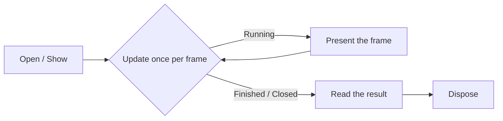

# Dialogs and overlays

The system overlays — message boxes, the error box, the on-screen keyboard, the browser, and the save
picker — draw on top of the running application and are driven from the frame loop: open one, advance
it once per frame while you keep presenting, then read the result and dispose it. They all live in
`SharpProspero.Platform`. Toast notifications are the exception: they fire and forget.

<details open markdown="block">
  <summary>On this page</summary>
  {: .text-delta }
- TOC
{:toc}
</details>

## The shared lifecycle

Every overlay dialog on this page follows the same shape. Opening it brings the shared dialog subsystem
up, loads the dialog's own module, and starts the dialog, in that order. From there you call `Update`
once per frame and keep presenting the display, because the dialog only advances when you pump it. When
`Update` reports the dialog has closed, you read its outcome. Disposing closes the dialog if it is still
open, shuts it down, and unloads the module.



{: .important }
> A dialog that you stop updating never closes, and the frame stops presenting, so the whole
> application looks frozen. Keep the `Update` and present calls running until the dialog reports it is
> done, and wrap the object in `using` so it always tears down.

## Message dialogs

`MessageDialog` shows either a message with buttons or a progress bar the application drives. The
progress bar is what a package installer shows while it works.

Drive a progress bar with `SetProgress` (0 to 100), and change its caption at any time with
`SetProgressMessage`:

```csharp
using var progress = MessageDialog.ShowProgress("Installing...");
while (installing)
    progress.SetProgress(percentDone);
```

Ask a question with `ShowMessage` and a `MessageDialogButtons` value — `Ok`, `YesNo`, or `OkCancel`.
Poll `Update` until it returns `MessageDialogState.Finished`, then read `ChosenButton`:

```csharp
using var ask = MessageDialog.ShowMessage("Delete this file?", MessageDialogButtons.YesNo);
while (ask.Update() == MessageDialogState.Running)
    display.Present();
bool yes = ask.ChosenButton == MsgDialogButtonId.Ok;   // OK and Yes share the first button
```

`ChosenButton` is a `MsgDialogButtonId` (from `SharpProspero.Interop.Dialog`); its `Ok` value is the
first button, which stands in for both OK and Yes, and `No` is the second. `MessageDialogState` has just
two members, `Running` and `Finished`.

| Member | What it does |
|---|---|
| `ShowMessage(text, buttons, userId)` | Open a message with a button set and wait for a choice. |
| `ShowProgress(caption, userId)` | Open a progress bar the application drives. |
| `SetProgress(percent)` | Move the bar to 0-100 (clamped). |
| `SetProgressMessage(message)` | Replace the caption shown with the bar. |
| `Update()` | Advance the dialog and report `Running` or `Finished`. |
| `ChosenButton` | The button the user picked, once finished. |

## Error dialogs

`ErrorDialog` presents the console's own message for an error code, so a utility reports a failure the
way the system does rather than inventing its own wording. Show it for the code, then poll until it
closes.

```csharp
using var dialog = ErrorDialog.Show(errorCode);
while (dialog.Update() != ErrorDialogState.Closed)
    display.Present();
```

`Show` takes the integer error code and an optional user id. `Update` returns
`ErrorDialogState.Running` or `ErrorDialogState.Closed`.

## Text input

`TextInputDialog` shows the on-screen keyboard and hands back what the user typed. This is the input
surface a file explorer, browser, or any interactive utility needs to let the user type. Open it, poll
until it closes, then read the text.

```csharp
using var input = TextInputDialog.Open("Enter a name", maxLength: 64);
while (input.Update() == TextInputState.Running)
    display.Present();
if (input.EndStatus == ImeDialogEndStatus.Ok)
    Use(input.Text);
```

`Open` centres the keyboard on screen. `maxLength` runs from 1 to 2048 characters. Pass an `ImeType`
to choose the layout (`Url` for a web address, and so on), a `placeholder` hint, an `initialText`
value, or `ImeOption.Password` to mask the field. Poll `Update` until it returns
`TextInputState.Finished`, then check `EndStatus`: `ImeDialogEndStatus.Ok` means the user accepted the
text, which `Text` then returns. `Text` is empty until the keyboard finishes and empty when the user
cancelled. Defaulting `userId` picks the signed-in user.

{: .tip }
> A key on a USB keyboard is a position, not a letter. To read typed characters directly from a
> physical keyboard instead of the on-screen one, see the keyboard input surface and its keycode
> converter under [Input](input.md).

## The web browser

`WebBrowser` opens the system browser over the running application. Open it for an address, then poll
until it closes.

```csharp
using var browser = WebBrowser.Open("https://example.com");
while (browser.Update() != WebBrowserState.Closed)
    display.Present();
int result = browser.Result();
```

`Update` returns `WebBrowserState.Running` or `WebBrowserState.Closed`. Once closed, `Result` reads the
browser's result code. `Open` takes the URL and an optional user id.

## The save picker

`SaveDataPicker` shows the on-screen list of a user's saves so the player can pick one, and reports
which they chose. It reads a bit differently from the others: poll `TryGetResult`, which returns
`false` while the dialog is still running and `true` once it finishes, setting the chosen directory (or
null when the user backed out).

```csharp
using var picker = SaveDataPicker.OpenList(userId);
while (!picker.TryGetResult(out string? directory))
    display.Present();
if (directory is not null)
    Mount(directory);
```

`OpenList` takes the user id and a `SaveDataDialogType` (defaulting to `Load`; `Save` and `Delete`
change the wording). The `Status` property exposes the underlying `CommonDialogStatus` if you would
rather watch the state directly. This picker only chooses a save; mounting the chosen directory and
reading its files is the programmatic side covered in [Save data](save-data.md).

## Notifications

`Notification` shows the on-screen toast that slides in at the top of the screen — to confirm a copy,
report a finished install, or show a short message. It is a static call with no lifecycle to pump.

```csharp
Notification.Show("Installed successfully.");
```

The message is trimmed to what a single request holds (1023 characters). It also drives the persistent
banner shown beside the system button. That banner stays up until you take it down, so it suits a
background task that should stay visible while it runs:

```csharp
Notification.ShowPsButtonBanner();   // optional JSON config: ShowPsButtonBanner("{...}")
// ... work continues, banner stays on screen ...
Notification.HidePsButtonBanner();
```

{: .note }
> `Notification.Show` returns immediately and needs no frame-loop pumping, unlike the overlay dialogs
> above. Pass it a JSON string to `ShowPsButtonBanner` to configure the banner, or nothing for the
> default.

Whether any of these overlays is available depends on what the running module is permitted to do; see
the [System services](system-services.md) overview for the permission notes.
