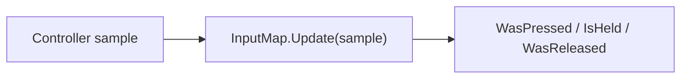

# Input

Everything a module reads from the player lives in `SharpProspero.Input`: the controller and its motion
and touch, the rumble motors and light bar it drives back, and a USB keyboard and mouse. A small
`InputMap` sits on top so game code asks about named actions instead of raw buttons.

<details open markdown="block">
  <summary>On this page</summary>
  {: .text-delta }
- TOC
{:toc}
</details>

## The controller

`GamePad` opens one controller for a user, reads a sample each frame, and drives its output. Open it
once at startup, read it in the frame loop, and dispose it at shutdown; disposing stops the motors.

```csharp
using SharpProspero.Input;
using SharpProspero.Interop.Pad;

using var gamePad = GamePad.Open();     // the system profile; pass Users.InitialUserId for one player's pad

GamePadState pad = gamePad.Read();
if (pad.IsPressed(ScePadButton.Cross))
    Jump();
```

`Read` returns a `GamePadState`, a decoded snapshot of one sample. When no sample is available it returns
`GamePadState.Neutral` — a resting value with both sticks centered — so a read never throws mid-frame. It
returns `Neutral` for an intercepted sample too: the system sets `ScePadButton.Intercepted` while it has
taken the controller for itself, and the rest of that sample describes what the system is doing with it
rather than what the player is pressing, so the whole sample is dropped.

Inside a `ProsperoApp`, the host already opens the pad and hands you the current sample on the frame
context, along with the previous one for edge detection. Use that instead of opening a second handle:

```csharp
protected override void OnFrame(FrameContext context)
{
    GamePadState pad = context.Input;
    if (context.Pressed(ScePadButton.Options))   // true only on the frame it goes down
        TogglePause();
}
```

See [Application](application.md) for the frame context and [Guides](guides.md) for worked examples.

### Buttons, sticks and triggers

`GamePadState` carries the digital buttons, both analog sticks, and both analog triggers. Buttons are a
`ScePadButton` flags value (in `SharpProspero.Interop.Pad`), so test one or several at once:

```csharp
if (pad.IsPressed(ScePadButton.L1 | ScePadButton.R1))   // both bumpers held
    OpenRadialMenu();
```

Sticks and triggers are raw bytes on the struct — `LeftStickX`, `LeftStickY`, `RightStickX`,
`RightStickY`, `LeftTrigger`, `RightTrigger`, each 0 to 255 with 128 at a stick's center. The `LeftStick`
and `RightStick` properties give the same axes as a `(float X, float Y)` from -1 to 1, already
recentered and clamped:

```csharp
(float x, float y) = pad.LeftStick;     // -1..1, 0 at rest
player.X += x * speed * context.DeltaSeconds;

float throttle = pad.RightTrigger / 255f;   // 0..1
```

{: .note }
> A zero-initialized `GamePadState` reads as full lower-left stick deflection, because a raw stick byte of
> 0 is a real extreme, not the center. Start from `GamePadState.Neutral` whenever you need a resting value.

### Motion and touch

A controller sample also carries the orientation, motion, and touch-pad contacts. `GamePadState` decodes
these as `System.Numerics` values, so they drop straight into vector math:

```csharp
using System.Numerics;

Quaternion facing = pad.Orientation;        // accumulated orientation
Vector3 gravity   = pad.Acceleration;       // in G, per axis
Vector3 spin      = pad.AngularVelocity;    // radians per second, per axis

if (pad.Touch1.IsActive)
    DrawCursor(pad.Touch1.X, pad.Touch1.Y);
```

`Touch1` and `Touch2` are the two touch-pad contacts, each a `TouchPoint` with an `X`/`Y` position, a
tracking `Id` that stays constant while the finger is down, and an `IsActive` flag. `TouchCount` reports
how many contacts are live (0 to 2). `IsConnected` and `TimestampMicroseconds` describe the sample
itself.

### Touch-pad gestures

`TouchGestureRecognizer` turns the raw contacts into gestures. Feed it each frame's sample and it returns
the gestures that completed or advanced: a tap, a double tap, a hold, a drag, a flick with its velocity,
and a two-finger pinch that carries both a scale and a rotation.

```csharp
var gestures = new TouchGestureRecognizer();
// each frame:
foreach (TouchGesture g in gestures.Update(pad))
{
    switch (g.Kind)
    {
        case TouchGestureKind.Tap:   Select(g.Position); break;
        case TouchGestureKind.Drag:  Scroll(g.Delta); break;
        case TouchGestureKind.Pinch: Zoom(g.Scale); Rotate(g.Rotation); break;
    }
}
```

The thresholds - how far a tap may move, how long a hold takes, the flick speed - are properties you can
tune. It keeps its own state, so a single recognizer follows a gesture across frames; call `Reset` to drop
everything in progress, after a screen change or when the pad handle is reopened.

### Output: rumble and light bar

`GamePad` drives the controller's motors and light bar alongside reading it. Each call returns false when
the controller does not accept the request.

```csharp
gamePad.SetVibration(largeMotor: 200, smallMotor: 120);   // 0 (stop) to 255 each
gamePad.SetLightBar(0x00, 0x80, 0xFF);                    // r, g, b
gamePad.ResetLightBar();                                  // back to the default color
gamePad.StopVibration();                                  // both motors off
```

The large motor is the low-frequency left motor and the small motor the high-frequency right one.
Disposing the pad stops both motors for you.

## Named actions

`InputMap` maps buttons to names, so code asks whether the player jumped rather than whether cross is
pressed — and the bindings stay in one place, ready to rebind. A binding can be one button, a chord
(several buttons combined with `|`, all of which must be held), or several alternatives (bind the same
action more than once). `Bind` returns the map so calls chain.



Feed it this frame's sample once with `Update`, then query; it keeps the previous sample itself so it can
tell a press from a hold.

```csharp
var input = new InputMap()
    .Bind("Jump", ScePadButton.Cross)
    .Bind("Fire", ScePadButton.R2)
    .Bind("Special", ScePadButton.L1 | ScePadButton.R1)   // a chord: both held
    .Bind("Confirm", ScePadButton.Cross)
    .Bind("Confirm", ScePadButton.Options);               // an alternative for the same action

// each frame:
input.Update(context.Input);
if (input.WasPressed("Jump")) Jump();
if (input.IsHeld("Fire"))     Fire();
if (input.WasReleased("Fire")) StopFiring();
```

`WasPressed` and `WasReleased` count each edge once; `IsHeld` is true for as long as the action is down.
`Unbind` clears every binding for an action and `IsBound` reports whether one exists.

## Keyboard and mouse

`Keyboard` and `Mouse` read a USB keyboard and mouse — the input a file explorer or a browser wants
beyond the controller. Open each for a user, read it each frame, and dispose it at shutdown.

```csharp
using var keyboard = Keyboard.Open();
using var mouse = Mouse.Open();

KeyboardState keys = keyboard.Read();
if (keys.Modifiers.HasFlag(KeyModifier.LeftControl)) { }

MouseState m = mouse.Read();
cursorX += m.DeltaX;              // the mouse reports movement since the last read, not a position
cursorY += m.DeltaY;
if (m.IsButtonDown(MouseButton.Primary)) { }
```

`KeyboardState.Keys` is the set of USB usage codes currently held (newest last); the read keeps only real
codes, so it is empty when nothing is down even though the count that comes back is never less than one.
`Modifiers` holds the shift/control/alt/gui state, `Leds` the lock keys that are on (num, caps, scroll),
and `Connected` reports whether a keyboard is attached. `IsKeyDown` tests one usage code and answers false
for zero, which is not a key. Producing a character needs `Leds` as well as `Modifiers` — caps lock decides
the case of a letter and num lock what the number pad gives — so pass both to the converter below.

`MouseState` gives the relative `DeltaX`/`DeltaY` movement, the `Wheel` and `Tilt` scroll, the `Buttons`
held, and `Connected` — an application accumulates the deltas into a cursor position of its own. A still
mouse produces nothing to read, so `Read` repeats the last reading with the four movement values zeroed
rather than reporting the mouse absent: a held button stays held and the cursor stays put. `Connected` and
`Buttons` therefore carry over from the last reading the device produced, and a mouse reads as absent only
when a reading says so or the read fails.

{: .note }
> `MouseButton` lives in `SharpProspero.Interop.Mouse` and `KeyModifier` in
> `SharpProspero.Interop.Keyboard`. `KeyboardState` is a `ref struct`: it cannot be stored in a field,
> boxed, or held across an `await`. Copy `Keys` into an array of your own to keep it past the current
> frame.

### From key codes to characters

A key code is a position on the keyboard, not a letter. `KeycodeConverter` turns one into the character it
produces, applying the layout and the held modifiers, so a build can read typed text from a USB keyboard
without the on-screen keyboard. It resolves from a system library at run time, so open it where the module
has access and dispose it when done. `TryOpen` returns null when the library is unavailable; `Open` throws.

```csharp
using KeycodeConverter? converter = KeycodeConverter.TryOpen();   // null without the library
if (converter is not null && keys.Connected)
{
    KeyboardLayout layout = converter.GetLayout();     // the user's chosen layout
    foreach (ushort keycode in keys.Keys)
    {
        char c = converter.ToCharacter(keycode, keys.Modifiers, layout, keys.Leds);
        if (c != '\0')                                 // '\0' for a key that makes no character
            typed += c;
    }
}
```

`GetLayout` reads the user's layout — one of the `KeyboardLayout` values, such as `EnglishUs`, `German`,
or `JapaneseKana` — so a build honors it instead of assuming one; pass a fixed `KeyboardLayout` to
`ToCharacter` if you want a specific one. `ToVirtualKeycode` gives the virtual key code for a physical
key, or -1 when there is none.
