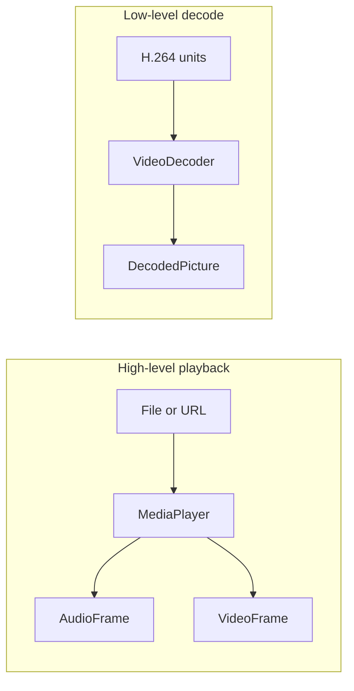

# Media

The `SharpProspero.Media` namespace has three entry points. `MediaPlayer` plays a whole file or network
stream end to end, decoding on its own threads while you pull the frames it produces. `VideoDecoder`
works one unit at a time and hands back each picture, for cases where you receive the stream yourself
or want the decoded frames rather than playback. `MediaMetadata` reads an audio track's tags with no
decoding and no system module. For turning compressed audio into samples without a picture, see
[Audio](audio.md).



<details open markdown="block">
  <summary>On this page</summary>
  {: .text-delta }
- TOC
{:toc}
</details>

## Reading a track's tags

`MediaMetadata.Read` takes the file's bytes - not a path - and returns a `MediaTags` record struct:
`Title`, `Artist`, `Album`, `TrackNumber` (as written, so "3/12" is possible), `Year` and `Genre`. It
reads the tag block at the front of the file and falls back to the 128-byte fixed tag some files keep at
the end, so a music player lists a folder by name and artist without touching the audio.

```csharp
using SharpProspero.Media;
using SharpProspero.Storage;

MediaTags tags = MediaMetadata.Read(FileSystem.ReadAllBytes("/app0/music/track.mp3"));
if (!tags.IsEmpty)
    Show(tags.Title, tags.Artist, tags.Album);
```

`MediaTags.Empty` is the all-empty set `Read` returns for a file with no tags, and `IsEmpty` tests for
it. Every field is a string; a tag the file does not carry comes back empty rather than null.

## Playing a file or stream

`MediaPlayer` opens a media file, starts it, and lets you pull decoded audio frames to send to an audio
device and video frames to draw to the display. Open it, call `Start`, then loop while it is active,
taking whatever frames are ready.

```csharp
using var avPlayer = SystemModule.Load(SystemModuleId.AvPlayer);   // the playback module

using var display = DisplayDevice.Open();
using var player = MediaPlayer.Open("/app0/movie.mp4");
using var audio = AudioOutDevice.OpenStereo();
player.Start();
while (player.IsActive)
{
    if (player.TryGetAudioFrame(out AudioFrame audioFrame))
        BufferSamples(audioFrame);   // your own buffer; whole blocks go to audio.Output
    if (player.TryGetVideoFrame(out VideoFrame videoFrame))
    {
        videoFrame.RenderTo(display.BackBuffer, 0, 0, display.Width, display.Height);
        display.Present();
    }
}
```

`AudioFrame.Samples` holds whatever the decoder produced, at the file's own `SampleRate` and
`ChannelCount`. `AudioOutDevice.Output` plays exactly `SamplesPerBlock` interleaved stereo samples at the
rate the output was opened with - 48000 or 192000 - and raises `ArgumentException` for a shorter span.
Buffer each frame, spread a mono track across both channels, and step through the samples at the ratio
between the file's rate and the output's, then push whole blocks. The media template shows the loop.

`TryGetAudioFrame` and `TryGetVideoFrame` return `false` when nothing has been decoded yet. That is
normal while the player is still filling, so keep calling. The player reads the file itself and decodes
on its own threads, and `MediaPlayer` answers its memory requests, so you supply no file or allocation
callbacks. Working memory comes from the unmanaged heap; the video frame buffers come from GPU-visible
direct memory, because the decoder writes them and you read them.

{: .note }
> The two frame types are `ref struct`s: their pixels and samples live in the player's own buffers and
> stay valid only until the next call for a frame. Consume each frame in the same loop iteration — do
> not store one in a field or hand it to another thread.

### Playback control

| Member | Effect |
|---|---|
| `Start()` | Turn on the first video, audio and subtitle stream the source carries, then begin playback. Reading a source runs on the player's own thread, so this waits for the streams to appear and raises `ProsperoException` when none does within `MediaPlayer.SourceReadTimeout` (10 seconds). |
| `Stop()` | End playback. |
| `Pause()` / `Resume()` | Hold and continue playback. |
| `SetLooping(bool)` | Set whether the source repeats. |
| `JumpTo(ulong milliseconds)` | Seek to a position. |
| `Position` | The current position, in milliseconds. |
| `IsActive` | Whether the player still has something to play. |

### Audio and video frames

An `AudioFrame` carries one run of decoded sound: `Samples` (interleaved 16-bit `ReadOnlySpan<short>`),
`TimeStamp` in milliseconds, `ChannelCount`, and `SampleRate`. `Samples` is sized by what the decoder
produced, so buffer it and match it to the rate and channel count of the
[audio output device](audio.md) before playing it.

A `VideoFrame` is one decoded picture in NV12. The buffer the decoder hands back is larger than the
picture inside it: `Height` is the buffer's height in rows and `Pitch` its row length in bytes, `Width`
is the width the stream declares, and `CropLeft`, `CropRight`, `CropTop` and `CropBottom` say how much of
each edge is not picture. The horizontal pair is measured from the pitch, so the padding that makes rows
a convenient length counts as crop. `VisibleWidth` (`Pitch` less the left and right insets) and
`VisibleHeight` (`Height` less the top and bottom insets) give the picture itself, and `TimeStamp` its
presentation time.

`RenderTo` draws only what is inside the insets to a `Surface`, converting the picture to the surface's
color and, in the four-argument form, scaling it to a destination rectangle:

```csharp
videoFrame.RenderTo(display.BackBuffer, 0, 0);                                  // the picture at its own size, at (0,0)
videoFrame.RenderTo(display.BackBuffer, 0, 0, display.Width, display.Height);   // scaled full-screen
```

Size a destination rectangle from `VisibleWidth` and `VisibleHeight`, not from `Width` and `Height`.

`display.BackBuffer` is the `Surface` you draw into; see the graphics pages for [2D scenes](graphics-scene.md)
and the surface model.

### Streaming from a URL

`MediaPlayer.OpenUrl` opens a network stream instead of a file. Pass an `http://` or `https://`
address and the player opens the stream over its own network source; the device needs a working
connection. Everything after opening is the same as a file.

```csharp
using var player = MediaPlayer.OpenUrl("https://example.com/stream.m3u8");
player.Start();
```

## Decoding video yourself

`VideoDecoder` decodes H.264 one unit at a time and returns each picture as it is produced. Reach for it
when you receive the stream yourself, or anywhere you want the frames rather than playback that
`MediaPlayer` handles.

The decoder is asked how much memory it needs and reserves every region itself, each of the kind the
service expects. You supply the picture buffer per call and read the picture back through it, so keep as
many buffers as you have pictures in flight.

```csharp
using var decoder = VideoDecoder.CreateAvc();          // 1080p, coded 1920 by 1088
using DirectMemoryRegion frame = decoder.AllocateFrameBuffer();

foreach (ReadOnlyMemory<byte> unit in units)
{
    DecodedPicture? picture = decoder.Decode(unit.Span, frame);
    if (picture is { } p)
        Present(p.Width, p.Height, p.PitchInBytes, p.AsSpan());   // your own routine to show it
}

while (decoder.Flush(frame) is { } tail)                // pictures still held back
    Present(tail.Width, tail.Height, tail.PitchInBytes, tail.AsSpan());
```

`VideoDecoder` takes no `SystemModule.Load`: `SystemModuleId` carries no identifier for the decoding
service, and nothing in the path above loads a module. The `AvPlayer` load belongs to `MediaPlayer`
alone.

| Call | What it does |
|---|---|
| `CreateAvc(maxWidth, maxHeight, profile, maxLevel)` | A decoder sized for the largest picture it must handle. The defaults are 1920 by 1088 at the high profile, level 4.2 — 1088 rather than 1080 because the argument is the coded height, which is a multiple of sixteen. |
| `AllocateFrameBuffer()` | Reserve a picture buffer of the size and alignment this decoder asks for. |
| `Decode(unit, frameBuffer, attachedData)` | Decode one unit; null while the decoder is still filling. |
| `Flush(frameBuffer)` | Push out a picture still held back; call until it returns null. |
| `Reset()` | Drop what the decoder carried, after seeking. |

`DecodedPicture` is a record struct that reports the picture's `Width`, `Height`, and `PitchInBytes`,
where its bytes are (`Buffer` and `BufferSize`), and whether it came from damaged input
(`IsErrorFrame`). `AsSpan()` returns the picture's bytes laid out by the pitch. Each picture is written
into the buffer you offered for it, so hold that buffer until the picture has been used, and keep one
buffer per picture in flight. `FrameBufferSize` and `FrameBufferAlignment` report what
`AllocateFrameBuffer` reserves if you want to manage the buffers yourself.

{: .important }
> `CreateAvc`, `AllocateFrameBuffer`, and the frame buffers reserve [direct memory](memory.md), and the
> decoder is not thread-safe. Dispose the decoder when you finish; disposing gives the compute queue
> back and releases every region.

For the other half of a media file — turning compressed MPEG audio into samples with `AudioDecoder` —
see [Audio](audio.md).
