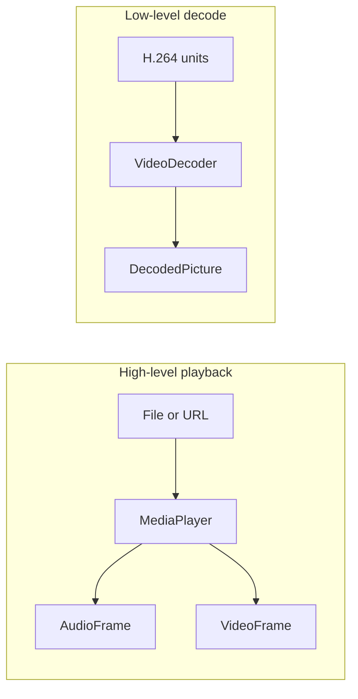

# Media

The `SharpProspero.Media` namespace has two entry points. `MediaPlayer` plays a whole file or network
stream end to end, decoding on its own threads while you pull the frames it produces. `VideoDecoder`
works one unit at a time and hands back each picture, for cases where you receive the stream yourself
or want the decoded frames rather than playback. For turning compressed audio into samples without a
picture, see [Audio](audio.md).



## Playing a file or stream

`MediaPlayer` opens a media file, starts it, and lets you pull decoded audio frames to send to an audio
device and video frames to draw to the display. Open it, call `Start`, then loop while it is active,
taking whatever frames are ready.

```csharp
SystemModule.Load(SystemModuleId.AvPlayer);   // the playback module

using var display = DisplayDevice.Open();
using var player = MediaPlayer.Open("/app0/movie.mp4");
using var audio = AudioOutDevice.OpenStereo();
player.Start();
while (player.IsActive)
{
    if (player.TryGetAudioFrame(out AudioFrame audioFrame))
        audio.Output(audioFrame.Samples);
    if (player.TryGetVideoFrame(out VideoFrame videoFrame))
    {
        videoFrame.RenderTo(display.BackBuffer, 0, 0, display.Width, display.Height);
        display.Present();
    }
}
```

`TryGetAudioFrame` and `TryGetVideoFrame` return `false` when nothing has been decoded yet. That is
normal while the player is still filling, so keep calling. The player reads the file itself, decodes on
its own threads, and answers every memory request from the unmanaged heap, so you supply no file or
allocation callbacks.

{: .note }
> The two frame types are `ref struct`s: their pixels and samples live in the player's own buffers and
> stay valid only until the next call for a frame. Consume each frame in the same loop iteration — do
> not store one in a field or hand it to another thread.

### Playback control

| Member | Effect |
|---|---|
| `Start()` | Begin playback. |
| `Stop()` | End playback. |
| `Pause()` / `Resume()` | Hold and continue playback. |
| `SetLooping(bool)` | Set whether the source repeats. |
| `JumpTo(ulong milliseconds)` | Seek to a position. |
| `Position` | The current position, in milliseconds. |
| `IsActive` | Whether the player still has something to play. |

### Audio and video frames

An `AudioFrame` carries one run of decoded sound: `Samples` (interleaved 16-bit `ReadOnlySpan<short>`),
`TimeStamp` in milliseconds, `ChannelCount`, and `SampleRate`. Pass `Samples` straight to an
[audio output device](audio.md).

A `VideoFrame` is one decoded picture. `Width`, `Height`, and `Pitch` describe its layout and
`TimeStamp` gives its presentation time. `RenderTo` draws it to a `Surface`, converting the picture to
the surface's color and, in the four-argument form, scaling it to a destination rectangle:

```csharp
videoFrame.RenderTo(display.BackBuffer, 0, 0);                                  // full size at (0,0)
videoFrame.RenderTo(display.BackBuffer, 0, 0, display.Width, display.Height);   // scaled full-screen
```

`display.BackBuffer` is the `Surface` you draw into; see the graphics pages for [2D scenes](graphics-scene.md)
and the surface model.

### Streaming from a URL

`MediaPlayer.OpenUrl` opens a network stream instead of a file. Pass an `http://` or `https://`
address and the player opens the stream over its own network source; the device needs a working
connection. Everything after opening is the same as a file.

```csharp
using var player = MediaPlayer.OpenUrl("https://example.com/stream.m3u8");
player.Start();
```

## Decoding video yourself

`VideoDecoder` decodes H.264 one unit at a time and returns each picture as it is produced. Reach for it
when you receive the stream yourself, or anywhere you want the frames rather than playback that
`MediaPlayer` handles.

The decoder is asked how much memory it needs and reserves every region itself, each of the kind the
service expects. You supply the picture buffer per call and read the picture back through it, so keep as
many buffers as you have pictures in flight.

```csharp
SystemModule.Load(SystemModuleId.AvPlayer);   // brings in the video decoder

using var decoder = VideoDecoder.CreateAvc();          // 1080p by default
using DirectMemoryRegion frame = decoder.AllocateFrameBuffer();

foreach (ReadOnlyMemory<byte> unit in units)
{
    DecodedPicture? picture = decoder.Decode(unit.Span, frame);
    if (picture is { } p)
        Present(p.Width, p.Height, p.PitchInBytes, p.AsSpan());   // your own routine to show it
}

while (decoder.Flush(frame) is { } tail)                // pictures still held back
    Present(tail.Width, tail.Height, tail.PitchInBytes, tail.AsSpan());
```

| Call | What it does |
|---|---|
| `CreateAvc(maxWidth, maxHeight, profile, maxLevel)` | A decoder sized for the largest picture it must handle. |
| `AllocateFrameBuffer()` | Reserve a picture buffer of the size and alignment this decoder asks for. |
| `Decode(unit, frameBuffer, attachedData)` | Decode one unit; null while the decoder is still filling. |
| `Flush(frameBuffer)` | Push out a picture still held back; call until it returns null. |
| `Reset()` | Drop what the decoder carried, after seeking. |

`DecodedPicture` is a record struct that reports the picture's `Width`, `Height`, and `PitchInBytes`,
where its bytes are (`Buffer` and `BufferSize`), and whether it came from damaged input
(`IsErrorFrame`). `AsSpan()` returns the picture's bytes laid out by the pitch. Each picture is written
into the buffer you offered for it, so hold that buffer until the picture has been used, and keep one
buffer per picture in flight. `FrameBufferSize` and `FrameBufferAlignment` report what
`AllocateFrameBuffer` reserves if you want to manage the buffers yourself.

{: .important }
> `CreateAvc`, `AllocateFrameBuffer`, and the frame buffers reserve [direct memory](memory.md), and the
> decoder is not thread-safe. Dispose the decoder when you finish; disposing gives the compute queue
> back and releases every region.

For the other half of a media file — turning compressed MPEG audio into samples with `AudioDecoder` —
see [Audio](audio.md).
