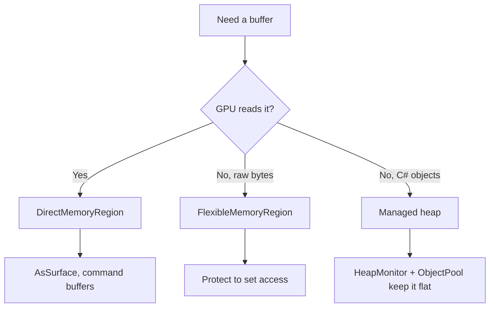

# Memory

A module works with three kinds of memory: GPU-visible direct memory for framebuffers and command
buffers, pool-managed flexible memory for general working buffers, and the managed heap that runs under
a bounded garbage collector. The types here, all in `SharpProspero.Memory`, reserve and map the first
two, report how much is left, and keep the third within a ceiling you set per project.

<details open markdown="block">
  <summary>On this page</summary>
  {: .text-delta }
- TOC
{:toc}
</details>

## Direct memory

GPU-visible buffers come from direct memory, not the managed heap. `DirectMemoryRegion` reserves, maps,
and releases a region in one disposable object.

```csharp
using SharpProspero.Memory;
using SharpProspero.Graphics;

using var region = DirectMemoryRegion.Allocate(bytes: 8u * 1024 * 1024);
Surface surface = region.AsSurface(1920, 1080);
```

`Allocate` rounds the size up to `alignment` (2 MiB by default), reserves cached memory shared between
the CPU and GPU, and maps it readable and writable by both. Override `memoryType`, `protection`,
`alignment` and `mappingFlags` for other uses. The region exposes its mapped base as `Pointer`, its
rounded `Size`, and its `PhysicalOffset`. `AsSurface` views the region as a drawing surface, with an
overload that takes an explicit row `stride`.

`Dispose` releases the reservation; it is safe to call more than once, and the `using` above runs it at
the end of the block. A region dropped without a `Dispose` releases from its finalizer, but rely on
`using` so the memory comes back promptly.

## Flexible memory

Working buffers the GPU does not read come from flexible memory instead. It is drawn from a pool the
system manages, so it needs no physical reservation. `FlexibleMemoryRegion` maps and releases it in one
disposable object, and `Protect` changes the protection later.

```csharp
using SharpProspero.Memory;
using SharpProspero.Interop.Kernel;

using var region = FlexibleMemoryRegion.Allocate(bytes: 1u * 1024 * 1024);
// region.Pointer is CPU read-write by default.
region.Protect(KernelMemory.ProtCpuRead);   // make it read-only
```

`Allocate` rounds the request up to a page and maps it CPU read-write unless you pass a different
`protection`. `Size` reports the rounded size and `Pointer` the mapped base. `Protect` throws once the
region has been disposed.

## Checking what is available

`SystemMemory` reports how much room is left, so a build that streams levels or grows a cache can check
that the next allocation fits before it attempts it.

```csharp
using SharpProspero.Memory;

nuint flexible = SystemMemory.AvailableFlexibleBytes();
nuint largestDirect = SystemMemory.LargestFreeDirectBytes();
```

`AvailableFlexibleBytes` returns the flexible memory the module still has. `LargestFreeDirectBytes`
returns the largest single run of free direct memory across the pool for the given alignment (2 MiB by
default) — the ceiling on a single `DirectMemoryRegion.Allocate`, which fails once no run is large
enough.

## The managed heap

The application runs with a small, non-concurrent collector and a hard ceiling baked into the image.
The default ceiling is 256 MiB; set your own per project with the `ProsperoHeapHardLimitBytes` MSBuild
property.

```xml
<PropertyGroup>
  <ProsperoHeapHardLimitBytes>268435456</ProsperoHeapHardLimitBytes>
</PropertyGroup>
```

A second property sets how much address space the collector holds for its regions:

```xml
<PropertyGroup>
  <ProsperoHeapRegionRangeBytes>402653184</ProsperoHeapRegionRangeBytes>
</PropertyGroup>
```

The default is 384 MiB. The collector reserves this range as one unbroken run before it starts, and
the build sets it because the collector otherwise asks for five times the ceiling — 1.25 GiB at the
default ceiling — which the pool will not hand out, leaving the collector unable to start.

Raise the range whenever you raise the ceiling. The range, not the ceiling, is the address space the
heap has to grow into, so a ceiling above it is a number the heap never reaches. The value is read
exactly as written and must cover a whole number of pages; a whole number of megabytes satisfies that
and stays readable.

{: .important }
> The device's memory maps are limited, and the heap ceiling is a hard wall: allocate past it and the
> collector cannot grow the heap, so the allocation fails outright. Keep per-frame allocation flat
> rather than relying on headroom. Draw into pre-allocated framebuffers instead of new buffers, reuse
> arrays and objects across frames (the frame context is already reused for you), and prefer
> `stackalloc` and pointers for short-lived unmanaged buffers.

### Watching heap pressure

`HeapMonitor` reads usage so a loop can react before it reaches the ceiling. `ExceedsBudget` compares
the committed heap against a fraction of the limit, and `Collect` runs a blocking, compacting
collection.

```csharp
using SharpProspero.Memory;

if (HeapMonitor.ExceedsBudget(0.85))
    HeapMonitor.Collect();
```

`Capture` returns a `HeapSnapshot` — a reading of `HeapSizeBytes`, `TotalAllocatedBytes`,
`HardLimitBytes`, and `CollectionCount` (generation-0 collections, which counts every collection that
has run), plus a `Pressure` ratio from 0 to 1 against the ceiling. When the runtime reports no
ceiling, `HardLimitBytes` and `Pressure` are both zero and `ExceedsBudget` always returns false, so
check `HardLimitBytes` before trusting either.

```csharp
HeapSnapshot heap = HeapMonitor.Capture();
long committedMiB = heap.HeapSizeBytes >> 20;
double pressure = heap.Pressure;   // 0 to 1 against the ceiling
```

Run `Collect` sparingly — after loading a scene rather than every frame. A blocking collection stalls
the frame, so calling it in a hot loop trades one problem for another.

### Pooling short-lived objects

When a hot loop needs a steady supply of short-lived objects — scratch lists, particles, projectiles —
an `ObjectPool<T>` reuses them instead of allocating each time, which keeps collection pressure down.
Borrow with `Rent`, give back with `Return`.

```csharp
using SharpProspero.Memory;

var scratch = new ObjectPool<List<int>>(() => new List<int>(), onReturn: l => l.Clear());
List<int> work = scratch.Rent();
// ... use work ...
scratch.Return(work);
```

The constructor's `factory` is required. Pass `onRent` to prepare an object as it goes out and
`onReturn` to reset it as it comes back, `prewarm` to make some up front (never more than the retained
limit), and `maxRetained` to cap how many idle objects the pool keeps, 1024 by default — a returned
object is kept up to that limit and dropped past it, so a burst does not grow the pool without bound.
`IdleCount` reports how many are ready to hand out without allocating, and `Clear` drops every idle
object.

{: .warning }
> Return each borrowed object exactly once, and drop your reference to it afterward. Returning the same
> object twice, or keeping it after returning it, lets two callers write the same instance at once.

### A bounded cache of built assets

When something is costly to build and cheap to rebuild — a decoded texture, a loaded sound, a rendered
glyph — an `LruCache<TKey, TValue>` keeps a fixed number of the most recently used ones and drops the
least recently used to stay within that budget. Reading or writing a key marks it as recently used, so what
is in active play stays resident while stale entries fall out.

```csharp
using SharpProspero.Memory;

var textures = new LruCache<string, Texture>(capacity: 32);
textures.Evicted += (key, tex) => tex.Dispose();      // release the dropped one

Texture icon = textures.GetOrAdd(path, LoadTexture);  // built once, then served from the cache
```

`TryGet` reads and refreshes, `Set` adds or replaces, and `GetOrAdd` builds a missing entry with a factory
and stores it. `ContainsKey` checks without counting as use, `Remove` and `Clear` drop entries without
raising `Evicted`, and `Keys` lists what is held, most recently used first. Hang a handler on `Evicted` to
free whatever a dropped entry was holding.

## How the three fit together



Direct and flexible regions live outside the managed heap and do not count against
`ProsperoHeapHardLimitBytes`, so moving large buffers off the heap is one of the most effective ways to
stay under the ceiling. See [Graphics](graphics.md) for how a `Surface` draws into a direct region, and
[Tips for application modules](extras-app-module-tips.md) for the same discipline in context.

## Reading the address space back

`MemoryMap` asks the platform what the process's own address space looks like. Use it when an
allocation was refused and the reason is not obvious, when chasing a leak, or when a memory report
needs to be legible.

```csharp
using SharpProspero.Memory;

foreach (MappedRange range in MemoryMap.Enumerate())
    Log.Info(range.ToString());
```

Each `MappedRange` carries its bounds and size, what backs it (`MappingBacking.Direct`, `Flexible`,
`Pooled`), whether it is a stack, whether it has memory behind it or is a reservation with nothing in
it yet, its protection bits (`CpuCanRead`, `CpuCanWrite`, `GpuCanRead`, `GpuCanWrite`) and the name it
was tagged with. `MemoryMap.Query` describes the single mapping covering one address, and `TryQuery`
reports a miss rather than throwing.

Tagging a range makes both the report above and the system's own tools name it:

```csharp
MemoryMap.NameRange((nuint)region.Pointer, region.Size, "frame buffers");
```

Two ceilings are worth watching alongside the byte counts:

```csharp
var (cpuTotal, cpuLeft, gpuTotal, gpuLeft) = MemoryMap.PageTableStats();
nuint configured = MemoryMap.ConfiguredFlexibleBytes();
```

A build that maps many small ranges runs out of page-table entries before it runs out of memory, and
the failure that follows reads like an out-of-memory one. `ConfiguredFlexibleBytes` is the flexible
ceiling the module was built with, as opposed to `SystemMemory.AvailableFlexibleBytes`, which is what
is left of it.
