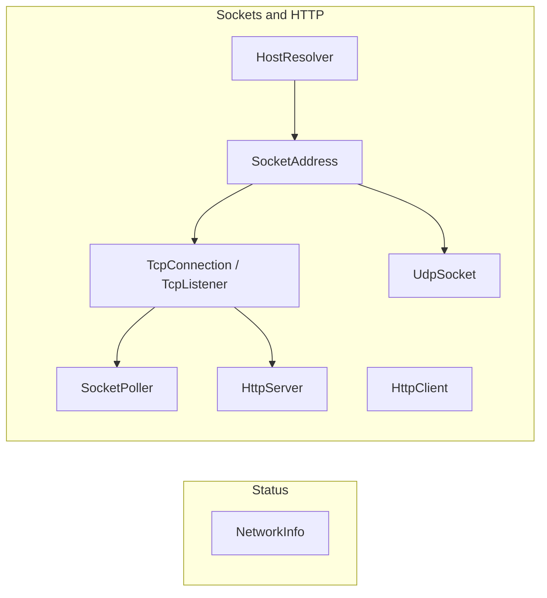

# Networking

Everything a module does over the network lives in `SharpProspero.Platform`: read the connection's
status, download over HTTP, run a small HTTP server, or drive raw TCP and UDP sockets directly. The
sockets are IPv4, with a poller for serving many connections from one thread and a resolver for
connecting by host name.



Two layers sit here. The high-level types — `NetworkInfo`, `HttpClient`, `HttpServer`, and
`DownloadService` — cover the common jobs on their own. Under them, the raw sockets and the poller are
for a protocol the high-level types do not speak.

| To | Use |
|---|---|
| Read the connection's status | `NetworkInfo` |
| Fetch a file or a package from a URL | `HttpClient` |
| Serve a page or an API | `HttpServer` |
| Speak your own protocol over TCP | `TcpConnection`, `TcpListener` |
| Send and receive datagrams | `UdpSocket` |
| Serve many connections from one thread | `SocketPoller` |
| Connect to a host by name | `HostResolver` |
| Control the transfers the system is running | `DownloadService` |

<details open markdown="block">
  <summary>On this page</summary>
  {: .text-delta }
- TOC
{:toc}
</details>

## Network information

`NetworkInfo` reports the connection, the same panel a system-information screen shows. Open it, read
the fields, dispose it. Each read reflects the connection at the moment it is called.

```csharp
using var net = NetworkInfo.Open();
if (net.IsConnected)
{
    Show(net.IpAddress);            // "192.168.1.20"
    Show(net.Ssid);                 // wireless network name, empty when wired
    Show(net.MacAddress);           // "00:1a:2b:c0:ff:ee"
    Show(net.SignalStrength);       // 0 to 100 on wireless
}
```

`State` reports where the connection is as a `NetCtlState` (`Disconnected`, `Connecting`,
`IpObtaining`, `IpObtained`); `IsConnected` is the shorthand for having an address. `Device` reports
`Wired` or `Wireless`. `IpAddress`, `SubnetMask`, `DefaultGateway`, `PrimaryDns`, `Ssid`, `MacAddress`
and `Mtu` fill in the rest. Opening needs no socket pool; the status service is the only network call
it makes.

## Addresses

A `SocketAddress` is an IPv4 endpoint: four address octets and a port.

```csharp
var any = SocketAddress.Any(8080);                 // every interface, port 8080
var local = SocketAddress.Loopback(9000);          // 127.0.0.1:9000
var server = SocketAddress.Parse("192.168.1.10", 21);
```

`IpString` gives the address as text without the port, `ToString` gives `address:port`, and `TryParse`
returns false instead of throwing on a malformed address.

## A TCP client

Connect, send a request, read the reply, and dispose the connection.

```csharp
using var conn = TcpConnection.Connect(SocketAddress.Parse("192.168.1.10", 80));
conn.SendAll("GET / HTTP/1.0\r\n\r\n"u8);

Span<byte> buffer = stackalloc byte[2048];
int read = conn.Receive(buffer);                   // 0 means the peer closed the connection
```

`SendAll` repeats until every byte is accepted. `Send` sends once and reports how many bytes went, for
callers that manage their own buffering. `SetReceiveTimeout` bounds a blocking receive; `RemoteAddress`
reports the peer, and `Shutdown` stops sends, receives, or both without closing the socket.

## A TCP server

Bind a listener, accept a client, serve it. This shape handles one client at a time; the next section
handles many at once.

```csharp
using var listener = TcpListener.Listen(SocketAddress.Any(8080));
while (running)
{
    using TcpConnection client = listener.Accept();
    Span<byte> request = stackalloc byte[1024];
    int read = client.Receive(request);
    client.SendAll(response);
}
```

`Listen` takes an optional backlog, the number of pending connections the system may queue.
`LocalAddress` reports the bound endpoint, resolving a zero port to the one the system assigned.

## Serving many clients from one thread

To serve several connections at once without threads, set the sockets to non-blocking and drive them
from a `SocketPoller`. The poller reports which sockets are ready; register each with a token the
caller chooses, usually an index into its own table of connections.

```csharp
using var listener = TcpListener.Listen(SocketAddress.Any(8080));
listener.Blocking = false;

using var poller = SocketPoller.Create();
poller.Add(listener.Handle, PollEvents.Read, token: 0);

Span<PollReady> ready = stackalloc PollReady[32];
while (running)
{
    int count = poller.Wait(ready, timeoutMicroseconds: -1);   // -1 waits until something is ready
    for (int i = 0; i < count; i++)
    {
        if (ready[i].Token == 0)
        {
            TcpConnection client = listener.Accept();
            client.Blocking = false;
            // register client.Handle with its own token and keep it in a table
        }
        else if (ready[i].IsReadable)
        {
            // read from the connection the token maps to
        }
    }
}
```

`PollEvents` is a flags enum: watch for `Read` and `Write`; `Error` and `HangUp` are reported, never
watched for. Each `PollReady` carries the `Token` that was registered and helpers over what fired —
`IsReadable`, `IsWritable`, and `IsClosed` for an error or a hang-up. `Add`, `Modify` and `Remove`
change what is watched. `SocketPoller.Abort` unblocks a thread waiting in `Wait`, so a server loop can
be told to stop.

## Downloading over HTTP

`HttpClient` downloads over HTTP and HTTPS, to fetch a file or a package from a URL. Create it, make as
many requests as needed, dispose it. Creating it brings up the network pool, the TLS context, and the
HTTP service in the order they depend on each other.

```csharp
using var http = HttpClient.Create();
HttpResponse response = http.Get("https://example.com/homebrew.pkg");
if (response.IsSuccess)
    FileSystem.WriteAllBytes("/data/homebrew.pkg", response.Body);
```

`Get` resolves the host in the URL itself and returns an `HttpResponse` with the `StatusCode` and the
`Body`; `IsSuccess` is true for a 2xx code. `Create` accepts an optional user-agent string. `FileSystem`
is covered in [Files and storage](storage.md); combined with the package installer in
[Packages and devices](packages-devices.md), this downloads and installs a package from the network.

## An HTTP server

`HttpServer` builds a small HTTP/1.1 server on these sockets, so a module can serve a page or an API to
a phone or a computer on the same network — a remote control panel, a status page, or a file browser.
Start it on a port and call `PollOnce` each frame so it never blocks the loop; it answers one waiting
request and returns. A handler maps a request to a response.

```csharp
using var server = HttpServer.Start(8080);

// In the frame loop, once per frame:
server.PollOnce(request => request.Path switch
{
    "/" => HttpServerResponse.Html("<h1>Hello from C#</h1>"),
    "/status" => HttpServerResponse.Json("{\"ok\":true}"),
    _ => HttpServerResponse.NotFound(),
});
```

`HttpServerRequest` gives the `Method`, `Path` (percent-decoded), `Query`, `Headers` and `Body`, plus
`Header(name)` for one header and `BodyText()` for the body as UTF-8. `HttpServerResponse` has `Text`,
`Html`, `Json`, `Bytes`, `NotFound` and `Redirect` builders, and its `StatusCode`, `ContentType`,
`Headers` and `Body` are settable for anything else. Each request is answered and its connection
closed, which keeps it simple and robust. To dedicate the loop to serving instead of polling, call
`Run(handler, keepRunning)`. Bind to the loopback address only, with `Start(port, loopbackOnly: true)`,
for a server just this console reaches.

{: .note }
> The server reads the whole request into memory, so it caps the header block (`MaxHeaderBytes`) and
> the body (`MaxBodyBytes`, default 8 MiB). A request over the body cap gets a 413.

## URL encoding and query strings

`WebEncoding` handles the URL text a client builds and a server reads: percent-encode a value so it is
safe in a URL, decode one back, build a query string from name/value pairs, and parse a query string or
an `application/x-www-form-urlencoded` request body into pairs.

```csharp
using SharpProspero.Platform;

string url = "https://host/search?" + WebEncoding.BuildQuery([new("q", "hello world")]);

// In an HTTP handler, read the posted form or the query:
foreach ((string name, string value) in WebEncoding.ParseQuery(request.BodyText()))
    Apply(name, value);
```

`PercentEncode` keeps the unreserved characters and escapes the rest (a space becomes `%20`, or `+` in
form style); `PercentDecode` reverses it. Text is handled as UTF-8, and a malformed escape raises a
`FormatException`. `ParseQuery` returns a list rather than a map, because a name may repeat.

## UDP

Datagrams need no connection. Bind to receive, send to an explicit destination.

```csharp
using var udp = UdpSocket.Bind(SocketAddress.Any(9000));
Span<byte> buffer = stackalloc byte[1500];
int read = udp.ReceiveFrom(buffer, out SocketAddress sender);
udp.SendTo(reply, sender);
```

`UdpSocket.Create` makes a send-only socket that is not bound to a local port. Each `SendTo` is one
whole datagram and each `ReceiveFrom` returns one, truncated to the buffer if it is larger.
`EnableBroadcast` allows sending to the broadcast address.

## Connecting by host name

`HttpClient` resolves the host in a URL on its own, so this step is only for the raw sockets: when a
`TcpConnection` or a `UdpSocket` targets a name rather than an address, resolve it first. A
`HostResolver` owns a small network pool for its lifetime.

```csharp
using var dns = HostResolver.Create();
SocketAddress address = dns.Resolve("example.com", 80);
using var conn = TcpConnection.Connect(address);
```

`Resolve` takes an optional per-attempt timeout and retry count.

## Background transfers

`DownloadService` controls the transfers the system is already running: find the task carrying a piece
of content, then hold it back, let it carry on, or stop it. A tool that reports what the console is
downloading, or that pauses a transfer while something else runs, works through this. The service is
loaded at run time and needs a block of memory the object reserves and releases, so reaching it depends
on what the running build is permitted to do — `TryOpen` reports a refusal rather than raising, while
`Open` is the same call that raises.

```csharp
using SharpProspero.Platform;

if (DownloadService.TryOpen(out DownloadService? transfers))
{
    using (transfers)
    {
        if (transfers!.TryFindTaskByContentId(contentId, kind, out int task))
        {
            transfers.Pause(task);
            // ... later
            transfers.Resume(task);
        }
    }
}
```

| Call | What it does |
|---|---|
| `TryOpen(out service, memorySize)` | Load and start the service, reporting whether it could be reached. |
| `TryFindTaskByContentId(contentId, kind, out taskId)` | Turn a content identifier into a task identifier. `kind` is one of the values in `FindKinds`. |
| `Start` / `Stop` / `Pause` / `Resume` (taskId) | Control one transfer. |
| `TryGetProgress(taskId, out progress)` | Read how far a transfer has gone as named fields. |
| `TryGetProgressRecord(taskId, destination)` | Read the whole progress record for the fields that are not named. |

`TryGetProgress` returns a `TransferProgress`: `TotalBytes`, `TransferredBytes`, a `PercentComplete`
derived from them, an `ErrorCode` (negative on failure, exposed as `HasError`), and `IsComplete`. The
service controls transfers that already exist; creating one is not offered.

{: .note }
> The service asks for at least `DownloadService.MinimumMemorySize` (1 MiB), which is the default the
> object passes.

## Errors

A failed socket call raises a `ProsperoException` whose `Code` carries the network error, so a caller
can branch on a specific failure such as a refused connection or a timeout. The address helpers throw
the usual argument exceptions instead — `SocketAddress.Parse` raises `FormatException` on a bad
address, where `TryParse` returns false.
