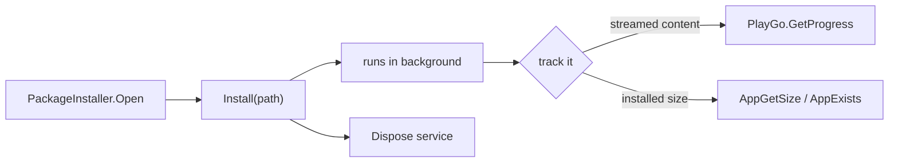

# Packages and devices

Install and remove titles, read how much of a title's content has arrived, and talk to the drives and
devices attached to the console. Every type on this page lives in `SharpProspero.Platform`.

Several of these services are privileged: they are loaded at run time and reach hardware or install
paths a plain application sandbox cannot. Treat their calls as best-effort and handle failure, and see
[System services](system-services.md) for what a build is permitted to do.

<details open markdown="block">
  <summary>On this page</summary>
  {: .text-delta }
- TOC
{:toc}
</details>

## Installing and removing packages

`PackageInstaller` installs a package file. The install service is not part of the module set a title
links against, so it is loaded at run time and its entry points are resolved by name.

```csharp
using var installer = PackageInstaller.Open();
installer.Install("/data/homebrew.pkg");
```

`Open` loads the service and starts it; `Install` hands the request over and the install continues in
the background; disposing shuts the service down. A missing module, a missing entry point, or a rejected
request all raise a `ProsperoException`. `AppExists("CUSA00000")` reports whether a title is installed,
and `AppGetSize("CUSA00000")` reads its installed size in bytes — an app manager lists and inspects
installed titles with these.

`Uninstall("CUSA00000")` removes an installed title. This deletes the application and its data, so
confirm the id first. Like `Install`, the call returns once the request is accepted and the removal
finishes in the background. An overload takes an option flag; leave it zero for the same behavior. On a
system whose firmware predates the option-taking form (before 3.00), a non-zero option raises a
`ProsperoException` rather than being dropped silently.

{: .warning }
> `Install` and `Uninstall` return as soon as the service accepts the request. The work is still running
> when the call returns, so do not assume it is finished — track it (below) before acting on the result.

Because the install runs in the background, a manager hands off the request and then polls for
completion — either the streamed-content progress from `PlayGo` or the installed size from `AppGetSize`:



## Download progress

`PlayGo` reads the install and download progress of the running application's content chunks — for a
launcher, or a title that streams its data while it plays. Pass the chunk ids you care about:

```csharp
using var playGo = PlayGo.Open();
DownloadProgress p = playGo.GetProgress(new ushort[] { 0, 1, 2 });
Show(p.Fraction);
```

`DownloadProgress` is a record struct of `Downloaded` and `Total` bytes; its `Fraction` property is the
ratio from 0 to 1 (and 1 when nothing is left to fetch). `GetLocus` reads where each chunk currently is,
for finer-grained tracking. Dispose the handle to close it and stop the service.

## Application parameters

`AppContent` reads the parameters a title was packaged with. Bring it up once — `Initialize` is safe to
call repeatedly and the first read brings it up on its own — then read a parameter by id. Ids 1 to 4 are
the user-defined integer parameters a title carries in its metadata.

```csharp
int level = AppContent.GetIntParam(1);   // user-defined parameter 1
```

## Launching another title

`AppLauncher` starts an installed application by its title id, so a module can act as a launcher. The id
is exactly nine characters (`AppLauncher.TitleIdLength`). On success the running application is replaced
by the one started, so the call does not return:

```csharp
AppLauncher.Launch("CUSA00000");
```

Launch arguments follow the id and are passed through to the started application:

```csharp
AppLauncher.Launch("CUSA00000", "--mode", "demo");
```

A wrong-length id raises `ArgumentException`; a title that cannot be started raises `ProsperoException`.

## USB storage

`UsbStorage` finds connected USB mass-storage devices and where each is mounted, so a module can browse a
USB drive with the ordinary file APIs. Each `UsbDevice` carries its `Id` and its `MountPath` (for example
`/mnt/usb0`). Read the mount path, then read the files under it.

```csharp
using var usb = UsbStorage.Open();
foreach (UsbDevice device in usb.ListDevices())
    foreach (DirectoryEntry entry in FileSystem.EnumerateDirectory(device.MountPath))
        Console.WriteLine(entry.Name);
```

`DirectoryEntry` and `FileSystem` are in `SharpProspero.Storage` — see [Files and storage](storage.md).
An empty list means nothing is connected. The system maps a device on its own; call `RequestMap` only to
ask for a mapping explicitly, and `RequestUnmap(device)` to release one. Reaching a mounted path still
depends on the process holding permission for it.

## Optical disc

`DiscDrive` reaches the Blu-ray drive. There is no dedicated disc service, so it works through the file
system and the raw device node, and both need the module to run with enough privilege to reach the
drive, which a normal application sandbox does not have — treat the reads as best-effort.

When the system has recognised a disc it mounts its filesystem under `DiscDrive.MountPoint` (`/mnt/disc`),
which is browsed with the ordinary file APIs:

```csharp
if (DiscDrive.IsDiscMounted)
    foreach (DirectoryEntry entry in DiscDrive.EnumerateFiles())
        Show(entry.Name);
```

The raw block device is opened for a sector-level read or a full dump. `OpenDevice` throws when it cannot
open the node; `TryOpenDevice` returns false instead:

```csharp
using var disc = DiscDrive.OpenDevice();               // /dev/cd0
long total = disc.DumpTo("/data/disc.iso", onProgress: bytes => Report(bytes));
```

`DumpTo` reads the device to a file until the end and returns the total bytes written; `Read` and `Seek`
do positioned reads. `DiscDrive.PrimaryDevice` and `SecondaryDevice` name the two drive nodes. What the
device returns is the drive's raw content, so for a commercial disc the readable files are the ones the
system has already mounted under `/mnt/disc`, not the raw sectors.

## Watching for device changes

`DeviceMonitor` notices when the set of connected devices changes, through the message bus. Start it,
then compare `Generation` against the last value you saw — it advances on any change — or read the
pending event bitmask with `PeekEvents` (leaves it) or `ConsumeEvents` (clears it).

```csharp
using var devices = DeviceMonitor.Start();
int seen = devices.Generation;
// each frame:
if (devices.Generation != seen)
{
    seen = devices.Generation;
    OnDevicesChanged();
}
```

The generation counter and the event bitmask are the reliable "something changed" signals; the meaning
of individual event bits and the per-device record layout are device-specific, so the monitor exposes the
change signal rather than a decoded device list. `Start` throws `InvalidOperationException` when the
service will not come up.

## Bluetooth HID

`BluetoothHid` is the entry point to the Bluetooth human-interface-device driver. `Initialize` opens the
device (privileged) and must run before any other Bluetooth HID call; it is safe to call more than once.
`Version` reads the module's build number.

```csharp
BluetoothHid.Initialize();
int build = BluetoothHid.Version;
```

This is a low-level driver surface. The device, report, and callback calls take structures whose layout
is device-specific, so they are exposed directly on `SharpProspero.Interop.Bluetooth.SceBluetoothHid`
(get and set input, feature, and output reports; read the report descriptor, device name, and device
info; register a device and a callback; interrupt output; disconnect) for advanced use. Each returns a
status code.

## Console feature flags

`FeatureFlag` reads the console's feature flags by number: whether a feature is enabled, and whether a
change to it is waiting for a reboot.

```csharp
if (FeatureFlag.IsOn(featureId))
    Enable();

bool pending = FeatureFlag.IsWaitingReboot(featureId);
```
