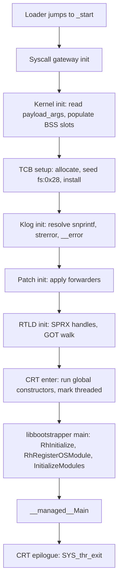

# Runtime bring-up

The payload's start object is the layer that turns a bare `.elf` a loader mapped and jumped to into
a running managed program. This page walks the sequence step by step, so a device log — with or
without the `sp:*` breadcrumbs — reads clearly.

## The sequence

The loader maps the ELF and jumps to `_start`. From `_start` the CRT runs, then it hands off to
`libbootstrapper.o`, then to the payload's `__managed__Main`, and finally the CRT epilogue exits
the thread. The order is fixed and every step has a matching breadcrumb in the diagnostic build.

## Each step

### 1. Syscall gateway

`__sp_crt_syscall` shuffles the C calling convention registers into the syscall ABI and dispatches
through an instruction gadget. The gadget address is derived once by `__sp_crt_syscall_init` from
the loader's `getpid` function pointer (which sits ten bytes before a real syscall instruction).
The result is a syscall shim callable from C with six register arguments and a seventh from the
stack.

Breadcrumb: `sp:init:syscall`. On failure the CRT emits `sp:crt:syscall-init:fail` and continues
into the kernel init with the shim disabled.

### 2. Kernel init

`__sp_kernel_init` reads the loader-supplied `payload_args` block (address, pipe primitive
descriptors, kernel data base), then populates the CRT's BSS slots for the kernel structures the
payload later accesses:

- `allproc` — head of the process list.
- `text_base` — the kernel's own text base.
- `bus_data_devices` — device bus root.
- `targetid` — the console model identifier.
- `utoken_flags` — the console's authorization token flags.
- `vmspace_vm_pmap` — the running process's page-table root.
- `kernel_rootvnode` — the root vnode used by the application-promotion path.

Each address is derived from the firmware major version through the per-firmware data table
(covered in [Kernel access](payload-kernel.md)).

Breadcrumbs: `sp:init:kernel` at the start; `sp:kernel:init:ok` on success. When the table has no
row for the running firmware the CRT falls through to a degenerate row and emits
`sp:kernel:init:degen`; the payload continues without kernel access. When the init fails outright
the CRT emits `sp:init:kernel:fail=0x<code>`.

### 3. TCB setup

The CRT allocates a thread-control block, writes a self-pointer at offset `0x0`, copies the host's
`fs:0x10` (pthread pointer) to offset `0x10`, copies the host's `fs:0x28` (stack canary) to offset
`0x28`, and installs the block via `sysarch(AMD64_SET_FSBASE)`. Every managed thread-local access
reads from a fixed offset off the thread pointer, so the block has to be in place before the
bootstrap runs.

Breadcrumb: `sp:tcb:set`.

### 4. Klog init

`__sp_klog_init` resolves `snprintf`, `vsnprintf`, `strerror`, and `__error` from handle `0x2`
(libSceLibcInternal). The klog helper writes to the kernel log directly via `SYS_kexec` (syscall 7),
so no `puts` binding is needed; the resolved helpers format the formatted `sp:*` lines the CRT
prints later.

Breadcrumbs: `sp:init:klog` at the start; `sp:klog:ok` on success.

### 5. Patch init

`__sp_patch_init` applies the runtime patches the CRT keeps for the current firmware: the syscall
shuffler landing pad, the pipe-primitive forwarders, and the small trampolines the resolver walks
through.

Breadcrumbs: `sp:init:patch` at the start; `sp:patch:ok` on success.

### 6. RTLD init

`__sp_rtld_init` handles the payload's own dynamic imports. It reads `DT_NEEDED` entries from the
payload's `PT_DYNAMIC`, loads each SPRX handle through `sceKernelLoadStartModule`, then walks the
payload's GOT and populates each `GLOB_DAT` slot with the resolved address. When RTLD init
finishes, the payload's own imports are bound.

Breadcrumbs: `sp:init:rtld` at the start; per-SPRX `sp:rtld:sprx:init`; the `.so` and payload
sub-passes emit `sp:rtld:so:init`, `sp:rtld:payload:init:start`, `sp:rtld:payload:init:done`, and
`sp:rtld:dlfcn:init`. On success the CRT emits `sp:rtld:ok`; when the whole init sequence is done
it emits `sp:init:done`.

### 7. CRT enter and bootstrap

`sp:crt:enter` marks the transition from CRT init to the ahead-of-time runtime bootstrap.
`libbootstrapper.o`'s `main` runs `RhInitialize`, `RhRegisterOSModule`, `InitializeModules`, and
calls `__managed__Main`. The managed entry is a plain C function pointer emitted by
`[UnmanagedCallersOnly(EntryPoint = "__managed__Main")]`, so the call is a straight jump.

Breadcrumbs: `sp:crt:enter`, `sp:isthreaded:ok`, `sp:main:enter`. When the runtime cannot mark
itself threaded the CRT emits `sp:isthreaded:fail`.

### 8. Thread exit

When `__managed__Main` returns, the CRT epilogue emits `sp:main:exit`, calls `SYS_thr_exit`
(syscall 431) with the return value, and emits `sp:exit` immediately before the syscall dispatch.
The syscall terminates only the hijacked thread — the host process continues. A daemon-shaped
payload that has to persist runs an infinite loop in `__managed__Main` and never reaches this
step; its own thread continues serving requests inside the host process.

## What can fail

Each step has a failure mode and a matching breadcrumb the diagnostic build emits. See
[Payload troubleshooting](payload-troubleshooting.md) for the signatures and the fixes.

## The firmware data table

The kernel-side addresses (`allproc`, `text_base`, `bus_data_devices`, `targetid`, `utoken_flags`,
`vmspace_vm_pmap`, `kernel_rootvnode`) come from a per-firmware data table baked into the CRT. The
table is indexed by the firmware major version. Because the version byte arrives in BCD form (for
firmware 10 the byte reads `0x10`), a three-instruction sequence converts BCD to a linear row
index before the lookup. Each row holds seven 32-bit columns:

| Column | Meaning |
|---|---|
| 0 | Kernel text-base negative offset. |
| 1 | `allproc` offset. |
| 2 | `bus_data_devices` offset. |
| 3 | `targetid` offset. |
| 4 | `utoken_flags` offset. |
| 5 | `vmspace_vm_pmap` offset. |
| 6 | `kernel_rootvnode` offset. |

`__sp_kernel_init` writes the derived addresses into BSS. Every kernel access from managed code
reads them from the same slots. See [Kernel access](payload-kernel.md) for the pipe primitive and
the per-field accessors managed code uses on top.
