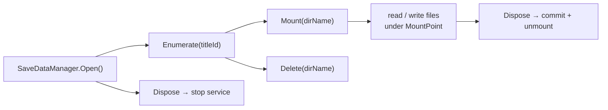

# Save data

Save data lives in per-user, per-title directories the system manages. `SaveDataManager` in
`SharpProspero.Platform` lists those directories, mounts one so its files become readable and
writable paths, and deletes them — the surface a save-data manager or a backup tool is built on.
`SaveDataPicker` puts the choice in the user's hands with the system dialog.

## The lifecycle

Every task starts by opening the service, ends by disposing it, and does its file I/O through a
mount that commits and unmounts when disposed.



## Opening the manager

`SaveDataManager.Open` starts the save-data service. With no argument it targets the signed-in user;
pass a user id to target another. It implements `IDisposable`, so keep it in a `using` and the service
stops when the block ends.

```csharp
using var saves = SaveDataManager.Open();
```

## Listing saves

`Enumerate` returns an `IReadOnlyList<SaveDataInfo>`, sorted by directory name. It lists the running
application's own saves. Leaving the title id out does not widen the search — the service fills in the
calling title — and passing another title's id does not reach that title's saves.

```csharp
using var saves = SaveDataManager.Open();
foreach (SaveDataInfo save in saves.Enumerate())
    Show(save.Title, save.SubTitle, save.ModifiedTime);
```

`SaveDataInfo` is a `readonly record struct` carrying the fields the save's parameter block holds:

| Field | Type | Meaning |
| --- | --- | --- |
| `DirName` | `string` | The save's directory name — its identity within the title, and the key you pass to `Mount` and `Delete`. |
| `Title` | `string` | The save's title line. |
| `SubTitle` | `string` | The subtitle line. |
| `Detail` | `string` | The longer detail text. |
| `UserParam` | `uint` | An integer the title stored alongside the save. |
| `ModifiedTime` | `DateTimeOffset` | When the save was last written. |

## Reading a save's files

`Mount` mounts one save and returns a `MountedSave`. Its `MountPoint` is the path the save's files
live under (for example `/savedata0`); join your file names onto it and read them with the
[storage APIs](storage.md). Mounts are read-only by default. Dispose the `MountedSave` to unmount.

```csharp
using var saves = SaveDataManager.Open();
string dirName = saves.Enumerate()[0].DirName;

using MountedSave mounted = saves.Mount(dirName);
byte[] data = FileSystem.ReadAllBytes(mounted.MountPoint + "/progress.dat");
```

## Writing to a save

Pass `readOnly: false` to mount for writing. Files written under the mount point are held until the
mount is unmounted, at which point disposing the `MountedSave` commits them.

```csharp
using var saves = SaveDataManager.Open();
using MountedSave mounted = saves.Mount(dirName, readOnly: false);

FileSystem.WriteAllBytes(mounted.MountPoint + "/progress.dat", payload);
// leaving the using block commits the write and unmounts.
```

{: .important }
> Writes are committed on unmount, not on each `WriteAllBytes` call. Let the `using` block dispose the
> `MountedSave` — or dispose it yourself — before you rely on the data being persisted. An abandoned
> mount leaves the changes uncommitted.

## Deleting a save

`Delete` removes a save by directory name. It cannot be undone, so confirm the choice with the user
first.

```csharp
using var saves = SaveDataManager.Open();
saves.Delete(dirName);
```

## Letting the user pick

`SaveDataPicker`, also in `SharpProspero.Platform`, opens the system dialog that lists a user's saves
and reports which one they chose — the same list-and-select flow the system shows, with none of the
enumeration wiring on your side. Open it with a user id (the signed-in user's id comes from
`Users.InitialUserId`), then poll it each frame while presenting the display until it finishes.

```csharp
using var picker = SaveDataPicker.OpenList(Users.InitialUserId);
while (!picker.TryGetResult(out string? directory))
    display.Present();

if (directory is not null)
    using (var saves = SaveDataManager.Open())
    using (MountedSave mounted = saves.Mount(directory))
        Load(mounted.MountPoint);
```

`TryGetResult` returns `false` while the dialog is still open and `true` once it has finished. When it
finishes, `directory` holds the chosen save's directory name, or `null` if the user backed out without
choosing. `OpenList` takes an optional `SaveDataDialogType` (`Load` by default; also `Save` and
`Delete`) that sets the dialog's wording. The `Status` property exposes the raw `CommonDialogStatus`
(`Running`, `Finished`, and so on) if you would rather branch on it than on `TryGetResult`. Both enums
live in `SharpProspero.Interop.Dialog`, so add that using directive to name them.

{: .note }
> The picker only advances while the frame loop keeps presenting. If you stop calling `Present`, the
> dialog freezes. See [Dialogs and overlays](dialogs.md) for the shared poll-until-finished pattern
> the message, text-input, and browser dialogs use as well.

## Where the versioned payload fits

`SaveDataManager` gives you the mount point and raw file access; it does not define what goes in the
files. For a self-describing, versioned blob — a header, a schema version, and forward/backward
handling as your save format changes — write a `SaveState` (in `SharpProspero.Storage`) into the
mounted directory. See [Files and storage](storage.md) for that payload format.
