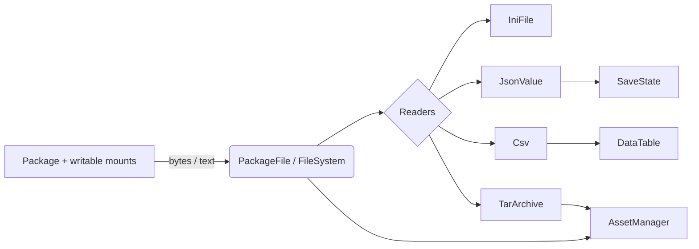

# Files and storage

Everything a module reads or writes at rest lives in `SharpProspero.Storage`: the raw file access, the
readers that turn bytes into settings, JSON, CSV and tables, and the higher-level pieces that build on them.
The lowest layer reads and writes bytes; the readers parse those bytes; and a few types stack on top to give
you an asset cache, a queryable table and a versioned save document.



<details open markdown="block">
  <summary>On this page</summary>
  {: .text-delta }
- TOC
{:toc}
</details>

## Read a bundled file

`PackageFile` reads files bundled with a module. Assets live under the package root, exposed as
`PackageFile.Root` (`/app0`).

```csharp
byte[] level = PackageFile.ReadAllBytes("/app0/assets/level.bin");
string config = PackageFile.ReadAllText("/app0/config.json");
```

`ReadAllBytes` opens, sizes, reads and closes the file in one call and throws a `ProsperoException` on
failure; `ReadAllText` decodes the result as UTF-8. The package root is read-only, so `PackageFile` only
reads. For anything more than a whole-file read, use `FileSystem`.

## Browse and change files

`FileSystem` lists a directory and creates, moves and removes entries. `EnumerateDirectory` returns each
`DirectoryEntry` with its `Name` and `Type`, leaving out `.` and `..`:

```csharp
foreach (DirectoryEntry entry in FileSystem.EnumerateDirectory("/app0/assets"))
{
    string kind = entry.IsDirectory ? "dir " : "file";
    long size = entry.IsFile ? FileSystem.GetFileSize($"/app0/assets/{entry.Name}") : 0;
    Log.Information($"{kind} {entry.Name} {size}");
}
```

`DirectoryEntry.Type` is a `FileEntryType` — `File`, `Directory`, `SymbolicLink` and the other Unix kinds —
and the `IsDirectory` and `IsFile` shortcuts cover the common cases. (`Log` is in `SharpProspero.Diagnostics`;
see [Diagnostics](diagnostics.md).)

`GetFileSize`, `Exists`, `CreateDirectory`, `DeleteFile`, `DeleteDirectory`, `Move`, `ReadAllBytes`,
`WriteAllBytes`, `ReadAllText` and `WriteAllText` round out the single-item operations. For whole trees there
is `EnumerateRecursive` (every file beneath a folder, as full paths), `CreateDirectoryRecursive` (a folder and
any missing parents), `CopyFile` and `CopyDirectory`.

{: .note }
> `/app0` is read-only. Writes need a writable mount such as the save-data or temporary storage a build is
> granted; see [Save data](save-data.md).

## Paths as text

`PathUtil` works with paths as plain strings and touches no files. `Combine` joins parts with a single
separator, and the accessors pull a path apart:

```csharp
string name = PathUtil.GetFileName(path);            // "level.csv"
string save = PathUtil.Combine("/data/saves", name); // "/data/saves/level.csv"
string png = PathUtil.ChangeExtension(save, "png");  // "/data/saves/level.png"
```

`GetFileNameWithoutExtension`, `GetExtension`, `GetDirectoryName`, `HasExtension` and `IsAbsolute` complete
the set. Paths use a forward slash, and an absolute path starts with one; when the right operand of `Combine`
is absolute it is returned unchanged.

## One path space over many sources

`AssetManager` gives a single logical path space over several sources, so a build asks for an asset by name
and does not care whether it comes from a package folder, a tar archive bundled with the title, or bytes
built at runtime. Mount the sources once, then read by name; the bytes are read on first use and kept, and a
decoded asset is decoded once and kept too.

```csharp
using SharpProspero.Storage;
using SharpProspero.Graphics;

var assets = new AssetManager();
assets.MountDirectory("/app0/assets");                                    // sits at the root of the path space
assets.MountArchive(FileSystem.ReadAllBytes("/app0/levels.tar"), prefix: "levels");

BmpImage title = assets.Load("ui/title.bmp", bytes => BmpImage.Decode(bytes)); // decoded once, then cached
byte[] world = assets.ReadBytes("levels/world1.dat");
```

`Load<T>` takes a decoder (`Func<byte[], T>`) and caches the decoded result under the name and type; a later
call for the same pair returns it without decoding again. `ReadBytes` returns the raw bytes and `TryReadBytes`
avoids the throw when an asset may be absent. A later mount covers an earlier one for the same name, so a patch
or a user folder can override the base content. `AddFile` adds a single in-memory asset, `Exists` tests a name,
`CachedPaths` lists what is held, and `Unload` / `ClearCache` drop cached entries while keeping the mounts.

{: .note }
> `AssetManager` is not thread-safe. Load from one thread, or guard it yourself.

## Settings files

`IniFile` keeps a module's own configuration in a small INI-style file, with no system service. Values live
under named sections as `key = value` lines, and a leading `;` or `#` marks a comment — a format the user can
read and edit too.

```csharp
IniFile settings = IniFile.Load("/data/app.ini");
int volume = settings.GetInt("audio", "volume", 80);
bool fullscreen = settings.GetBool("display", "fullscreen", true);

settings.Set("audio", "volume", 90);
settings.Save("/data/app.ini");
```

`GetString`, `GetInt` and `GetBool` each take a fallback for a missing value, so a first run with no file
still gets sensible defaults. `Load` returns an empty store when the file is absent, `Contains` tests a key,
`Remove` deletes one, and `Sections` lists the section names. Section and key lookups ignore case, so
`[Audio]` and `[audio]` are one section and `volume` reads back as `Volume`. `Parse` builds a store from
INI text you already hold, and `ToString` returns the store as INI text — the same text `Save` writes.

## JSON

`JsonValue` reads and writes JSON as a self-contained calculation — for a configuration file, a manifest, or a
reply from a service. Reading a field that is missing, or reading it as the wrong kind, returns the fallback
you give rather than throwing, so a missing field is easy to handle. Objects keep their keys in the order they
were added, so a file read and written back keeps its shape.

```csharp
JsonValue config = JsonValue.Load("/data/config.json");   // Null when the file is absent
int volume = config.GetInt("volume", 80);
bool music = config["audio"].GetBool("music", true);
string first = config["profiles"][0].GetString("name", "Player 1");

var reply = JsonValue.NewObject();
reply["ok"] = true;
reply["count"] = 3;
reply["items"] = JsonValue.NewArray().Add("a").Add("b");
reply.Save("/data/out.json");                             // indented by default
string compact = reply.Write();                           // or a compact string
```

`Type` reports which of the six `JsonType` kinds a value holds — `Null`, `Boolean`, `Number`, `String`,
`Array`, `Object`. `Parse` reads text and throws `JsonException` on bad input, while `TryParse` returns false
instead. `AsString`, `AsNumber`, `AsInt`, `AsBool` read a value with a fallback, and `GetString`, `GetInt`,
`GetNumber` and `GetBool` read a named value from an object in one step. `Write(indented: true)` lays the
output out over several lines. `Count` gives the number of items in an array or named values in an object,
and `Keys` lists an object's keys in order, so a value of unknown shape can be walked. `ContainsKey` tests
for a name, `TryGet` reads a named value and reports whether it was there, `AsLong` reads a number too wide
for an `int`, `Add` appends to an array and returns it so calls chain, and `JsonValue.Of` builds a value
from a boolean, a number or a string.

## CSV

`Csv` reads and writes comma-separated values — a table exported from a tool, a list the user can open in a
spreadsheet. A field holding the separator, a quote or a line break is wrapped in quotes on writing and
unwrapped on reading, so the round trip keeps the data intact. Pass a tab for tab-separated values.

```csharp
List<string[]> rows = Csv.Load("/data/scores.csv");   // empty list when the file is absent
foreach (string[] row in rows)
    Log.Information($"{row[0]} = {row[1]}");

Csv.Save("/data/out.csv", new[]
{
    new[] { "name", "score" },
    new[] { "Ada", "42" },
});
```

`Parse` and `Write` do the same work on a string: rows are separated by a line break and fields by the
separator.

## Tabular data

`DataTable` turns the raw rows the CSV and JSON readers produce into something a list or grid interface can
bind to: named columns of text cells you can sort, filter and group. Each of those returns a new table, so the
original is untouched.

```csharp
DataTable scores = DataTable.FromCsv(FileSystem.ReadAllText("/data/scores.csv"));
DataTable top = scores
    .Where(r => r["mode"] == "ranked")
    .SortBy("score", descending: true, comparer: TextFormat.NaturalComparer);
foreach (DataRow row in top.Rows)
    Log.Information($"{row["name"]}: {row["score"]}");
```

`FromCsv` reads the first row as column names unless you pass `hasHeader: false`. A blank or missing name
becomes `col0`, `col1`, … by position, and a name that repeats gains a `_2`, `_3`, … suffix, so a file with
a duplicated header still loads. A `DataRow` reads a cell by column name or index. `SortBy` is stable —
equal keys keep their order — and takes an `IComparer<string>`, so `TextFormat.NaturalComparer` (in
`SharpProspero.Text`) puts "9" before "20"; `GroupBy` splits the rows into a table per value; `ToCsv`
writes it back out.

To build a table from data that is not CSV, construct it with its column names and add rows:
`new DataTable("name", "score")` then `AddRow("Ada", "42")`. A row with fewer cells than the table has
columns is padded with empty cells; one with more is rejected. `Columns`, `ColumnCount`, `RowCount`,
`Row(index)` and `IndexOfColumn(name)` read the shape back.

## Versioned saves

`SaveState` standardizes a save file as a schema version paired with a JSON payload, so a later build can load
a save written by an earlier one. `Write` wraps the payload with its version, `Read` pulls both back, and
`MigrateTo` walks an old save up to the current version through per-version upgrade steps.

```csharp
JsonValue data = JsonValue.NewObject();
data["score"] = 1200;
FileSystem.WriteAllText(path, new SaveState(3, data).Write(indented: true));

// Loading a possibly-older save and bringing it current:
var migrations = new Dictionary<int, Func<JsonValue, JsonValue>>
{
    [1] = d => /* v1 -> v2 */ d,
    [2] = d => /* v2 -> v3 */ d,
};
SaveState save = SaveState.Read(FileSystem.ReadAllText(path)).MigrateTo(3, migrations);
```

The entry keyed by version `v` transforms the payload written for `v` into the payload for `v + 1`.

{: .important }
> A missing upgrade step, a step that returns null, or a target older than the save is an error, so a broken
> chain fails loudly rather than loading half-converted data.

For the console's own save-data slots — mounting, quotas and the picker — see [Save data](save-data.md).

## Tar archives

`TarArchive` reads a tar file — the common way to bundle many assets into one — into its members as a
self-contained calculation. It handles the widely used forms — the original layout, the ustar long-path
prefix, GNU long names, and the extended headers that carry a long path or a size the header's own field
cannot hold — and returns each regular file and directory; other record kinds, such as links, are skipped.
An extended header applies to the entry that follows it and takes precedence over the shortened name left
in that entry's own header, so members that differ only past the hundredth character stay separate. A tar
is not compressed, so a member's bytes come back as stored.

```csharp
foreach (TarEntry entry in TarArchive.Read(FileSystem.ReadAllBytes("/data/assets.tar")))
{
    if (!entry.IsDirectory)
        Install(entry.Name, entry.Data);   // entry.Text decodes the bytes as UTF-8
}
```

Each `TarEntry` carries its `Name` (with any directory prefix already joined on), `IsDirectory`, and `Data`,
plus a `Text` shortcut that decodes the bytes as UTF-8. A malformed archive — a bad header checksum, a bad
size, or an entry running past the end — raises a `ProsperoException` rather than returning partial results.
`AssetManager.MountArchive` reads a tar through this type, so a bundled archive can back a whole mount.

## Zlib decompression

`ZlibDecompressor` inflates zlib-compressed data through the system compression service, for reading a
compressed asset or an archive member. Create one, decompress as many blocks as needed, then dispose it.

```csharp
using var zlib = ZlibDecompressor.Create();
byte[] plain = zlib.Decompress(compressed);
```

Each `Decompress` call produces at most 64 KiB. `Create` takes the work-buffer size, 64 KiB by default, and
initializes the service.

{: .warning }
> There is one service instance, so create at most one decompressor at a time and dispose it before making
> another.

## Related

- [Numerics and vectors](numerics.md) — math, random and spatial helpers.
- [Buffers and encodings](buffers.md) — reading and writing binary layouts, ring buffers, base-N text.
- [XML](xml.md) — a reader and writer for XML configuration and data files.
- [Hashing and checksums](hashing.md) — verifying a file's integrity after a read.
