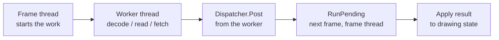

# Threading

Slow work — reading a file, decoding an image, a network request — freezes the screen if it runs inside `OnFrame`. The types in `SharpProspero.Threading` move that work onto another thread and give the frame loop a cheap way to check when it is done and pick up the result.

## The pattern

Anything the frame loop calls must return fast, because the display only advances when `OnFrame` returns and lets the app present. The rule of thumb: start the slow work on a background thread, poll a flag each frame, and never let a worker thread touch drawing state or shared game state directly. Three pieces cover it.

- `BackgroundOperation` / `BackgroundOperation<T>` run one job on a thread of their own.
- `WorkQueue` runs a stream of jobs on a small pool of shared threads, and `WorkItem<T>` is the result handle a pooled job hands back.
- `Dispatcher` carries a result from a worker thread back to the frame thread, where it is safe to apply.

Every thread `BackgroundOperation` and `WorkQueue` create takes the stack size the build sets in `ProsperoThreadStackBytes`, 1 MiB by default:

```xml
<PropertyGroup>
  <ProsperoThreadStackBytes>1048576</ProsperoThreadStackBytes>
</PropertyGroup>
```

Raise it for a job that recurses deeply or stack-allocates a large buffer. The value is a decimal count of bytes; anything else reads as zero and is dropped without a message.

{: .warning }
> A worker thread must not touch a drawing surface or most application state. Reading a byte array or decoding pixels off-thread is fine; assigning the decoded surface into your app is not — do that back on the frame thread through a `Dispatcher`.

## One job at a time

`BackgroundOperation` runs a single piece of work on its own background thread and lets the frame loop check whether it has finished without blocking. Use `BackgroundOperation<T>` when the work produces a result you want back.

```csharp
using SharpProspero.Graphics;
using SharpProspero.Storage;
using SharpProspero.Threading;

// Start a load off the frame loop. The lambda runs on a background thread at once.
var loading = new BackgroundOperation<PngImage>(
    () => PngImage.Decode(FileSystem.ReadAllBytes(path)));
```

Poll it each frame and act when it is done. `IsComplete` is true whether the work succeeded or threw; `Failed` and `Error` tell you which.

```csharp
// In OnFrame:
if (loading.IsComplete)
{
    if (loading.Failed)
        Log.Error($"decode failed: {loading.Error}");
    else
        UseImage(loading.Result); // ready — reading Result no longer waits
}
```

Reading `Result` before the work finishes blocks the calling thread until it does, and rethrows the exception the work threw — which is why you poll `IsComplete` first rather than read `Result` blind. `Wait()` and `Wait(TimeSpan)` block on purpose when you do want to join, the timed form returning whether the work finished in time. The non-generic `BackgroundOperation` is the same shape for a job with no result, exposing `IsComplete`, `Failed`, and `Error`.

An operation runs on exactly one thread and cannot be reused; start a new one for the next job. For a steady stream of jobs, reach for a pool instead of spawning a thread each time.

## A pool for many jobs

`WorkQueue` keeps a small set of worker threads alive and feeds them whatever you hand it. Create it with a worker count, enqueue actions, and dispose it at shutdown.

```csharp
using SharpProspero.Threading;

using var queue = new WorkQueue(workerCount: 2, name: "io");
queue.Enqueue(() => WriteCache(entry));
queue.Enqueue(() => WriteCache(other));
```

`name` labels the worker threads: with two workers and `name: "io"` a thread list shows `io #0` and `io #1`. It defaults to null, which leaves the threads unnamed. `BackgroundOperation` and `BackgroundOperation<T>` take the same optional `name` and apply it verbatim to their single thread.

`WorkerCount` and `PendingCount` report the pool size and how many jobs are still waiting to start. `Dispose` stops taking new jobs, waits for the queued and running ones to finish, and joins the threads — so a `using` block drains the queue on the way out. `Enqueue` after that throws `ObjectDisposedException`, so a shutdown path that still hands out work must post it before the queue goes down.

A job that throws is caught so one bad job never takes a worker thread down. By default the exception is swallowed; set `ErrorHandler` to see it. The handler is called on a worker thread, so treat what it touches as shared state.

```csharp
queue.ErrorHandler = ex => Log.Error($"job failed: {ex}");
```

To get a result back from a pooled job, enqueue a `Func<T>` instead of an `Action`. That overload returns a `WorkItem<T>` — the pooled counterpart to `BackgroundOperation<T>` — which you poll the same way.

```csharp
WorkItem<PngImage> item = queue.Enqueue(() => PngImage.Decode(bytes));

// In OnFrame:
if (item.IsComplete && !item.Failed)
    UseImage(item.Result);
```

`WorkItem<T>` exposes the same `IsComplete`, `Failed`, `Error`, `Result`, and `Wait` members as a background operation, and reading `Result` early waits and rethrows exactly as it does there. Reach for `WorkQueue` when many jobs run over an app's life; reach for `BackgroundOperation<T>` for a single self-contained job.

{: .note }
> Whatever a job shares with the frame thread must be guarded — a `lock`, an `Interlocked` counter — because the worker and the frame loop run at the same time. The safest design shares nothing and hands the finished result back through a `Dispatcher`.

## Choosing which processor work runs on

A large application keeps its parts apart so none of them can take time from the others: the frame loop on
one processor, an emulated core or an audio mixer on another, background loading on the rest. `Processor`
does the placing.

```csharp
using SharpProspero.Threading;

var core = new BackgroundOperation(() =>
{
    Processor.NameCurrentThread("cpu-core");
    Processor.PlaceCurrentThread(Processor.Only(4), Processor.PriorityDefault - 32);
    RunCore();
});
```

A processor set is a bit mask: bit *n* admits processor *n*. Build one with `Processor.Only`,
`Processor.Mask` or `Processor.Range(first, afterLast)` rather than writing the number out; `Processor.All`
is every processor and `Processor.Count` is how many there are.

| Member | What it does |
|---|---|
| `Only`, `Mask`, `Range`, `All`, `Count` | Build a processor set. |
| `SetCurrentThreadAffinity`, `TrySetCurrentThreadAffinity`, `CurrentThreadAffinity` | Confine the calling thread, or read where it may run. |
| `CurrentThreadPriority`, `PriorityHighest`, `PriorityDefault`, `PriorityLowest` | How urgently the thread is served. A *smaller* number is served first. |
| `PlaceCurrentThread` | Set the processor set and the priority in one call — what a worker does as its first act. |
| `NameCurrentThread` | The name a profiler and a crash report show in place of a bare thread number. |
| `Current`, `CurrentThreadId`, `Yield` | Which processor the thread is on now, its scheduler identifier, and giving up the rest of its slice. |

These act on the thread that calls them, because a thread is addressed by a handle only that thread can
read back. To place a worker, call them from inside that worker. `WorkQueue` does this for you: pass an
`affinityMask` and every worker pins itself before taking its first job.

## Handing results back to the frame thread

A drawing surface and most app state are not safe to touch off the frame thread, so a job should not apply its own result. `Dispatcher` is a one-way hand-off: work posted from any thread is queued and run later on the thread that drains it. `ProsperoApp` owns one and drains it once per frame before `OnFrame`, so posted work always runs on the frame thread. Reach it as `Dispatcher` inside the app or `context.Dispatcher` inside a frame.

```csharp
// On a worker thread, once the pixels are decoded:
context.Dispatcher.Post(() => _texture = decoded.AsSurface());
// The lambda runs on the next frame, on the frame thread, where touching _texture is safe.
```

`Post` only queues the callback and is safe to call from any thread; the callback runs later, not at the moment you post it. `PendingCount` reports how many callbacks are waiting. When the app drains the queue, `RunPending` runs the callbacks queued at that moment and returns how many ran — work a callback posts is left for the next drain, so a callback that re-posts itself cannot stall the loop. `Clear` drops whatever is queued without running it.

By default an exception from a posted callback propagates out of `RunPending` and the work not yet run stays queued; set `ErrorHandler` to catch it so the rest of the batch still runs.

```csharp
context.Dispatcher.ErrorHandler = ex => Log.Warning($"posted work threw: {ex}");
```

The full round trip: start the work off-thread, let it compute a plain result, and post the one line that applies that result back onto the frame thread.



`Log` in these snippets is in `SharpProspero.Diagnostics`; see [Diagnostics](diagnostics.md). The frame loop and `context` that owns the dispatcher are described in [Application](application.md), and per-frame budgeting sits alongside [Timing](timing.md).

## Waiting on the platform's own primitives

`WorkQueue` and `Dispatcher` cover work that starts and finishes inside the app. A part that has to
wait on something the system owns — a descriptor becoming readable, a timer, a signal raised from a
worker — waits on a platform primitive instead, because a thread blocked on one of those is visible to
the system's scheduler and can be released in priority order.

### An event flag

An event flag is a 64-bit pattern of bits: several threads wait on it and one or more set it. Unlike a
condition variable it keeps its state, so a thread that arrives after the bits were set is satisfied at
once rather than missing the signal. One bit per thing being waited for lets a single thread wait for
several unrelated things without a lock around them.

```csharp
using SharpProspero.Threading;

using var ready = new EventFlag("assets-ready");

// On the loading threads, as each part finishes:
ready.Set(1UL << 0);   // textures
ready.Set(1UL << 1);   // audio

// On the thread that needs both:
ready.Wait(0b11, EventFlagWait.All, timeout: TimeSpan.FromSeconds(10));
```

`EventFlagWait.Any` returns as soon as one named bit appears; `EventFlagClear` decides what happens to
the pattern afterwards, which is how a bit becomes a one-shot token. `TryWait` reports a timeout as a
value rather than an exception, `Poll` tests without blocking, and `CancelWaiters` releases everyone at
once when a subsystem shuts down.

### A counting semaphore

`CountingSemaphore` holds a count between zero and a ceiling, and a waiter may take more than one unit
at a time — which is what a pool of interchangeable resources needs when a job cannot start until it
has several of them.

```csharp
using var slots = new CountingSemaphore("decode-slots", initialCount: 4, maximumCount: 4);

slots.Wait(count: 2);          // this job needs two buffers
try { Decode(); }
finally { slots.Release(2); }
```

`TryWait` takes a timeout and reports it rather than throwing; `TryTake` never blocks.

### One place to wait for everything

`EventQueue` collects reports from several sources at once — timers, a descriptor becoming readable or
writable, a file changing, and events the app raises itself — so a service thread blocks in one call
instead of polling each source in turn.

```csharp
using var queue = new EventQueue("service");
queue.AddTimer(id: 1, TimeSpan.FromMilliseconds(250));
queue.AddReadable(socketDescriptor);
queue.AddUserEvent(id: 99);          // used to break the wait from another thread

Span<QueuedEvent> reports = stackalloc QueuedEvent[8];
while (running)
{
    int count = queue.Wait(reports, TimeSpan.FromSeconds(1));
    for (int i = 0; i < count; i++)
        switch (reports[i].Source)
        {
            case EventSource.Timer: Tick(); break;
            case EventSource.Readable: ReadSocket(); break;
            case EventSource.User: running = false; break;
        }
}
```

`Wait` returns zero when a bounded wait runs out of time, so a timeout is an ordinary outcome rather
than an exception. `TriggerUserEvent` is safe from any thread and is the way to wake a thread that is
blocked in `Wait`. Each report carries the identifier its source was added under, so one queue can
carry many timers without confusion, along with `Data` (readable bytes, or an error number when
`IsError` is set) and `FilterFlags` (which change fired, for a file watch).

Every timeout on these types is a `TimeSpan`, converted by `WaitTimeout.ToMicroseconds`. The platform
counts whole microseconds in a 32-bit field, so a single wait caps at a little over 71 minutes
(`WaitTimeout.Maximum`); a longer wait is built from repeated shorter ones. A remainder below a
microsecond rounds up rather than down, so a very short wait never turns into "do not wait at all".

## Policy, and measuring what a thread used

`Processor.CurrentThreadPriority` decides which thread is served first. `SchedulingPolicy` decides what
happens between threads that already share a priority, and `Processor.SetCurrentThreadScheduling` sets
both together.

| Policy | What it does |
|---|---|
| `Default` | The time-shared policy a thread runs under unless it is changed. |
| `FirstInFirstOut` | Runs until it blocks or yields rather than being pre-empted by an equal. Starves its equals if it never yields. |
| `RoundRobin` | Equal-priority threads take turns, so none of them can hold the processor. |

```csharp
Processor.SetCurrentThreadScheduling(SchedulingPolicy.RoundRobin, Processor.PriorityDefault - 32);
```

`Processor.ClampPriority` brings a priority computed as an offset back inside the accepted range —
the platform refuses the whole call for an out-of-range value rather than doing what was meant.

`Processor.CurrentThreadProcessorTime` reads the time this thread has actually spent running, which
advances only while it is on a processor. Sampling it around a piece of work measures the work rather
than the wall-clock time, so a worker that mostly waits does not look expensive.
