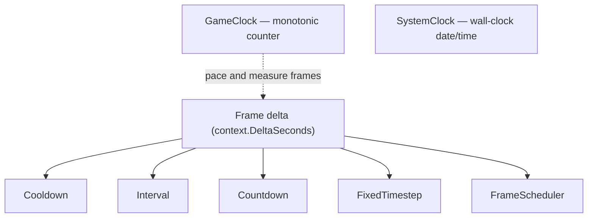

# Timing

Everything time-related lives in `SharpProspero.Timing`: two clocks for reading time, and a set of small
timers that turn each frame's delta into game logic. The clocks answer "what time is it"; the frame timers
answer "has enough time passed to do the thing".



## Clocks

Two clocks measure two different things. Use `GameClock` to pace and measure work; use `SystemClock`
for the calendar date and time.

### GameClock — monotonic time

`GameClock` is a monotonic clock backed by the process-time counter. Construct one to measure from a fixed
origin, or use its static members for one-off readings and sleeping. The readings never move backward and
are unaffected by wall-clock changes.

```csharp
using SharpProspero.Timing;

var clock = new GameClock();
// ... work ...
double seconds = clock.ElapsedSeconds;
GameClock.Sleep(TimeSpan.FromMilliseconds(2));
```

`ElapsedMicroseconds` and `ElapsedSeconds` count from construction; `Restart` moves the origin to now.
The static `GameClock.ProcessMicroseconds` reads the microseconds since the process started, and
`GameClock.Sleep` suspends the caller for a `TimeSpan`, rounded to whole microseconds. `Sleep` blocks the
calling thread, so keep it off the frame loop — a sleeping frame is a frozen screen; move slow work to
[Threading](threading.md) instead.

### SystemClock — wall-clock time

For the calendar date and time, `SystemClock` reads the real-time clock and returns a `DateTime`:

```csharp
DateTime utc = SystemClock.UtcNow;
DateTime local = SystemClock.LocalNow;
```

Unlike the game clock, the system clock follows the calendar and can jump when the clock is set, so never
use it to measure an elapsed duration.

{: .warning }
> Do not derive a per-frame delta from `SystemClock`. If the user changes the console clock mid-frame the
> difference can go negative or leap forward. Use `GameClock` or the frame delta for that.

### PrecisionClock — the finest monotonic counter

`GameClock` counts whole microseconds. Where that is too coarse — pacing an emulated core, measuring a
block of work that takes tens of microseconds, landing a frame on a deadline — `PrecisionClock` reads the
hardware counter directly and reports in the counter's own units.

```csharp
ulong start = PrecisionClock.Ticks;
Simulate();
double ms = PrecisionClock.ElapsedSince(start).TotalMilliseconds;
```

| Member | What it does |
|---|---|
| `Ticks`, `Frequency` | The counter now, and how many of its units make a second. |
| `ElapsedSince`, `SecondsSince` | The time since an earlier reading. |
| `ToTimeSpan`, `ToMicroseconds`, `FromTimeSpan` | Convert between counter units and durations at a given frequency. |
| `Resolution` | The smallest step the clock can report — the floor on how precise a sleep can be. |
| `Sleep`, `SleepNanoseconds` | Suspend the caller to nanosecond precision, asking again for the remainder if the wait is cut short. |
| `WaitUntil` | Sleep most of the way to a counter reading, then yield in short turns for the last part. |
| `CycleCounter`, `CycleCounterFrequency` | The processor's own cycle counter. Finer still, but per-processor — pin the thread first. |
| `CurrentProcessor` | Which processor the calling thread is on at this instant. |

`WaitUntil` is what paces a loop to a deadline: it sleeps for the bulk of the wait, which costs nothing,
and spends only the last fraction of a millisecond yielding, which lands far closer to the mark than a
sleep alone.

## Frame timers

For game logic there are three small timers driven by the frame's delta, not by a clock. Advance each one
per frame with the time since the last frame — `(float)context.DeltaSeconds` — and read the result. Each
timer ignores a step that is zero, negative or not finite instead of folding it in, so a stalled or
mis-measured frame cannot poison a timer.

- `Cooldown` is a gate that is ready, then cold for a set time: a weapon on a recharge, an ability, a
  button that ignores a second press.
- `Interval` fires on a steady beat: spawn something every few seconds, tick a clock, poll on a schedule.
- `Countdown` is a one-shot that fires once when it reaches zero: a delayed action, a respawn, a message
  that clears itself.

```csharp
var fireRate = new Cooldown(0.25f);
var spawner = new Interval(2f);
var respawn = new Countdown(3f);

// each frame, with dt = (float)context.DeltaSeconds:
fireRate.Advance(dt);
if (firePressed && fireRate.TryUse())
    Shoot();

for (int i = 0; i < spawner.Advance(dt); i++)
    SpawnEnemy();

if (respawn.Advance(dt))
    Respawn();
```

`Cooldown.TryUse` returns true only when the gate is ready and starts the cooldown; `IsReady` and
`Remaining` report its state, and `Start`/`Reset` force it cold or ready. `Interval.Advance` returns how
many whole periods elapsed since the last call, so a long frame fires the right number of times rather than
dropping beats, and `Interval.Reset` clears the progress toward the next fire. `Countdown.Advance` returns
true on the single frame it reaches zero, then stays elapsed until you `Restart` it; `IsRunning` and
`IsElapsed` read that state without advancing. Assign `Cooldown.Duration` or `Interval.Period` while the
timer runs — a weapon that fires faster, a spawner that speeds up. A negative duration, or a period of zero
or less, throws `ArgumentOutOfRangeException`.

{: .tip }
> `Cooldown.Fraction` (1 down to 0) and `Countdown.Progress` (0 up to 1) give a 0..1 value ready to drive a
> recharge meter or a progress bar.

## Fixed simulation steps

For a simulation that must advance in equal amounts regardless of the display rate — game physics, or an
emulated core — `FixedTimestep` turns the variable frame delta into a fixed number of steps. Feed it the
real delta; it returns how many steps are due and leaves an `Alpha` for interpolating the render between
the last two steps.

```csharp
var sim = new FixedTimestep(1.0 / 60);

// each frame:
int steps = sim.Advance(context.DeltaSeconds);
for (int i = 0; i < steps; i++)
    Step(sim.Step);
Draw(sim.Alpha); // 0..1 between the previous and current step
```

The callback overload runs a delegate once per due step: `sim.Advance(context.DeltaSeconds, () => Step(sim.Step))`.
`Reset` clears the leftover time.

{: .note }
> `MaxFrameTime` (default 0.25 s) clamps how much real time one `Advance` absorbs, so a hitch or a
> breakpoint cannot trigger a catch-up burst of steps. A single slow frame drops the backlog instead of
> spiralling.

## Scheduled callbacks

Where the frame timers above are values a frame polls, a `FrameScheduler` runs a callback for you when its
time comes. Call `Update` once per frame with the seconds elapsed; it fires the callbacks that came due, in
order, on that thread.

```csharp
using SharpProspero.Timing;

var scheduler = new FrameScheduler();
scheduler.After(1.5, () => ShowHint());        // once, in 1.5 s
int spawn = scheduler.Every(0.75, SpawnEnemy); // repeating, every 0.75 s

// each frame:
scheduler.Update(context.DeltaSeconds);
// later:
scheduler.Cancel(spawn);
```

`After` returns a handle for `Cancel`; `Every` repeats until cancelled and, after a long pause, fires once
and re-arms rather than firing once per missed interval. Work scheduled from inside a callback waits for the
next `Update`, so a callback that re-schedules itself cannot spin. `Count` reports how many callbacks the
scheduler is holding. `Cancel` marks an entry instead of removing it, so `Count` still includes it until the
next `Update` sweeps it out. `Clear` cancels everything and empties the list right away; called from inside
a callback it marks the entries instead, and that `Update` sweeps them out.

For the per-frame delta these timers consume, see the frame loop on [Application](application.md); for
measuring and graphing frame times, see [Diagnostics](diagnostics.md).
