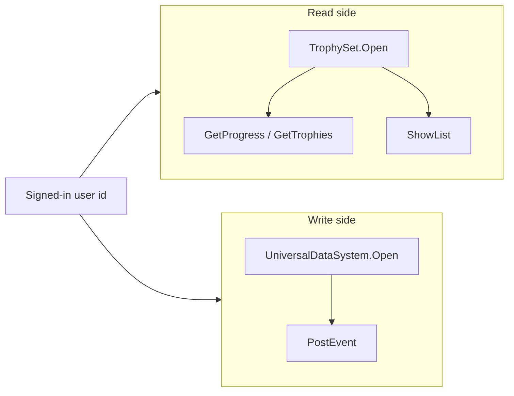

# Trophies and events

Trophies split into two halves: a read side that shows the player's progress, and a write side that reports what the player did. Both live in `SharpProspero.Platform` and both work against a signed-in user.

## The two sides

`TrophySet` reads a title's trophies and the current progress, and can show the system trophy screen. It never unlocks anything. Unlocking a trophy — along with reporting activities and statistics — goes through `UniversalDataSystem`, which posts named events; a trophy set defines the event that unlocks each trophy.



{: .note }
> Both sides need a signed-in user whose title has a registered trophy set. Get the id from `Users.InitialUserId` — see [System information](system.md).

## Reading progress

`TrophySet.Open(userId)` creates the context and handle and registers the title's trophies; dispose it when you are done. `GetProgress` returns the set-wide totals, `GetTrophies` returns every trophy with its unlock state, and `ShowList` opens the system trophy screen.

```csharp
using SharpProspero.Platform;

int userId = Users.InitialUserId;

using var trophies = TrophySet.Open(userId);

TrophyProgress progress = trophies.GetProgress();   // e.g. 12 of 34 unlocked, 41%
hud.SetHeader($"{progress.Title}: {progress.UnlockedTrophies}/{progress.TotalTrophies}");

foreach (TrophyInfo t in trophies.GetTrophies())
    hud.AddRow(t.Name, t.Unlocked);

trophies.ShowList();                                 // the system trophy screen
```

`TrophyProgress` is a record struct carrying `Title`, `TotalTrophies`, `UnlockedTrophies`, and `ProgressPercentage` (0 to 100). Each `TrophyInfo` carries the trophy's `Id`, `Grade`, `Unlocked`, `Hidden`, `Name`, and `Description`. `Grade` is a `SceNpTrophy2Grade` (in `SharpProspero.Interop.Np`) with the values `Platinum`, `Gold`, `Silver`, `Bronze`, and `Unknown` — for example, to weight a completion score:

```csharp
using SharpProspero.Interop.Np;

int Weight(TrophyInfo t) => t.Grade switch
{
    SceNpTrophy2Grade.Platinum => 300,
    SceNpTrophy2Grade.Gold     => 90,
    SceNpTrophy2Grade.Silver   => 30,
    SceNpTrophy2Grade.Bronze   => 15,
    _                          => 0,
};
```

A title that ships more than one trophy set selects among them with the `serviceLabel` argument to `Open`; the default of `0` is the first set.

## Posting events

The write side is `UniversalDataSystem`. Initialize the module once with a working memory pool (128 KB by default), open a session for a user, post events, then terminate the module at shutdown. `Open` takes the same `serviceLabel` as the read side, so a title with more than one trophy set posts to the set that label selects.

```csharp
using SharpProspero.Platform;

UniversalDataSystem.Initialize();

using (var uds = UniversalDataSystem.Open(userId))
{
    uds.PostEvent("LEVEL_COMPLETE", e => e
        .Set("LEVEL", 3)
        .Set("TIME_SECONDS", 42.5)
        .Set("PERFECT", true));
}

UniversalDataSystem.Terminate();
```

`PostEvent(name, build)` creates the event, runs the build callback to fill in its properties, and posts it when the callback returns. The callback receives a `UdsEvent` — a `ref struct` valid only for the duration of the call — with `Set` overloads for string, `int`, `long`, `double`, and `bool` values. Each `Set` returns the same `UdsEvent`, so calls chain. The `build` parameter has the delegate type `UdsEventBuilder`.

{: .warning }
> `UdsEvent` is a `ref struct`; do not capture it or use it outside the build callback. Build the whole event inside the delegate.

## Unlocking a trophy

Unlocking is a special event whose name and property are defined by the trophy set: post `_UnlockTrophy` with the trophy's id in `_trophy_id`.

```csharp
using var uds = UniversalDataSystem.Open(userId);
uds.PostEvent("_UnlockTrophy", e => e.Set("_trophy_id", trophyId));
```

Read the result back from the read side: after posting, reopen the `TrophySet` (or call `GetProgress` again on an open one) and the unlocked count reflects the change. The two sides talk to the same system service, so the read side sees what the write side posts.

Every method here throws `ProsperoException` on failure — a session that cannot be opened, an event that cannot be posted — so wrap the calls where a missing user or an unregistered trophy set is a real possibility.

## Related services

- [Save data](save-data.md) — the other main per-user service, mounting and reading a player's saves.
- [Dialogs and overlays](dialogs.md) — `Notification` for the on-screen banner that pairs well with an unlock.
- [System information](system.md) — `Users` for the signed-in user id these calls take.
